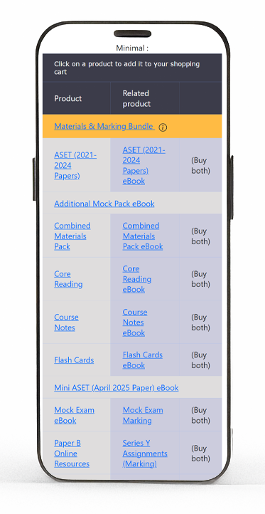

<style scoped>
h1 {
    margin: 0px;
    font-weight: 600;
    letter-spacing: -0.022em;
    font-optical-sizing: auto;
    font-style: normal;
    font-variation-settings: "wght" 600;
    font-family: Inter, Poppins, sans-serif;
    color: rgba(47,47,47,1);
    font-size: calc(1em * var(--wholestep) * var(--wholestep)) !important;
    line-height: var(--halfstep-dec) !important;
    border-bottom:1px solid rgba(47,47,47,0.45);
    width:fit-content;
  }
  h2 {
    margin-right: 0px;
    margin-bottom: 0px;
    margin-left: 0px;
    font-weight: 200;
    font-optical-sizing: auto;
    font-style: normal;
    font-variation-settings: "wght" 200;
    margin-top: calc(var(--2xs) / var(--wholestep) / var(--wholestep) / var(--halfstep));
    font-family: Inter, Poppins, sans-serif;
    color: #2F2F2F;
    font-size: calc(1em * var(--wholestep)) !important;
    line-height: calc(var(--halfstep) / var(--wholestep)) !important;
    letter-spacing: -0.022em !important;
  }
  
</style>

# BPP ActEd

## E-Store UI Redesign

---

<div class="columns">
  
<div>

## Background

  Modernize existing [ActEd eStore](https://www.acted.co.uk/estore)

- Horizontal menu  
- Veritcal navigation menu
- product list page
- tuition list page
- Online Classroom page
</div>
<div>

## Objectives

- Modernise layout
- Improve responsiveness and adaptive design, mobile friendly
- Intuitive Navigation
- Accessibility
- Align with modern UI/UX behavior

</div>
</div>

---

## Part 1

1. **Initial Analysis**
   1. Table layout vs mobile responsiveness
   1. Relationships and Information/Visual Hierarchy
   1. Products Table
1. **Industry Patterns Research**
    1. Sites Studied
    1. Focus
    1. Findings
1. **Feasibility Study**
    1. Products
    1. User
    1. Navigation
    1. Cart

---

## 1. Initial Analysis

### 1.1 Table layout vs mobile friendliness

- Tables are difficult to have a consistent layout in tablet/mobile resolution.
- For a table to be responsive, the height of each row will need to be increased.
- The smaller the resolution more height for each cell.
- Even with minimal padding and margin applied but information is not display properly in smaller screen size.
- If we add more info for a product then a single product may takes up the most of the screen and readabi`  lity suffers.
- Wrapping table cell breaks the relationship of Printed/ebook/Buy both.
- Wrapping text results in word breaking up, cell with different height, terrible readability.

---

<style scoped>
  td:last-child, th:last-child {
    background-color:#EDEDED;
  }
  td,th,tr {
    border: 0;
  }
</style>

Layout appears very crowded even with minimal styling.
Wrapping and uneven height makes it quite difficult to read.

| Minimal info | Info Added | Flex Grid |
|:------:|:------:|:------:|
|| |  |

---
<style scoped>
  td,th,tr {
    border: 1px solid rgba(47,47,47,0.66);
  }
  td:last-child, th:last-child {
    background-color:#FFFFDD;
  }
</style>

### 1.2 Relationships and Information/Visual Hierarchy

#### 1.2.1 Relationship within each row in the products table

| Primary | Secondary | Relationship within row| Buy Now |
|:------:|:------:|:------:|:------:|
| Printed | eBook | Same product | Material + Material <br/>**standard** + **additional** |
| Mock Exam / Assignments | Marking | Different product | Material + Marking <br/>**standard** + **standard** |

#### ❗Same "Buy Now" trigger different behavior

---
<style scoped>
  td,th,tr {
    border: 1px solid rgba(47,47,47,0.66);
  }
  td:last-child, th:last-child {
    background-color:#FFFFDD;
  }
</style>

#### 1.2.2 Information Hierarchy vs Visual Hierarchy in the products table

| Primary | Secondary | Relationship within row| Info Heirarchy | Visual Hierarchy | Remarks|
|:------:|:------:|:------:|:------:|:------:|:-------|
| Bundle | - | - | ☀️ Highest | ☀️ Highest | ⬆️ Spacing<br>⬆️ font weight<br>⬆️ colour|
| Printed | eBook | Same product | 🌑 Low | 🌑 Low |  |
| Mock Exam / Assignments | Marking | Different product | 🌑 Low | 🌑 Low |  |
| ASET / Mini-ASET<br>Vault / AMP | - | - | 🌑 Low | 🌤️ Higher | ⬆️Spacing |

#### ❗Rows for ASET / Mini-ASET / Vault / AMP

- Same information heirarchy as other products apart from Bundle
- Higher visual heirarchy than other products
- Mismatch visual vs information heirarchy: Visually more important, Information similar to other products 

---

### 1.3 Products Layout controlled by products table

The layout of the products table is controlled where clause condition:

- .NOT. main_product_category
- products.addonsale field.

```vbs
    SELECT *, RECNO() AS "rec", IIF("/PB" $ code .AND. .NOT. "/PB&R" $ code .AND. .NOT. "/PBAR" $ code,"A"+fullname,"Z"+fullname) AS "listorder" FROM "products" ;
                        WHERE ","+ALLTRIM(products.webtype)+"," $ ",DISTANCE,PAPER,MARKING,ELECTRONIC," ;
                        .AND. products.subject == lcSubject ;
                        .AND. .NOT. ("/CC/" $ products.code) ;
                        .AND. .NOT. ("/CCPR/" $ products.code) ;
                        .AND. .NOT. ("/CN/" $ products.code) ;
                        .AND. .NOT. ("/CNPR/" $ products.code) ;
                        .AND. .NOT. ("/CFC/" $ products.code) ;
                        .AND. .NOT. ("/MX/" $ products.code) ;
                        .AND. .NOT. ("/MY/" $ products.code) ;
                        .AND. .NOT. ("/MM1/" $ products.code) ;
                        .AND. .NOT. ("/MM2/" $ products.code) ;
                        .AND. .NOT. ("/CNRB/" $ products.code) ;
                        .AND. .NOT. ("/CCR/" $ products.code) ;
                        .AND. products.websale = "Y" ;
                        .AND. BETWEEN(DATE(),products.release,products.expiry) ;
                        ORDER BY listorder ;
                        INTO CURSOR tmpQuery READWRITE
```
---

#### Imagine 2 scenarios below

1. Adding third product variation (e.g. AI) for products together with ebook and printed
    - Requires "Buy Both" button for either ebook and printed (printed + AI and ebook + AI)
1. Or retiring all printed material

These scneario might be far fetched but it illsutrate the rigid structure is susceptible to change.

Layout is controlling the flexibility of data structure will hinder adapting future business needs.

❗**The form (layout) is limiting its function (behavior of products)**

---

## 2 Research : Industry Patterns

<div class="columns">
  
<div>

### 2.1 Sites studied

- [IFoA](https://my.actuaries.org.uk/eShop#!curr/GBP/cat/0a3e7cab-541a-ee11-8f6d-0022483edc02/page/1/sort/0)
- [ACTEX](https://www.actexlearning.com/exams/cs1)
- [ThinkActuary](https://thinkactuary.co.uk/#/landing)
- [Oxford Unibersity Press](https://global.oup.com/academic/category/science-and-mathematics/biological-sciences/?view=Grid&type=listing&lang=en&cc=gb)
- various e-commerce online store (e.g. Amazon, ebay, apple...etc.)

</div>
<div>

### 2.2 Focus

- Products page layout
- Mobile Navigation and Menu
- Common elements and functionalities

</div>
</div>

---

### 2.3 Findings

<div class="columns">  
<div>

#### 2.3.1 Product Card with Grid Layout

- Fixed height/width cards for each resolutions
- Responsive grid slots, i.e.
  - 1440px+ (Desktop+): 4 cards/row
  - 1024px (Laptop): 3 cards/row
  - 768px (Tablet): 2 cards/row
  - 425px (Mobile): 1 card/row

</div>
<div>

#### 2.3.2 Navigation

- Mobile: Hamburger menu with drawer
- layered navigation structure
    (general category → specific category)
- breadcrumbs

</div>
</div>

---

<div class="columns">  
<div>

#### 2.3.3 Summary

Summaries of common elements and functionalities for on the landing page or product page:

1. **Products**
    - Product card in grid
    - pricing and description
1. **Filtering and Searching**
1. **User**
    - access to functions thru out
      - Login/Logout
      - update profile
        - password
        - email
        - info

</div>
<div>

3. **Cart Panel**
    - View cart content in collapisble panel
    - no postback
1. **Navigatio Menu**
    - Mobile: Hamburger menu with drawer
    - layered navigation structure (general category → specific category)

</div>
</div>

---

## 3 Feasibility Study

### 3.1 Products

<div class="columns">  
<div>

#### 3.1.1 Files

- fwx
  - estore_product_list
  - 48 FWX files need revision (Search for any fwx files with products/products_oc/products_special. Some obsolete)
- dbf
  - products
  - products_oc
  - products_special
  - class

</div>
<div>

#### 3.1.2 Frontend (HTML/JS/CSS)

- Major rework in `estore_product_list.fwx`
- create product card
- CSS responsive flex grid

#### 3.1.3 Backend and Database

- Update tmpQuery SELECT (fetch all products)
  - Remove addonsale logic
  - Revise "Buy both" logic
  - Fetch pricing, VAT, descriptions

##### Difficulties : 10/10

</div>
</div>

---

### 3.2 Filtering and searching

<div class="columns">  
<div>

#### 3.2.1 Files

- fwx
  - estore_product_list
- dbf
  - (**NEW**) filter_groups, filter_groups_items, filter_groups_items_product

#### 3.2.2 Frontend (HTML/JS/CSS)

- Filtering system
  - Add filter panel in `estore_product_list.fwx`
  - Re-render products with filtered result set
- Search functionality
  - Search box dialog on Navigation Bar
  - Result panel

</div>
<div>

#### 3.2.3 Backend and Database

- Filtering system
  - build products' properties for filtering
  - grouping products into properties
  - extract filtered products
- Search functionality
  - build metadata for products
  - FuzzyWuzzy (Server side) vs lunr.js (Client)
  - extract

##### Difficulties : 8/10

</div>
</div>

---

### 3.3 Refactoring User functionality from checkout process

<div class="columns">  
<div>

#### 3.3.1 Files

- estore_checkout_retrieve
- estore_checkout_pw_check
- estore_checkout_details
- estore_checkout_pw_login_success

#### 3.3.2 Frontend (HTML/JS/CSS)

- New files
  - Login/Logout
  - Profile updates
  - Password reset
  - Email change
- Test all path requires authentication and user profile

</div>
<div>

#### 3.3.3 Backend and Database

- Tables
  - students
  - estore_pw
  - estore_reset_pw

##### Difficulties : 6/10

</div>
</div>

---

### 3.4 View Cart Function (No postback)

<div class="columns">  
<div>

#### 3.4.1 Files

- fwx
  - **estore_cart_view**  
  - estore_checkout_pw_login_success
  - estore_checkout_details
  - estore_checkout_summary
  - estore_checkout_notes
  - estore_checkout_terms_conditions
  - estore_checkout_payment
- dbf
  - estore_cart
  - estore_manager  
  - students

</div>
<div>

#### 3.4.2 Frontend (HTML/JS/CSS)

- Refactor estore_cart_view into an common js component
- local storage and Cookies setting for cart items
- bootstrap CSS : Offcanvas Components for drawer sidebar

#### 3.4.3 Backend and Database

- Implement cart API call
  - add/remove cart items
  - create/get/refresh cart items
  - Revise checkout workflow

#### Difficulties : 6/10

</div>
</div>

---

### 3.5 Navigation Refactoring

<div class="columns">  
<div>

#### 3.5.1 Files

- fwx
  - all active fwx
- dbf
  - products
  - products_oc
  - class

#### 3.5.2 Frontend (HTML/CSS/JS)

- boostrap CSS Navbar Component
- Reference main website's navbar

</div>
<div>

#### 3.5.3 Backend

- Links using Filtering mechanism to show only relevant products
- Links grouping (Subjects, Distance Learning, Tutorial...etc)

#### Difficulties : 3/10

</div>
</div>

---

## Crossroads

**Assumption : Let's say we need to update from VFP to be using modern language in 5 years.**

<div class="columns">  
<div>

### Approach 1: Update layout only (CSS+JS)

- keep table format
- minimal backend or database changes
- User function refactoring and Nav menu possible
- The layout will only be slightly better (a lot of horizontal scrolling for tables)
- Will need re-do layout in most pages after backend updated

</div>
<div>

#### Time required for a full modern eStore

Consider the time for each frontend and backend is **f** and **b** respectively.

**3f+2b**

1. Only update css+js : **1f**
1. Update Forpro backend : **1b**
1. update css+js again : **1f**
1. Update to modern backend : **1b**
1. Update to modern frontend : **1f**

</div></div>

---

<div class="columns">  
<div>

### Approach 2: Update both frontend (CSS+JS) and backend (VFP)

- Feasible
  - Product cards with Grid
  - User function refactoring
  - Nav menu
- Partial
  - Cart Panel, Filtering, Searching
    - VFP does not support partial rendering, any user action will require re-render of DOM
    - No framework for state management. Require storing states in server (filters select, result returned, pagination).
- Layout for the Cart Panel, Filtering, Searching and pages with visual feedback/micro-animations will need revisiting.

</div>
<div>

#### Time required for a full modern eStore

Consider the the time for each frontend and backend is **f** and **b** respectively.

**1.5f+2b**

1. Update Forpro backend and css+js : **1f + 1b**
1. Update to modern backend : **1b**
1. update Cart Panel, Filtering, Searching and misc : **0.5f**

</div></div>

---
<style scoped>
  tr:last-child>td{
    background-color:#FFFFDD;
  }
  tr:nth-child(4)>td{
    background-color:#FFFFDD;
  }
</style>

#### Timeline

| Approach 1 | Approach 2|
|:--------:|:--------:|
| css+js | |
| VFP | VFP |
| css+js | css+js |
| **modern backend** | **modern backend** |
| **modern frontend** | **modern frontend** |

---

Skip the repeated work,<br> tackle what will create the most value

---

## Approach 3 : A new eStore

---

## Part 2

1. Technology Stack
1. Methodology & Architecture
1. Feature Matrix
    1. User Management
    1. Product
    1. Search & Filtering
    1. Rules Engine
    1. Shopping Cart & Checkout
    1. Email System

---

## 1. Technology Stack

<div class="columns">

<div>

**Database:**
- PostgreSQL 18

**Backend:**
- Python 3.14
- Django 5.1  
  - ORM
  - Django REST Framework
  - JWT Authentication
  - CORS, CSRF protection
- GraphQL (Administrate API)
- MJML (Email templates)
- JsonLogic (Rules engine)

</div>

<div>

**Frontend:**

- React 18
  - React Router
  - React Hooks
  - Context API
  - Redux Toolkit
  - Google Material-UI Component
  - Axios

</div>
</div>

---
<div class="columns">

<div>

## 2. Methodology & Architecture

- Object Oriented Programming (**OOP**)
- Agile Methodology
- Test-driven Development (**TDD**): Red-Green-Refactor cycle
- Model-View-Controller (**MVC**) Architecture

## 3. Design Pattern

- React/Frontend Patterns
  - **React Component Composition**: Product Cards
  - **React Context API**: Cart and Tutorial state management  
  - **React Hooks Pattern**: useProductsSearch, useAuth, useCart
  - **Observer Pattern**: Filter state management (Redux)

</div>
<div>

- Backend/Django Patterns  
  - **Chain of Responsibility**: Rules Engine execution flow
  - **Command Pattern**: Rules Engine action dispatchers
  - **Repository Pattern**: RuleRepository with caching
  - **Template Method**: Rules Engine template processing
  - **Django ORM (ActiveRecord)**: Cart, Order, Product models

- System-Wide Patterns
  - **Singleton**: Redux Store configuration
  - **Service Layer**: cartService, authService, rulesEngineService
  - **Module Pattern**: Utility functions (VAT, pricing, formatting)
  
</div>
</div>

---

## Implementation Progress: Feature Matrix

### Overall Completion: **86%**

| Category | Completed | In Progress | To Implement | Blocked |
|----------|-----------|-------------|--------------|---------|
| User Management | 9/11 | 0 | 2 | 0 |
| Product Catalog | 7/11 | 2 | 2 | 0 |
| Search & Filtering | 9/9 | 0 | 0 | 0 |
| Rules Engine | 23/24 | 0 | 1 | 0 |
| Cart & Checkout | 9/11 | 0 | 1 | 1 |
| Email System | 15/16 | 0 | 1 | 0 |
| Payment | 0/1 | 0 | 0 | 1 |

**Total:** 73/83 features (86%)

---

## Implementation: User Management (11 features)

| Feature | Type | Status | Notes |
|---------|:----:|:------:|-------|
| Registration Wizard | 🆕 New | ✅ | Multi-step validation |
| Dynamic Int'l Phone Validation | 🆕 New | ✅ | E.164 format |
| Int'l Address Lookup | 🆕 New | ✅ | Postcoder API |
| Int'l Dynamic Address Fields | 🆕 New | ✅ | Country-specific validation |
| User Login | ✨ Revised | ✅ | Django + JWT |
| Password Reset | ✨ Revised | ✅ | Email-based flow |
| Change Email | ✨ Revised | ✅ | Verification required |
| Update Profile | ✨ Revised | ✅ | Via wizard |
| Sign Out | ✨ Revised | ✅ | Token invalidation |
| Extended User Types | ✨ Revised | ⚠️ To be Implemented | Students, Marker, etc. |
| User Preferences | ✨ Revised | ⚠️ To be Implemented | Subject/location prefs |

---

## Implementation: Product Catalog (11 features)

| Feature | Type | Status | Notes |
|---------|:----:|:------:|-------|
| Product Grid | ✨ Revised | ✅ | Responsive CSS Grid |
| Material Cards | ✨ Revised | ✅ | With variations |
| Marking Cards | ✨ Revised | ✅ | Deadline validation |
| Tutorial Cards | ✨ Revised | ✅ | Session selection |
| Product Variations | ✨ Revised | ✅ | Printed/eBook/types |
| Recommended Products | 🆕 New | ✅ | Relationships |
| Tutorial Choice Panel | 🆕 New | ✅ | Context, Dialog, Summary |
| Tutorial Dates | ✨ Revised | 🛠️ In progress | Schedule component |
| OC (India/UK) | ✨ Revised | 🛠️ In progress | Region variations |
| Check Availability | ✨ Revised | ⚠️ To be Implemented | Real-time API |
| Tutorial Request | ✨ Revised | ⚠️ To be Implemented | Tutorial request submission |

---

## Implementation: Search & Filtering (9 features)

| Feature | Type | Status | Technical Implementation |
|---------|:----:|:------:|--------------------------|
| Fuzzy Search | 🆕 New | ✅ | FuzzyWuzzy, Levenshtein distance |
| Filtering | 🆕 New | ✅ | Redux state, URL sync |
| Filter Configuration | 🆕 New | ✅ | Root of filter trees |
| Filter Groups | 🆕 New | ✅ | Hierarchical tree |
| Product Groups | 🆕 New | ✅ | Mapping tables |
| Subject Filtering | 🆕 New | ✅ | Multi-select Redux |
| Delivery Mode Filter | 🆕 New | ✅ | Printed/eBook/Online |
| Category Filtering | 🆕 New | ✅ | Bundle/Material/Tutorial |
| Product Type Filtering | 🆕 New | ✅ | Core Study Materials, Revision Materials |

---

## Implementation: Rules Engine (24 features) 1/4

| Feature | Type | Status | Notes |
|---------|:------:|:--------:|-------|
| Rules Engine | 🆕 New | ✅ | RuleEngine service with JSONB-based ActedRule model. Performance optimization with caching |
| Rules Entry Point | 🆕 New | ✅ | Entry Point for rules execution |
| Rules Configuration | 🆕 New | ✅ | Rule conditon, action and management via Django admin |
| Inline Model Message | 🆕 New | ✅ | Rules for displaying Message via inline alert or dialog modal that does not require tracking |
| Message Templates | 🆕 New | ✅ | MessageTemplate with JSON/HTML content formats |
| Holiday Messages | 🆕 New | ✅ | Easter/Exam message display |

---

## Implementation: Rules Engine (21 features)...cont 2/4

| Feature | Type | Status | Notes |
|---------|:------:|:--------:|-------|
| Session Change Messages | 🆕 New | ✅ | Exam session change notifications |
| ASET and Vault Message | 🆕 New | ✅ | Tutorial session change notifications |
| UK Import Tax Warning | 🆕 New | ✅ | Message for non-UK student |
| Expired Marking Deadlines Warning | 🆕 New | ✅ | Message for marking with expired deadline |
| Product List Delivery Information | 🆕 New | ✅ | Message for delivery information |
| User Acknowledgements Rules | 🆕 New | ✅ | Rules that requires user acknowledgement when ordering |

---

## Implementation: Rules Engine (21 features) ...cont 3/4

| Feature | Type | Status | Notes |
|---------|:------:|:--------:|-------|
| Terms and Conditions Rules | 🆕 New | ✅ | T&C rule enforcement via user_acknowledge actions |
| Digital Content Acknowledgment | 🆕 New | ✅ | digital content enforcement via user_acknowledge actions |
| Tutorial Credit Card Acknowledgment | 🆕 New | ✅ | nominal booking fee for tutorial order with credit card |
| User Preference Rules | 🆕 New | ✅ | Rules that stores user preference when ordering |
| Marketing Preference Rule | 🆕 New | ✅ | User preference for marketing |
| Special Educational Needs Preference Rule | 🆕 New | ✅ | User preference for special education needs |

---

## Implementation: Rules Engine (21 features) ...cont 4/4

| Feature | Type | Status | Notes |
|---------|:------:|:--------:|-------|
| Employer Feedback Preference Rule | 🆕 New | ✅ | User preference for sharing feedback to employer |
| Health and Safety Preference | 🆕 New | ✅ | Health and safety preference attending tutorial |
| Update Rules | 🆕 New | ✅ | Rule for applying changes to orders |
| Tutorial Booking Fee | 🆕 New | ✅ | Add or remove tutorial booking fee rules |
| Dynamic VAT Rules | 🆕 New | ✅ | 17 composite VAT rules for UK/IE/EU/SA/ROW with product-specific rates |
| Employer Validation Rules | 🆕 New | 🛠️ In progress | Employer-specific rules not yet configured |

---

## Implementation: Shopping Cart & Checkout (11 features)

| Feature | Type | Status | Technical Implementation |
|---------|:----:|:------:|--------------------------|
| Add/Update/Empty Cart | ✨ Revised | ✅ | Cart/CartItem models |
| Cart Panel | 🆕 New | ✅ | Slide-out component |
| Checkout Steps | 🆕 New | ✅ | Multi-step wizard |
| Invoice Address | ✨ Revised | ✅ | Address management |
| VAT Calculation | 🆕 New | ✅ | Rules engine-based |
| Terms & Conditions | 🆕 New | ✅ | Audit trail |
| Special Ed Support | 🆕 New | ✅ | Accessibility options |
| Order Notes | ✨ Revised | ✅ | Customer notes |
| Product Preferences | 🆕 New | ✅ | Item-specific |
| Credit Card Payment | ✨ Revised | 🛠️ In progress | Gateway integration |
| Invoice Payment | ✨ Revised | ⛔ Blocked | Invoice processing |

---

## Implementation: Email System (16 features)

| Feature | Type | Status | Notes |
|---------|------|--------|-------|
| Email Module | ✨ Revised | ✅ | Email system framework |
| Email Settings | ✨ Revised | ✅ | Email configuration |
| MJML Templates | ✨ Revised | ✅ | Responsive email templates |
| Conditional Email Rendering | ✨ Revised | ✅ | Dynamic email content |
| Email Attachments | ✨ Revised | ✅ | Attachment support |
| Content Rules | ✨ Revised | ✅ | Email content rules |
| Placeholders | ✨ Revised | ✅ | Dynamic content placeholders |
| User Registration Emails | ✨ Revised | ✅ | User Registration Email verification |
| Change Emails Verification | ✨ Revised | ✅ | User Email change verification |
| Reset Password Token Verification | ✨ Revised | ✅ | Reset Password Verification with Time-restricted token |
| Reset Password Notification | ✨ Revised | ✅ | Reset Password Notification |
| Order Confirmation Emails | ✨ Revised | ✅ | Printed material confirmations |
| Digital Material Confirmations | ✨ Revised | ✅ | Digital order confirmations |
| Marking Material Confirmations | ✨ Revised | ✅ | Marking order confirmations |
| Tutorial Order Confirmations | ✨ Revised | ✅ | Tutorial confirmations |
| Tutorial Request Emails | ✨ Revised | 🛠️ In progress | Tutorial request notifications |

---

## Test Coverage

**Overall: 96/96 tests passing (100%)**

**Test Suites:**
- Redux filters: 43 tests
- URL synchronization: 33 tests
- Product search: 7 tests
- Performance: 5 tests

**Coverage:**
- Frontend: 85%
- Backend: 80%

---

## Performance Metrics

**URL Update:**
- Average: 0.069ms
- 95th percentile: 0.092ms
- Maximum: 0.104ms
- Target: < 5ms
- **Result: Exceeds target by 50x**

**Page Load:**
- Product list: 1.8 seconds (target: <3s)
- Time to interactive: 2.1 seconds
- Search results: 1.0 seconds (target: <2s)

**Database Query:**
- FoxPro: 2.4s average
- PostgreSQL: 0.2s average
- **Improvement: 12x faster**

---

## Technical Implementation: Redux Filters

**Architecture:**
- Centralized filter state in Redux Toolkit
- Bidirectional URL synchronization via middleware
- Memoized selectors for performance
- Modular slice structure (baseFilters, navigationFilters, filterSelectors)

**State Structure:**
```javascript
{
  subjects: [], categories: [], product_types: [],
  products: [], modes_of_delivery: [],
  searchQuery: '', currentPage: 1, pageSize: 20,
  isFilterPanelOpen: false, isLoading: false,
  error: null, filterCounts: {}
}
```

**URL Sync:** Redux action → Middleware → URL (< 0.1ms)

---
c
## Technical Implementation: Rules Engine

**Core Components:**
- RuleEngine (orchestrator)
- RuleRepository (JSONB storage, caching)
- Validator (JSON Schema validation)
- ConditionEvaluator (JsonLogic)
- ActionDispatcher (command pattern)
- MessageTemplateService (placeholders)
- ExecutionStore (audit trail)

**ActedRule JSONB:**
```json
{
  "rule_id": "rule_checkout_terms_v3",
  "entry_point": "checkout_terms",
  "condition": {"type": "jsonlogic", "expr": {...}},
  "actions": [{"type": "user_acknowledge", ...}]
}
```

---

## Technical Implementation: Mobile Responsive

**Breakpoint Strategy (Material-UI v5):**
- `xs`: 0-599px (mobile portrait)
- `sm`: 600-899px (mobile landscape, small tablets)
- `md`: 900-1199px (tablets, small desktops)
- `lg`: 1200-1535px (desktops)
- `xl`: 1536px+ (large desktops)

**Touch Accessibility:**
- Minimum: 44px × 44px (WCAG 2.1 AA)
- Implemented: 48px × 48px
- Button spacing: Minimum 8px gaps

**Animation:** CSS transforms (GPU-accelerated), respect prefers-reduced-motion

---

## Database Schema Comparison

<div class="columns">

<div>

### FoxPro (Old)
```
products (
  code CHAR(50),
  fullname CHAR(255),
  deadline1 DATE,
  deadline2 DATE,
  ... deadline3-10 NULL,
  binder CHAR(50),  -- NULL for eBook
  boxsize CHAR(50)  -- NULL for eBook
)
```

**Issues:**
- Fixed-width (wasted storage)
- No foreign keys
- Redundant data
- Arbitrary limits

</div>

<div>

### PostgreSQL (New)
```sql
products (
  id SERIAL PRIMARY KEY,
  code VARCHAR(50) UNIQUE NOT NULL,
  full_name VARCHAR(255) NOT NULL,
  product_type VARCHAR(50) NOT NULL
)

marking_deadlines (
  id SERIAL PRIMARY KEY,
  marking_product_id INT REFERENCES ...,
  deadline DATE NOT NULL
  -- No limit on deadlines
)
```

**Improvements:**
- Variable-length fields
- Foreign key constraints
- Normalized schema
- Scalable design

</div>

</div>

---

## Architecture Comparison

| Aspect | FoxPro | Django/React |
|--------|--------|--------------|
| Rendering | Full page reload | Partial (Virtual DOM) |
| State | No management | Redux + Context API |
| API | No API concept | RESTful API |
| Auth | Custom | Django + JWT |
| Security | Manual | Framework-level |
| Testing | Manual | Automated (96 tests) |
| Database | Not ACID | PostgreSQL ACID |
| Schema | Fixed-width, redundant | Normalized, FK constraints |

---

## Development Velocity Comparison

| Task | FoxPro | Django/React |
|------|--------|--------------|
| Add product type | Modify 48+ files, SQL | Add model, serializer, component (3 files) |
| Update message | Code change + deploy | Admin panel edit (no deploy) |
| Add business rule | Multiple file changes | Admin panel config |
| Test changes | Manual regression | Run test suite |
| Security fix | Manual audit + patch | Framework update |

---

## Live Demo: Product Discovery

<!--
DEMO SCRIPT:

1. Desktop View
   - Product grid with cards
   - Responsive layout

2. Search (typo tolerance)
   - Type: "acturail" → finds "actuarial"
   - FuzzyWuzzy Levenshtein distance

3. Filters
   - Subject: CM2
   - Category: Core Study Material
   - Delivery: eBook
   - URL updates automatically
   - Filter counts update in real-time

4. Mobile View
   - Chrome DevTools → iPhone 12 Pro
   - Grid adapts to viewport
   - Touch-friendly interactions

5. Compare Old Store
   - Open www.acted.co.uk/estore
   - Show table layout breaking on mobile
-->

*[Live demonstration]*

---

## Live Demo: Tutorial Selection

<!--
DEMO SCRIPT:

1. Tutorial Product Cards
   - Visual card layout

2. Tutorial Choice Panel
   - Click "Select Tutorial"
   - Show available sessions
   - Color-coded availability (with icons for accessibility)
   - Select session → immediate feedback

3. Tutorial Summary Bar
   - Expand summary
   - Review selections
   - Edit/remove capability

4. Mobile Tutorial Selection
   - Drawer pattern
   - Touch targets 48px × 48px

5. Compare Old Store
   - Traffic light system
   - Table navigation
   - Accessibility issues
-->

*[Live demonstration]*

---

## Live Demo: Checkout & Rules Engine

<!--
DEMO SCRIPT:

1. Cart Panel
   - Slide-out component
   - VAT breakdown
   - No page reload

2. Checkout Steps
   - Step-by-step wizard
   - Delivery preferences
   - Terms & conditions modal (staff-editable JSON content)
   - VAT calculation (17 composite rules)

3. Mobile Checkout
   - Drawer pattern for expanded states
   - Touch-friendly forms
   - Step progress indicator

4. Payment (blocked)
   - Show placeholder
   - Explain test account blocker
-->

*[Live demonstration]*

---

## Live Demo: Admin Features

<!--
DEMO SCRIPT:

1. Django Admin Home
   - Navigate: http://localhost:8888/admin/

2. Message Templates
   - Rules Engine → Message Templates
   - Edit example template
   - Show JSON content structure
   - Make edit, save → immediate update

3. Rules Configuration
   - Rules Engine → Rules
   - Show rule example (UK Import Tax Warning)
   - Entry point, condition, action
   - Priority, template reference

4. Order Management
   - Orders list with filters
   - Order detail view
   - Complete order information
   - Audit trail (terms acceptances)
-->

*[Live demonstration]*

---

## Live Demo: Technical Details

<!--
DEMO SCRIPT:

1. Redux DevTools
   - Chrome DevTools → Redux tab
   - Click filter → show action log
   - State tree updates
   - URL synchronization middleware

2. Test Output
   - Terminal: npm test
   - 96/96 tests passing
   - Coverage: 85% frontend, 80% backend

3. Performance
   - Network tab → page load
   - <2 seconds load time
   - Minimal requests (caching)
-->

*[Live demonstration]*

---

## Remaining Work

### Blocked (1 feature)
- Payment integration (test account required)
- Estimated: 2-3 weeks once unblocked

### In Progress (7 features)
- Tutorial Dates: 1 week
- OC India/UK: 1 week
- Check Availability: 1 week
- Credit Card Payment: 2-3 weeks (blocked)
- Invoice Payment: 1 week
- Mobile Checkout refinement: 1 week

### To Implement (3 features)
- Extended user types: 2-3 weeks
- User preferences: 1 week

---

## Development Environment

**Backend:**
```bash
cd backend/django_Admin3
.\.venv\Scripts\activate
python manage.py runserver 8888
```

**Frontend:**
```bash
cd frontend/react-Admin3
npm install
npm start
```

**Database:** PostgreSQL 18 on ACTEDDBDEV01

**Testing:**
```bash
python manage.py test  # Backend
npm test               # Frontend
```

---

## Documentation

**Technical:**
- docs/EstoreLayoutRedesign.md (original analysis)
- docs/redux-devtools-verification.md
- docs/product_card_design.md
- CLAUDE.md (architecture patterns)

**Specifications:**
- specs/spec-filter-searching-refinement-20251021.md

**Source Code:**
- backend/django_Admin3/
- frontend/react-Admin3/

---

## Next Steps

**Immediate:**
1. Obtain payment gateway test account (blocking)
2. Complete tutorial features (dates, availability)
3. Finalize mobile checkout
4. User acceptance testing (UAT)

**Post-Implementation:**
1. Data migration strategy
2. Staff training (Django admin)
3. Phased rollout (A/B testing at 10% traffic)
4. Performance monitoring
5. Customer service documentation

---

## Why Not HTML/CSS Update

**Feasibility study revealed:**
- 48+ files require modification
- Product relationships controlled by SQL
- No framework for partial rendering
- Auth/cart/profile extraction = extensive refactoring
- FoxPro architectural limitations
- Maintenance burden increases with workarounds

**Assessment:** Architectural ceiling reached

---

## Why Django/React

**Selection Criteria:**
- Industry-proven (Instagram, Spotify, Netflix, Facebook)
- Large developer community (10M+)
- Active development (regular releases)
- Comprehensive security
- Rich ecosystem (4,000+ Django packages)
- Long-term support (10+ years)

**Alternatives Considered:**
- FoxPro update: Ceiling reached
- Flask/FastAPI: Less comprehensive
- Vue/Angular: Smaller ecosystem

---

## Implementation Approach

1. ✅ **Research:** Industry patterns analyzed
2. ✅ **Feasibility:** FoxPro update effort assessed
3. ✅ **Architecture:** Django/React stack selected
4. ✅ **Development:** 85% features implemented
5. ✅ **Integration:** DBF compatibility verified
6. ⏳ **Payment:** Blocked on test account
7. ⏳ **UAT:** User acceptance testing
8. ⏳ **Deployment:** Phased rollout

---

## Questions?

**Available for:**
- Live demonstrations
- Technical questions
- Architecture discussion
- Timeline and resource planning
- Performance metrics review

**System Access:**
- Frontend: http://localhost:3000/
- Backend API: http://localhost:8888/api/
- Admin Panel: http://localhost:8888/admin/

---

*Presentation by: [Your Name]*
*Date: 2025-01-16*
*Status: 85% Complete - Payment Integration Blocked*
