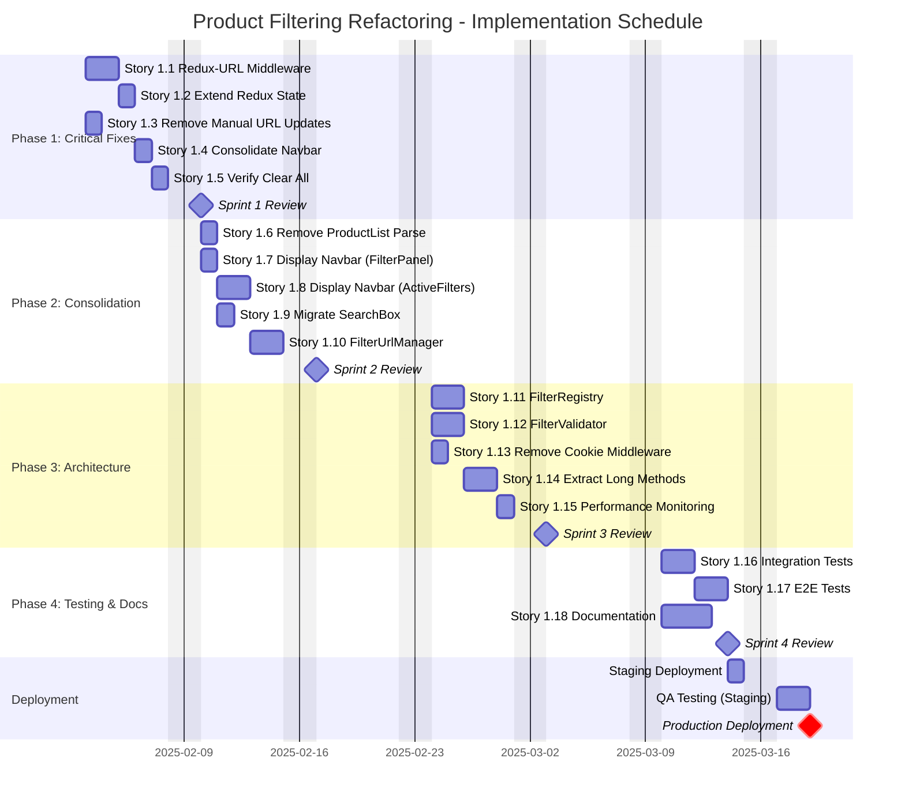

# Product Filtering Refactoring - Implementation Schedule

**Epic**: Product Filtering State Management Refactoring
**Total Stories**: 18 stories across 4 phases
**Total Effort**: ~30 developer-days
**Schedule Created**: 2025-01-19
**Target Start Date**: [TBD - To Be Determined]
**Target Completion Date**: [TBD - Based on start date + 8 weeks]

---

## Table of Contents

1. [Executive Summary](#executive-summary)
2. [Sprint Overview](#sprint-overview)
3. [Detailed Sprint Breakdown](#detailed-sprint-breakdown)
4. [Gantt Chart](#gantt-chart)
5. [Resource Allocation](#resource-allocation)
6. [Milestones and Deliverables](#milestones-and-deliverables)
7. [Risk Management](#risk-management)
8. [Success Metrics](#success-metrics)

---

## Executive Summary

### Schedule Overview

- **Duration**: 8 weeks (4 sprints × 2 weeks each)
- **Team Size**: 2-3 developers recommended
- **Total Effort**: ~30 developer-days
- **Sprint Capacity**: Assuming 60% capacity (6 days/week per developer for actual development)

### Key Dates

| Milestone | Target Week | Deliverable |
|-----------|-------------|-------------|
| **Sprint 1 Complete** | Week 2 | Phase 1 complete (Critical Fixes) |
| **Sprint 2 Complete** | Week 4 | Phase 2 complete (Consolidation) |
| **Sprint 3 Complete** | Week 6 | Phase 3 complete (Architecture) |
| **Sprint 4 Complete** | Week 8 | Phase 4 complete (Testing + Docs) |
| **Production Deploy** | Week 9 | Live in production |

### Sprint Allocation

```
Sprint 1 (Week 1-2):  Phase 1 - Critical Fixes (5 stories, 6 days)
Sprint 2 (Week 3-4):  Phase 2 - Cleanup & Consolidation (5 stories, 8 days)
Sprint 3 (Week 5-6):  Phase 3 - Architecture Improvements (5 stories, 9 days)
Sprint 4 (Week 7-8):  Phase 4 - Testing & Documentation (3 stories, 6 days)
```

---

## Sprint Overview

### Sprint 1: Phase 1 - Critical Fixes (Week 1-2)

**Goal**: Fix critical bugs that affect user experience

**Stories**: 5 stories (1.1 - 1.5)
**Total Effort**: 6 developer-days
**Team**: 2 developers
**Sprint Capacity**: 12 days (2 devs × 6 days)
**Buffer**: 6 days (50%)

| Story | Title | Effort | Assigned To | Dependencies |
|-------|-------|--------|-------------|--------------|
| 1.1 | Redux-to-URL Middleware | 2 days | Dev 1 | None |
| 1.2 | Extend Redux State (Navbar) | 0.5 days | Dev 1 | 1.1 |
| 1.3 | Remove Manual URL Updates | 1 day | Dev 2 | 1.1 |
| 1.4 | Consolidate Navbar Filters | 1 day | Dev 2 | 1.2, 1.3 |
| 1.5 | Verify Clear All + URL Reset | 0.5 days | Dev 1 | 1.4 |

**Sprint Goals**:
- ✅ Redux ↔ URL synchronization working
- ✅ No manual URL updates in navigation handlers
- ✅ All critical bugs fixed
- ✅ QA testing passed

**Sprint Review**: Demo filter synchronization and clear all functionality

---

### Sprint 2: Phase 2 - Cleanup & Consolidation (Week 3-4)

**Goal**: Consolidate filter management and remove redundant code

**Stories**: 5 stories (1.6 - 1.10)
**Total Effort**: 8 developer-days
**Team**: 2 developers
**Sprint Capacity**: 12 days (2 devs × 6 days)
**Buffer**: 4 days (33%)

| Story | Title | Effort | Assigned To | Dependencies |
|-------|-------|--------|-------------|--------------|
| 1.6 | Remove ProductList URL Parsing | 1 day | Dev 1 | Sprint 1 complete |
| 1.7 | Display Navbar Filters in FilterPanel | 1 day | Dev 2 | Sprint 1 complete |
| 1.8 | Display Navbar Filters in ActiveFilters | 1.5 days | Dev 1 | 1.7 |
| 1.9 | Migrate SearchBox to Redux | 1 day | Dev 2 | 1.6 |
| 1.10 | Centralized FilterUrlManager | 2 days | Dev 1 + Dev 2 | 1.6, 1.9 |

**Sprint Goals**:
- ✅ Navbar filters fully integrated
- ✅ SearchBox using Redux (no local state)
- ✅ FilterUrlManager utility created
- ✅ Code cleanup complete
- ✅ Unit tests for all changes

**Sprint Review**: Demo consolidated filter management

---

### Sprint 3: Phase 3 - Architecture Improvements (Week 5-6)

**Goal**: Implement robust architecture patterns for extensibility

**Stories**: 5 stories (1.11 - 1.15)
**Total Effort**: 9 developer-days
**Team**: 2-3 developers (recommend adding 3rd developer)
**Sprint Capacity**: 12-18 days (2-3 devs × 6 days)
**Buffer**: 3-9 days (25-50%)

| Story | Title | Effort | Assigned To | Dependencies |
|-------|-------|--------|-------------|--------------|
| 1.11 | FilterRegistry Pattern | 2 days | Dev 1 | Sprint 2 complete |
| 1.12 | FilterValidator Utility | 2 days | Dev 2 | Sprint 2 complete |
| 1.13 | Remove Cookie Middleware | 0.5 days | Dev 3 (or Dev 1) | Sprint 1 verified |
| 1.14 | Extract Long Methods (filtersSlice) | 2 days | Dev 1 | 1.11 |
| 1.15 | Performance Monitoring | 1 day | Dev 2 | 1.11, 1.12, 1.14 |

**Sprint Goals**:
- ✅ FilterRegistry pattern implemented
- ✅ Validation prevents invalid combinations
- ✅ Cookie middleware removed
- ✅ FiltersSlice refactored (modular)
- ✅ Performance monitoring in dev mode
- ✅ Integration tests passing

**Sprint Review**: Demo registry pattern, validation, and performance monitoring

---

### Sprint 4: Phase 4 - Testing & Documentation (Week 7-8)

**Goal**: Comprehensive testing and documentation for production readiness

**Stories**: 3 stories (1.16 - 1.18)
**Total Effort**: 6 developer-days
**Team**: 2-3 developers
**Sprint Capacity**: 12-18 days (2-3 devs × 6 days)
**Buffer**: 6-12 days (50-67%)

| Story | Title | Effort | Assigned To | Dependencies |
|-------|-------|--------|-------------|--------------|
| 1.16 | Integration Test Suite | 2 days | Dev 2 (QA focused) | All stories 1.1-1.15 |
| 1.17 | E2E Test Suite (Playwright) | 2 days | Dev 2 (QA focused) | 1.16 |
| 1.18 | Documentation & Knowledge Transfer | 2 days | Dev 1 + Dev 3 | All stories complete |

**Sprint Goals**:
- ✅ Integration tests: 90%+ coverage
- ✅ E2E tests: All critical paths covered
- ✅ Cross-browser testing passed
- ✅ Complete documentation delivered
- ✅ Team onboarding completed
- ✅ **Production ready!**

**Sprint Review**: Demo complete system, present documentation, celebrate! 🎉

---

## Detailed Sprint Breakdown

### Sprint 1: Week 1-2 (Phase 1 - Critical Fixes)

#### Week 1

**Monday - Wednesday** (Dev 1):
- Story 1.1: Implement urlSyncMiddleware
  - Create middleware file
  - Configure in store
  - Write unit tests
  - Test Redux → URL synchronization

**Monday - Tuesday** (Dev 2):
- Story 1.3: Remove manual URL updates from navigation
  - Identify all manual `navigate()` calls
  - Remove URL updates
  - Verify middleware handles URL
  - Update tests

**Wednesday - Thursday** (Dev 1):
- Story 1.2: Extend Redux state for navbar filters
  - Add navbar filter fields to Redux
  - Add actions/reducers
  - Update selectors
  - Write tests

**Wednesday - Friday** (Dev 2):
- Story 1.4: Consolidate navbar filter usage
  - Update useProductsSearch to use Redux
  - Remove URL parsing from hook
  - Test integration
  - Code review

**Thursday - Friday** (Dev 1):
- Story 1.5: Verify clear all + URL reset
  - Test clearAllFilters action
  - Verify URL resets to /products
  - Integration testing
  - Bug fixes

#### Week 2

**Monday - Tuesday** (Both Devs):
- Bug fixes and refinements
- Code review and merge PRs
- Integration testing
- Sprint review preparation

**Wednesday**:
- Sprint 1 Review & Demo
- Retrospective
- Sprint 2 Planning

**Thursday - Friday**:
- Buffer time / Start Sprint 2 stories

---

### Sprint 2: Week 3-4 (Phase 2 - Consolidation)

#### Week 3

**Monday - Tuesday** (Dev 1):
- Story 1.6: Remove ProductList URL parsing
  - Keep only initial mount hydration
  - Remove navigation-triggered parsing
  - Update tests
  - Verify no regressions

**Monday - Tuesday** (Dev 2):
- Story 1.7: Display navbar filters in FilterPanel
  - Add UI for tutorial_format dropdown
  - Add distance_learning checkbox
  - Add tutorial checkbox
  - Wire up Redux actions
  - Test UI interactions

**Wednesday - Thursday** (Dev 1):
- Story 1.8: Display navbar filters in ActiveFilters
  - Update FILTER_CONFIG for navbar filters
  - Add getDisplayValue functions
  - Test chip rendering
  - Test chip removal

**Wednesday - Thursday** (Dev 2):
- Story 1.9: Migrate SearchBox to Redux
  - Remove local state
  - Use Redux actions
  - Update tests
  - Verify search functionality

**Friday** (Both Devs):
- Story 1.10: Create FilterUrlManager utility
  - Design API (toUrlParams, fromUrlParams, buildUrl)
  - Implement methods
  - Write comprehensive tests
  - Refactor existing code to use utility

#### Week 4

**Monday - Tuesday** (Both Devs):
- Story 1.10 completion (if needed)
- Integration testing
- Refactoring and cleanup
- Update all components to use FilterUrlManager

**Wednesday**:
- Sprint 2 Review & Demo
- Retrospective
- Sprint 3 Planning

**Thursday - Friday**:
- Buffer time / Start Sprint 3 stories

---

### Sprint 3: Week 5-6 (Phase 3 - Architecture)

#### Week 5

**Monday - Wednesday** (Dev 1):
- Story 1.11: FilterRegistry Pattern
  - Design registry API
  - Implement register(), getConfig(), toUrlParams(), fromUrlParams()
  - Register all existing filter types
  - Write comprehensive tests
  - Update components to use registry

**Monday - Wednesday** (Dev 2):
- Story 1.12: FilterValidator Utility
  - Design validator API
  - Implement validation rules:
    - Tutorial format requires tutorial
    - Product requires subject
    - Other business rules
  - Write tests for all rules
  - Integrate with FilterPanel

**Monday - Tuesday** (Dev 3 or Dev 1):
- Story 1.13: Remove Cookie Middleware
  - Remove cookieMiddleware from store
  - Delete cookiePersistenceMiddleware.js
  - Remove cookie-related actions
  - Search and remove all cookie references
  - Test URL persistence works

**Thursday - Friday** (Dev 1):
- Story 1.14: Extract Long Methods from filtersSlice
  - Split into baseFilters.slice.js
  - Split into navigationFilters.slice.js
  - Create filterSelectors.js
  - Maintain public API compatibility
  - Update tests

#### Week 6

**Monday - Tuesday** (Dev 2):
- Story 1.15: Performance Monitoring
  - Create PerformanceTracker utility
  - Create performance budget config
  - Create performance monitoring middleware
  - Add timing to urlSyncMiddleware
  - Add timing to API calls
  - Add timing to validation
  - Test in development mode

**Wednesday - Thursday** (All Devs):
- Integration testing (Phase 3)
- Bug fixes
- Performance testing
- Code review and refactoring

**Friday**:
- Sprint 3 Review & Demo
- Retrospective
- Sprint 4 Planning

---

### Sprint 4: Week 7-8 (Phase 4 - Testing & Docs)

#### Week 7

**Monday - Wednesday** (Dev 2 - QA Lead):
- Story 1.16: Integration Test Suite
  - Create test utilities (testHelpers.js)
  - Set up MSW for API mocking
  - Write Redux middleware integration tests
  - Write FilterPanel integration tests
  - Write filter persistence tests
  - Write FilterRegistry integration tests
  - Write FilterValidator integration tests
  - Achieve 90%+ coverage

**Monday - Wednesday** (Dev 1 + Dev 3):
- Story 1.18: Documentation (Part 1)
  - Start architecture documentation
  - Create developer onboarding guide
  - Begin API reference

**Thursday - Friday** (Dev 2):
- Story 1.17: E2E Test Suite
  - Install and configure Playwright
  - Create Page Object Model (ProductsPage)
  - Write basic filtering E2E tests
  - Write filter persistence E2E tests

#### Week 8

**Monday - Tuesday** (Dev 2):
- Story 1.17: E2E Test Suite (continued)
  - Write filter validation E2E tests
  - Write user workflow E2E tests
  - Write URL synchronization tests
  - Cross-browser testing
  - CI/CD integration

**Monday - Wednesday** (Dev 1 + Dev 3):
- Story 1.18: Documentation (Part 2)
  - Complete architecture docs with diagrams
  - Create testing guide
  - Create migration guide
  - Create troubleshooting guide
  - Create code recipes
  - Add JSDoc comments to code
  - Update main README

**Thursday** (All Devs):
- Final integration testing
- Final bug fixes
- Performance testing
- Cross-browser testing
- Staging deployment

**Friday**:
- Sprint 4 Review & Demo
- Epic Retrospective
- Team celebration! 🎉

---

## Gantt Chart

### Visual Timeline (Mermaid Gantt)



### Timeline Summary

```
┌─────────────────────────────────────────────────────────────────────────┐
│                   EPIC IMPLEMENTATION TIMELINE                          │
├─────────────────────────────────────────────────────────────────────────┤
│                                                                         │
│  Week 1-2:  ████████ Phase 1 - Critical Fixes (5 stories)              │
│             └─> Sprint 1 Review                                         │
│                                                                         │
│  Week 3-4:  ██████████ Phase 2 - Consolidation (5 stories)             │
│             └─> Sprint 2 Review                                         │
│                                                                         │
│  Week 5-6:  ████████████ Phase 3 - Architecture (5 stories)            │
│             └─> Sprint 3 Review                                         │
│                                                                         │
│  Week 7-8:  ██████████ Phase 4 - Testing & Docs (3 stories)            │
│             └─> Sprint 4 Review & Epic Complete! 🎉                     │
│                                                                         │
│  Week 9:    ████ Staging → Production Deployment                        │
│                                                                         │
└─────────────────────────────────────────────────────────────────────────┘
```

---

## Resource Allocation

### Team Composition

**Minimum Team**: 2 developers
**Recommended Team**: 2-3 developers

#### Developer Roles

**Dev 1: Senior Frontend Developer** (Lead)
- Focus: Redux architecture, middleware, state management
- Stories: 1.1, 1.2, 1.5, 1.6, 1.8, 1.10 (shared), 1.11, 1.14
- Additional: Code reviews, architecture decisions

**Dev 2: Frontend Developer (QA Focus)**
- Focus: Component integration, testing, validation
- Stories: 1.3, 1.4, 1.7, 1.9, 1.10 (shared), 1.12, 1.15, 1.16, 1.17
- Additional: Test automation, E2E testing

**Dev 3: Frontend Developer** (Optional, recommended for Sprint 3+)
- Focus: Documentation, utility functions, cleanup
- Stories: 1.13, 1.18 (shared)
- Additional: Code cleanup, documentation

### Sprint Capacity Planning

**Assumptions**:
- 2-week sprints
- 5 working days per week
- 60% development capacity (6 days/week actual coding)
- 40% overhead (meetings, code review, bug fixes, support)

**Sprint Capacity**:
- 2 developers: 12 development days per sprint
- 3 developers: 18 development days per sprint

**Utilization by Sprint**:

| Sprint | Stories | Effort | Team Size | Capacity | Utilization | Buffer |
|--------|---------|--------|-----------|----------|-------------|--------|
| Sprint 1 | 5 | 6 days | 2 devs | 12 days | 50% | 6 days (50%) |
| Sprint 2 | 5 | 8 days | 2 devs | 12 days | 67% | 4 days (33%) |
| Sprint 3 | 5 | 9 days | 3 devs | 18 days | 50% | 9 days (50%) |
| Sprint 4 | 3 | 6 days | 3 devs | 18 days | 33% | 12 days (67%) |

### Skills Required

- ✅ **Redux/Redux Toolkit**: Expert level
- ✅ **React**: Advanced level
- ✅ **JavaScript/ES6+**: Advanced level
- ✅ **Testing (Jest, RTL)**: Intermediate level
- ✅ **E2E Testing (Playwright/Cypress)**: Intermediate level
- ✅ **Git/GitHub**: Intermediate level
- ✅ **Technical Writing**: Basic level

---

## Milestones and Deliverables

### Major Milestones

#### Milestone 1: Sprint 1 Complete (End of Week 2)
**Date**: Week 2, Friday
**Deliverable**: Phase 1 - Critical Fixes Complete

**Acceptance Criteria**:
- ✅ urlSyncMiddleware implemented and tested
- ✅ Redux state extended for navbar filters
- ✅ Manual URL updates removed from navigation
- ✅ Navbar filters consolidated in useProductsSearch
- ✅ Clear all filters resets URL correctly
- ✅ All Sprint 1 stories merged to main
- ✅ Integration tests passing
- ✅ Code reviewed and approved

**Demo**: Show filter synchronization, URL updates, clear all functionality

---

#### Milestone 2: Sprint 2 Complete (End of Week 4)
**Date**: Week 4, Friday
**Deliverable**: Phase 2 - Cleanup & Consolidation Complete

**Acceptance Criteria**:
- ✅ ProductList URL parsing simplified (mount only)
- ✅ Navbar filters displayed in FilterPanel
- ✅ Navbar filters displayed in ActiveFilters
- ✅ SearchBox migrated to Redux (no local state)
- ✅ FilterUrlManager utility created and integrated
- ✅ All Sprint 2 stories merged to main
- ✅ Code cleanup complete (no redundant code)
- ✅ Unit tests passing (90%+ coverage)

**Demo**: Show consolidated filter management, SearchBox integration

---

#### Milestone 3: Sprint 3 Complete (End of Week 6)
**Date**: Week 6, Friday
**Deliverable**: Phase 3 - Architecture Improvements Complete

**Acceptance Criteria**:
- ✅ FilterRegistry pattern implemented
- ✅ FilterValidator utility created
- ✅ Cookie middleware removed
- ✅ FiltersSlice refactored (modular)
- ✅ Performance monitoring implemented (dev mode)
- ✅ All Sprint 3 stories merged to main
- ✅ Integration tests passing
- ✅ Performance budgets defined and monitored

**Demo**: Show registry pattern extensibility, validation, performance monitoring

---

#### Milestone 4: Sprint 4 Complete (End of Week 8)
**Date**: Week 8, Friday
**Deliverable**: Phase 4 - Testing & Documentation Complete

**Acceptance Criteria**:
- ✅ Integration test suite complete (90%+ coverage)
- ✅ E2E test suite complete (Playwright)
- ✅ Cross-browser testing passed (Chrome, Firefox, Safari)
- ✅ Complete documentation delivered
- ✅ All Sprint 4 stories merged to main
- ✅ All tests passing in CI/CD
- ✅ Team onboarding completed using documentation

**Demo**: Demo complete system, present documentation, celebrate epic completion! 🎉

---

#### Milestone 5: Production Deployment (Week 9)
**Date**: Week 9, Wednesday
**Deliverable**: Filtering System Live in Production

**Acceptance Criteria**:
- ✅ Code deployed to staging environment
- ✅ QA testing completed on staging
- ✅ Performance testing passed
- ✅ Security review passed
- ✅ Deployed to production
- ✅ Smoke tests passed in production
- ✅ Monitoring and alerts configured
- ✅ No critical issues in first 24 hours

**Communication**: Announce launch to team, stakeholders, users

---

## Risk Management

### Risk Register

| Risk | Probability | Impact | Mitigation | Owner |
|------|-------------|--------|------------|-------|
| **Story dependencies block progress** | Medium | High | Plan stories in dependency order, identify critical path | PM |
| **Developer unavailability** | Medium | High | Cross-train team, document work, maintain buffer | Dev Lead |
| **Technical complexity underestimated** | Medium | Medium | Add buffer time, early prototyping, code reviews | Dev Lead |
| **Integration issues between phases** | Low | High | Integration testing after each sprint, CI/CD | QA Lead |
| **Breaking changes in dependencies** | Low | Medium | Lock dependency versions, test before upgrading | Dev 1 |
| **Performance regressions** | Medium | Medium | Performance monitoring (Story 1.15), baseline metrics | Dev 2 |
| **Test flakiness** | High | Low | Proper async handling, cleanup, retry logic | Dev 2 |
| **Documentation becomes outdated** | High | Low | Update docs with code changes, PR checklist | All Devs |
| **Scope creep** | Medium | Medium | Strict story scope, defer enhancements to backlog | PM |
| **Production bugs post-deployment** | Medium | High | Comprehensive testing, staged rollout, rollback plan | Dev Lead |

### Mitigation Strategies

#### For Schedule Risks

1. **Buffer Time**: Each sprint includes 25-67% buffer
2. **Early Warning**: Daily standups to identify blockers
3. **Flexible Scope**: Stories can be deferred if needed
4. **Parallel Work**: Stories 1.11 and 1.12 can run parallel

#### For Technical Risks

1. **Code Reviews**: All PRs reviewed by at least one other developer
2. **Integration Testing**: Test after each sprint
3. **CI/CD**: Automated testing on every commit
4. **Performance Monitoring**: Track metrics throughout development

#### For Team Risks

1. **Documentation**: Detailed story documents for each task
2. **Knowledge Sharing**: Pair programming, code reviews
3. **Backup Plans**: Stories can be reassigned if needed
4. **Onboarding**: Story 1.18 creates onboarding materials

---

## Success Metrics

### Sprint Success Criteria

**Each sprint considered successful if**:
- ✅ All planned stories completed (or justified deferrals)
- ✅ All tests passing (unit + integration)
- ✅ Code reviewed and merged to main
- ✅ Demo completed in sprint review
- ✅ No critical bugs introduced
- ✅ Sprint retrospective completed

### Epic Success Criteria

**Epic considered successful if**:
- ✅ All 18 stories completed
- ✅ All acceptance criteria met
- ✅ Test coverage ≥ 90%
- ✅ Documentation complete
- ✅ Deployed to production
- ✅ No critical production issues in first week
- ✅ Performance metrics within budgets
- ✅ Team satisfied with code quality

### Key Performance Indicators (KPIs)

**Development KPIs**:
- **Story Completion Rate**: Target 100% (all 18 stories)
- **Sprint Velocity**: Track actual vs. planned effort
- **Code Review Time**: Target < 24 hours per PR
- **Merge Frequency**: Target daily merges to main

**Quality KPIs**:
- **Test Coverage**: Target ≥ 90%
- **Bug Escape Rate**: Target < 5 bugs to production
- **Code Quality**: Pass all linting, no critical code smells
- **Performance**: All operations within defined budgets

**Team KPIs**:
- **Team Satisfaction**: Survey after each sprint (target: satisfied)
- **Knowledge Sharing**: All team members understand architecture
- **Documentation Usage**: New developer onboarded successfully

---

## Dependencies and Prerequisites

### Technical Prerequisites

**Before Sprint 1 Starts**:
- ✅ Development environment set up (Node.js, Python, PostgreSQL)
- ✅ Git repository access for all team members
- ✅ Development server running locally for all devs
- ✅ Code editor and recommended extensions installed
- ✅ Team has reviewed epic PRD and story documents

**Before Each Sprint**:
- ✅ Previous sprint complete (or stories deferred with justification)
- ✅ All PRs from previous sprint merged
- ✅ Sprint planning meeting completed
- ✅ Stories assigned to developers
- ✅ Dependencies identified and addressed

### External Dependencies

- **Backend API**: Must be stable and available during development
- **Design Team**: Material-UI components and styling decisions
- **QA Team**: Testing support for Sprints 3-4
- **DevOps**: CI/CD pipeline configuration, staging/production access
- **Product Owner**: Available for clarifications and acceptance

---

## Communication Plan

### Regular Meetings

**Daily Standup** (15 minutes):
- Time: 10:00 AM daily
- Format: What did you do? What will you do? Any blockers?
- Attendees: Dev team

**Sprint Planning** (2 hours):
- When: First Monday of each sprint
- Format: Review stories, estimate, assign, commit to sprint goal
- Attendees: Dev team, PM, Product Owner

**Sprint Review** (1 hour):
- When: Last Friday of each sprint
- Format: Demo completed stories, gather feedback
- Attendees: Dev team, stakeholders, PM, Product Owner

**Sprint Retrospective** (1 hour):
- When: Last Friday of each sprint (after review)
- Format: What went well? What could improve? Action items
- Attendees: Dev team, PM

### Status Reporting

**Weekly Status Update**:
- **To**: Stakeholders, management
- **Content**: Sprint progress, risks, achievements
- **Format**: Email or Slack message
- **Sent by**: PM or Dev Lead

**Epic Progress Dashboard**:
- **Updated**: Daily (automated via CI/CD)
- **Includes**: Stories completed, test coverage, velocity
- **Access**: Shared dashboard link for stakeholders

---

## Appendix

### Sprint Planning Template

```markdown
## Sprint [Number] Planning

**Sprint Goal**: [High-level goal for this sprint]

**Sprint Duration**: [Start Date] to [End Date] (2 weeks)

**Team Capacity**: [X] developers × 6 days = [Y] developer-days

### Stories Committed

| Story | Title | Effort | Assignee | Dependencies |
|-------|-------|--------|----------|--------------|
| X.Y | Story Title | Z days | Dev Name | Previous stories |

### Sprint Backlog

- [ ] Story X.Y: [Title]
- [ ] Story X.Y: [Title]
- [ ] Story X.Y: [Title]

### Risks and Mitigation

- **Risk 1**: [Description] → **Mitigation**: [Plan]
- **Risk 2**: [Description] → **Mitigation**: [Plan]

### Definition of Done

- [ ] All acceptance criteria met
- [ ] Tests written and passing
- [ ] Code reviewed and approved
- [ ] Merged to main branch
- [ ] Documentation updated
```

### Sprint Review Template

```markdown
## Sprint [Number] Review

**Sprint Goal**: [Goal from planning]

**Date**: [Review Date]

### Completed Stories

- ✅ Story X.Y: [Title] - [Demo link/notes]
- ✅ Story X.Y: [Title] - [Demo link/notes]

### Demo Highlights

1. [Key feature/improvement demonstrated]
2. [Key feature/improvement demonstrated]
3. [Key feature/improvement demonstrated]

### Metrics

- **Stories Completed**: X of Y planned
- **Velocity**: X developer-days
- **Test Coverage**: X%
- **Bugs Found**: X
- **Bugs Fixed**: X

### Feedback Received

- [Stakeholder feedback]
- [User feedback]
- [Team feedback]

### Next Sprint Preview

- Story X.Y: [Title]
- Story X.Y: [Title]
```

### Sprint Retrospective Template

```markdown
## Sprint [Number] Retrospective

**Date**: [Retro Date]

### What Went Well? 😊

- [Thing that went well]
- [Thing that went well]
- [Thing that went well]

### What Could Be Improved? 🤔

- [Thing to improve]
- [Thing to improve]
- [Thing to improve]

### Action Items 🎯

| Action | Owner | Due Date |
|--------|-------|----------|
| [Action to take] | [Name] | [Date] |
| [Action to take] | [Name] | [Date] |

### Shoutouts 🙌

- [Team member] for [contribution]
- [Team member] for [contribution]
```

---

## Version History

| Version | Date | Changes | Author |
|---------|------|---------|--------|
| 1.0 | 2025-01-19 | Initial implementation schedule created | PM Agent |

---

## Contact and Support

**Project Manager**: [Name/Email]
**Dev Lead**: [Name/Email]
**QA Lead**: [Name/Email]
**Product Owner**: [Name/Email]

**Slack Channel**: #epic-filtering-refactoring
**Jira Board**: [Link to Jira board]
**Documentation**: `docs/` directory in repository

---

**Ready to start?** 🚀

1. Schedule Sprint 1 Planning meeting
2. Assign Story 1.1 and 1.3 to kick off Sprint 1
3. Set up project board and tracking
4. Begin development!

**Good luck with the implementation!** 💪
