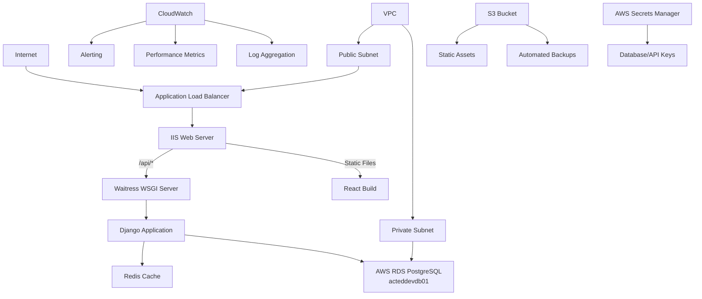

# Admin3 Production Server Setup - Comprehensive Guide
## AWS EC2 Windows Server 2025 - Enterprise-Grade Deployment

### **Overview**
This comprehensive guide provides enterprise-grade deployment procedures for Admin3 on AWS EC2 Windows Server 2025. It includes security hardening, monitoring, backup procedures, and performance optimization suitable for production environments and end-user demos.

### **Architecture Overview**


---

## **Table of Contents**

1. [Pre-Production Checklist](#1-pre-production-checklist)
2. [Infrastructure Setup](#2-infrastructure-setup)
3. [Security Hardening](#3-security-hardening)
4. [Application Deployment](#4-application-deployment)
5. [Monitoring & Logging](#5-monitoring--logging)
6. [Backup & Recovery](#6-backup--recovery)
7. [Performance Optimization](#7-performance-optimization)
8. [CI/CD Integration](#8-cicd-integration)
9. [Troubleshooting Guide](#9-troubleshooting-guide)
10. [Maintenance Procedures](#10-maintenance-procedures)
11. [Security Incident Response](#11-security-incident-response)

---

## **1. Pre-Production Checklist**

### **1.1 AWS Account Preparation**
- [ ] AWS account with appropriate permissions
- [ ] VPC configured with public/private subnets
- [ ] Security groups defined for EC2 and RDS
- [ ] IAM roles created
- [ ] S3 buckets for backups and static assets
- [ ] CloudWatch configured
- [ ] AWS Secrets Manager setup
- [ ] RDS PostgreSQL instance (acteddevdb01) created
- [ ] RDS subnet group configured
- [ ] RDS security group allows EC2 access on port 5432

### **1.2 Domain and SSL Requirements**
- [ ] Domain name registered and configured
- [ ] SSL certificate obtained (Let's Encrypt or AWS Certificate Manager)
- [ ] DNS records configured
- [ ] CDN setup (CloudFront) if required

### **1.3 Backup and Recovery Planning**
- [ ] Backup strategy defined (RTO/RPO requirements)
- [ ] Recovery procedures documented
- [ ] Test restore procedures validated

---

## **2. Infrastructure Setup**

### **2.1 Enhanced EC2 Instance Configuration**

#### **2.1.1 Instance Specifications**
```yaml
Instance Type: m7i.large (minimum for production)
vCPUs: 2
Memory: 8 GB
Storage: 
  - Root: 50 GB GP3
  - Data: 100 GB GP3 (separate volume for PostgreSQL)
  - Logs: 20 GB GP3
Network: Enhanced networking enabled
```

#### **2.1.2 Security Groups Configuration**

**EC2 Security Group (Admin3-EC2-SG):**
```yaml
Inbound Rules:
  - HTTP (80): 0.0.0.0/0
  - HTTPS (443): 0.0.0.0/0
  - RDP (3389): [Your IP Address only]
  - Redis (6379): 127.0.0.1/32 (localhost only)
  
Outbound Rules:
  - HTTPS (443): 0.0.0.0/0 (for updates, Let's Encrypt)
  - PostgreSQL (5432): [RDS Security Group]
  - SMTP (587): [Email provider only]
  - HTTP (80): 0.0.0.0/0 (for package downloads)
```

**RDS Security Group (Admin3-RDS-SG):**
```yaml
Inbound Rules:
  - PostgreSQL (5432): [EC2 Security Group]
  
Outbound Rules:
  - None (RDS doesn't need outbound rules)
```

#### **2.1.3 Enhanced Initial Setup**
```powershell
# Set execution policy for PowerShell
Set-ExecutionPolicy -ExecutionPolicy RemoteSigned -Scope LocalMachine

# Install Windows Updates
Install-Module PSWindowsUpdate -Force
Get-WindowsUpdate -Install -AcceptAll -AutoReboot

# Install Chocolatey
Set-ExecutionPolicy Bypass -Scope Process -Force; `
[System.Net.ServicePointManager]::SecurityProtocol = [System.Net.ServicePointManager]::SecurityProtocol -bor 3072; `
iex ((New-Object System.Net.WebClient).DownloadString('https://community.chocolatey.org/install.ps1'))

# Install required software
choco install -y python nodejs git redis nginx awscli
choco install -y nssm # For service management
choco install -y 7zip # For backup compression
```

### **2.2 AWS RDS PostgreSQL Setup**

#### **2.2.1 RDS Instance Configuration**

**Create RDS PostgreSQL Instance:**
```yaml
Instance Identifier: acteddevdb01
Engine: PostgreSQL 17.x
Engine Version: 17.4 (or latest)
Instance Class: db.t4g.micro
Storage Type: gp2
Allocated Storage: 20 GB (minimum)
Storage Encryption: Enabled
Multi-AZ: No (dev) or Yes (prod)
Publicly Accessible: No
VPC Security Groups: Admin3-RDS-SG
DB Subnet Group: Create with private subnets
Backup Retention: 7 days (minimum)
Backup Window: 03:00-04:00 UTC
Maintenance Window: Sunday 04:00-05:00 UTC
Deletion Protection: Yes
```

#### **2.2.2 Install PostgreSQL Client Tools on EC2**
```powershell
# Install PostgreSQL client tools only (no server needed)
choco install postgresql --params '/Password:NotUsed /ClientOnly:true'

# Or install just the client tools
choco install postgresql-client

# Install OpenSSL for SSL connections
choco install openssl
```

#### **2.2.3 Database Setup via RDS Console or CLI**
```powershell
# Set environment variables for RDS connection
$env:PGHOST = "acteddevdb01.crueqe6us4nv.eu-west-2.rds.amazonaws.com"
$env:PGPORT = "5432"
$env:PGUSER = "postgres"
$env:PGPASSWORD = "NeiTzsch3!l8AA"
$env:PGDATABASE = "postgres"

# Connect to RDS and create database (quoted to preserve case)
psql -h $env:PGHOST -U $env:PGUSER -c "CREATE DATABASE acteddbdev01;"

# Create application user
psql -h $env:PGHOST -U $env:PGUSER -c "CREATE USER actedadmin WITH PASSWORD 'Act3d@dm1n0EEoo';"

# Grant database-level privileges (while connected to postgres)
psql -h $env:PGHOST -U $env:PGUSER -c "GRANT ALL PRIVILEGES ON DATABASE acteddbdev01 TO actedadmin;"

# NOW connect to the ACTEDDBDEV01 database for schema permissions
psql -h $env:PGHOST -U $env:PGUSER -d acteddbdev01 -c "GRANT USAGE ON SCHEMA public TO actedadmin;"
psql -h $env:PGHOST -U $env:PGUSER -d acteddbdev01 -c "GRANT CREATE ON SCHEMA public TO actedadmin;"

# Create backup user and set permissions
psql -h $env:PGHOST -U $env:PGUSER -c "CREATE USER backup_user WITH PASSWORD 'Act3dB@ckUq';"
psql -h $env:PGHOST -U $env:PGUSER -d acteddbdev01 -c "GRANT CONNECT ON DATABASE acteddbdev01 TO backup_user;"
psql -h $env:PGHOST -U $env:PGUSER -d acteddbdev01 -c "GRANT USAGE ON SCHEMA public TO backup_user;"
psql -h $env:PGHOST -U $env:PGUSER -d acteddbdev01 -c "GRANT SELECT ON ALL TABLES IN SCHEMA public TO backup_user;"
psql -h $env:PGHOST -U $env:PGUSER -d acteddbdev01 -c "ALTER DEFAULT PRIVILEGES IN SCHEMA public GRANT SELECT ON TABLES TO backup_user;"

# Clear sensitive environment variables
$env:PGPASSWORD = $null
```

#### **2.2.4 EC2 to RDS Connection Setup**
```powershell
# Test RDS connection from EC2
$rdsEndpoint = "acteddevdb01.crueqe6us4nv.eu-west-2.rds.amazonaws.com"
$testConnection = Test-NetConnection -ComputerName $rdsEndpoint -Port 5432

if ($testConnection.TcpTestSucceeded) {
    Write-Host "RDS connection successful" -ForegroundColor Green
} else {
    Write-Host "RDS connection failed - check security groups" -ForegroundColor Red
}

# Test database connection
$env:PGPASSWORD = "Act3d@dm1n0EEoo"
psql -h $rdsEndpoint -U actedadmin -d acteddbdev01 -c "SELECT version();"
$env:PGPASSWORD = $null
```

### **2.3 Redis Cache Setup (Fixed)**

#### **2.3.1 Redis Installation and Configuration**
```powershell
# Install Redis using chocolatey
choco install redis-64 -y

# Wait for installation to complete
Start-Sleep -Seconds 10

# Find Redis installation directory (Redis executables are in the redis folder, not redis-64)
$redisDir = "C:\ProgramData\chocolatey\lib\redis\tools"

# Verify Redis server executable exists
if (Test-Path "$redisDir\redis-server.exe") {
    Write-Host "Redis installed in: $redisDir" -ForegroundColor Green
} else {
    Write-Host "Redis installation not found, checking alternative locations..." -ForegroundColor Yellow
    # Alternative search if not in expected location
    $redisPath = Get-ChildItem -Path "C:\ProgramData\chocolatey\lib" -Recurse -Name "redis-server.exe" | Select-Object -First 1
    if ($redisPath) {
        $redisDir = Split-Path $redisPath -Parent
        Write-Host "Redis found in: $redisDir" -ForegroundColor Green
    } else {
        Write-Error "Redis installation not found. Please check chocolatey installation."
        exit 1
    }
}

# Create Redis configuration file
$redisConfig = "$redisDir\redis.conf"
$configContent = @"
# Redis Configuration for Admin3
port 6379
bind 127.0.0.1
protected-mode yes
requirepass R3d1sP@ssW

# Memory management
maxmemory 512mb
maxmemory-policy allkeys-lru

# Persistence
save 300 10
save 60 1000

# Logging
loglevel notice
logfile "C:\\logs\\redis\\redis.log"

# Windows specific
tcp-keepalive 60
timeout 0
"@

# Create logs directory
New-Item -ItemType Directory -Path "C:\logs\redis" -Force

# Write configuration file
$configContent | Out-File -FilePath $redisConfig -Encoding UTF8

Write-Host "Redis configuration created at: $redisConfig"
```

#### **2.3.2 Redis Windows Service Setup**
```powershell
# Install Redis as Windows service using NSSM
$redisExe = "$redisDir\redis-server.exe"
$serviceName = "Redis"

# Install NSSM if not already installed
if (-not (Get-Command nssm -ErrorAction SilentlyContinue)) {
    choco install nssm -y
}

# Install Redis service
nssm install $serviceName $redisExe $redisConfig
nssm set $serviceName AppDirectory $redisDir
nssm set $serviceName DisplayName "Redis Server"
nssm set $serviceName Description "Redis in-memory data structure store"
nssm set $serviceName Start SERVICE_AUTO_START
nssm set $serviceName AppStdout "C:\logs\redis\redis-stdout.log"
nssm set $serviceName AppStderr "C:\logs\redis\redis-stderr.log"
nssm set $serviceName AppRotateFiles 1
nssm set $serviceName AppRotateOnline 1
nssm set $serviceName AppRotateBytes 10485760  # 10MB

# Start Redis service
Start-Service $serviceName
Set-Service -Name $serviceName -StartupType Automatic

# Verify Redis is running
Start-Sleep -Seconds 5
$redisStatus = Get-Service -Name $serviceName
Write-Host "Redis service status: $($redisStatus.Status)" -ForegroundColor $(if ($redisStatus.Status -eq "Running") {"Green"} else {"Red"})
```

#### **2.3.3 Redis Connection Test**
```powershell
# Test Redis connection
try {
    # Install Redis CLI if not available
    if (-not (Get-Command redis-cli -ErrorAction SilentlyContinue)) {
        $env:PATH += ";$redisDir"
    }
    
    # Test connection
    $result = redis-cli -a "R3d1sP@ssW" ping
    if ($result -eq "PONG") {
        Write-Host "Redis connection successful" -ForegroundColor Green
    } else {
        Write-Host "Redis connection failed" -ForegroundColor Red
    }
} catch {
    Write-Host "Redis connection error: $_" -ForegroundColor Red
}
```

#### **2.3.4 Redis Troubleshooting**
```powershell
# Redis troubleshooting script
function Test-RedisHealth {
    Write-Host "Redis Health Check" -ForegroundColor Cyan
    Write-Host "==================" -ForegroundColor Cyan
    
    # Check service status
    $service = Get-Service -Name "Redis" -ErrorAction SilentlyContinue
    if ($service) {
        Write-Host "Service Status: $($service.Status)" -ForegroundColor $(if ($service.Status -eq "Running") {"Green"} else {"Red"})
    } else {
        Write-Host "Redis service not found" -ForegroundColor Red
        return
    }
    
    # Check process
    $process = Get-Process -Name "redis-server" -ErrorAction SilentlyContinue
    if ($process) {
        Write-Host "Process Status: Running (PID: $($process.Id))" -ForegroundColor Green
    } else {
        Write-Host "Redis process not running" -ForegroundColor Red
    }
    
    # Check port
    $port = Get-NetTCPConnection -LocalPort 6379 -ErrorAction SilentlyContinue
    if ($port) {
        Write-Host "Port 6379: Listening" -ForegroundColor Green
    } else {
        Write-Host "Port 6379: Not listening" -ForegroundColor Red
    }
    
    # Check logs
    $logFile = "C:\logs\redis\redis.log"
    if (Test-Path $logFile) {
        $recentLogs = Get-Content $logFile -Tail 5
        Write-Host "Recent logs:" -ForegroundColor Yellow
        $recentLogs | ForEach-Object { Write-Host "  $_" }
    }
}

# Run health check
Test-RedisHealth
```

---

## **2.4 EC2 to RDS Connection Configuration**

### **2.4.1 Network Configuration Prerequisites**

#### **VPC and Subnet Setup**
```yaml
VPC Configuration:
  - VPC CIDR: 10.0.0.0/16
  - Public Subnet: 10.0.1.0/24 (for EC2)
  - Private Subnet: 10.0.2.0/24 (for RDS)
  - Internet Gateway: Attached to VPC
  - NAT Gateway: In public subnet (for EC2 outbound traffic)
  - Route Tables: Configured for proper routing
```

#### **Security Group Configuration Details**
```powershell
# Create EC2 Security Group
aws ec2 create-security-group --group-name Admin3-EC2-SG --description "Security group for Admin3 EC2 instance"

# Add inbound rules for EC2
aws ec2 authorize-security-group-ingress --group-name Admin3-EC2-SG --protocol tcp --port 80 --cidr 0.0.0.0/0
aws ec2 authorize-security-group-ingress --group-name Admin3-EC2-SG --protocol tcp --port 443 --cidr 0.0.0.0/0
aws ec2 authorize-security-group-ingress --group-name Admin3-EC2-SG --protocol tcp --port 3389 --cidr YOUR_IP/32

# Create RDS Security Group
aws ec2 create-security-group --group-name Admin3-RDS-SG --description "Security group for Admin3 RDS instance"

# Add inbound rule for RDS (from EC2 security group)
aws ec2 authorize-security-group-ingress --group-name Admin3-RDS-SG --protocol tcp --port 5432 --source-group Admin3-EC2-SG
```

### **2.4.2 Connection Testing and Troubleshooting**

#### **Network Connectivity Test**
```powershell
# Test network connectivity to RDS
function Test-RDSConnectivity {
    param(
        [string]$RDSEndpoint = "acteddevdb01.xxxxxxxxxx.us-east-1.rds.amazonaws.com",
        [int]$Port = 5432
    )
    
    Write-Host "Testing RDS connectivity..." -ForegroundColor Cyan
    
    # Test TCP connection
    $tcpTest = Test-NetConnection -ComputerName $RDSEndpoint -Port $Port
    
    if ($tcpTest.TcpTestSucceeded) {
        Write-Host "✓ TCP connection to RDS successful" -ForegroundColor Green
        Write-Host "  Remote Address: $($tcpTest.RemoteAddress)" -ForegroundColor Gray
        Write-Host "  Remote Port: $($tcpTest.RemotePort)" -ForegroundColor Gray
    } else {
        Write-Host "✗ TCP connection to RDS failed" -ForegroundColor Red
        Write-Host "  Check security groups and network ACLs" -ForegroundColor Yellow
        return $false
    }
    
    # Test DNS resolution
    try {
        $dnsResult = Resolve-DnsName -Name $RDSEndpoint -Type A
        Write-Host "✓ DNS resolution successful" -ForegroundColor Green
        Write-Host "  IP Address: $($dnsResult.IPAddress)" -ForegroundColor Gray
    } catch {
        Write-Host "✗ DNS resolution failed: $_" -ForegroundColor Red
        return $false
    }
    
    return $true
}

# Run connectivity test
Test-RDSConnectivity
```

#### **Database Connection Test**
```powershell
# Test database connection and permissions
function Test-DatabaseConnection {
    param(
        [string]$Host = "acteddevdb01.xxxxxxxxxx.us-east-1.rds.amazonaws.com",
        [string]$Database = acteddbdev01,
        [string]$Username = "actedadmin",
        [string]$Password = "Act3d@dm1n0EEoo"
    )
    
    Write-Host "Testing database connection..." -ForegroundColor Cyan
    
    # Set environment variables
    $env:PGHOST = $Host
    $env:PGPORT = "5432"
    $env:PGDATABASE = $Database
    $env:PGUSER = $Username
    $env:PGPASSWORD = $Password
    
    try {
        # Test basic connection
        $result = psql -c "SELECT version();"
        if ($LASTEXITCODE -eq 0) {
            Write-Host "✓ Database connection successful" -ForegroundColor Green
        } else {
            Write-Host "✗ Database connection failed" -ForegroundColor Red
            return $false
        }
        
        # Test permissions
        $result = psql -c "SELECT current_user, current_database();"
        if ($LASTEXITCODE -eq 0) {
            Write-Host "✓ Database permissions verified" -ForegroundColor Green
        } else {
            Write-Host "✗ Database permissions check failed" -ForegroundColor Red
        }
        
        # Test table creation (and cleanup)
        $result = psql -c "CREATE TABLE test_connection (id INT); DROP TABLE test_connection;"
        if ($LASTEXITCODE -eq 0) {
            Write-Host "✓ Database write permissions verified" -ForegroundColor Green
        } else {
            Write-Host "✗ Database write permissions failed" -ForegroundColor Red
        }
        
    } catch {
        Write-Host "✗ Database connection error: $_" -ForegroundColor Red
        return $false
    } finally {
        # Clear sensitive environment variables
        $env:PGHOST = $null
        $env:PGPORT = $null
        $env:PGDATABASE = $null
        $env:PGUSER = $null
        $env:PGPASSWORD = $null
    }
    
    return $true
}

# Run database connection test
Test-DatabaseConnection
```

### **2.4.3 Common Connection Issues and Solutions**

#### **Issue 1: Connection Timeout**
```powershell
# Problem: psql: could not connect to server: Connection timed out
# Solution: Check security groups and network ACLs

function Fix-ConnectionTimeout {
    Write-Host "Troubleshooting connection timeout..." -ForegroundColor Yellow
    
    # Check security groups
    Write-Host "1. Verify RDS security group allows inbound on port 5432 from EC2 security group"
    Write-Host "2. Verify EC2 security group allows outbound on port 5432 to RDS security group"
    Write-Host "3. Check VPC route tables for proper routing"
    Write-Host "4. Ensure RDS is in private subnet and EC2 can route to it"
    
    # AWS CLI commands to check
    Write-Host "`nAWS CLI commands to verify:" -ForegroundColor Cyan
    Write-Host "aws ec2 describe-security-groups --group-names Admin3-RDS-SG"
    Write-Host "aws ec2 describe-security-groups --group-names Admin3-EC2-SG"
    Write-Host "aws rds describe-db-instances --db-instance-identifier acteddevdb01"
}
```

#### **Issue 2: Authentication Failed**
```powershell
# Problem: psql: FATAL: password authentication failed
# Solution: Verify credentials and user permissions

function Fix-AuthenticationFailed {
    Write-Host "Troubleshooting authentication..." -ForegroundColor Yellow
    
    Write-Host "1. Verify RDS master username and password"
    Write-Host "2. Check if user 'actedadmin' exists in the database"
    Write-Host "3. Verify user has proper permissions on database 'ACTEDDBDEV01'"
    
    # Connect as master user to fix permissions
    Write-Host "`nTo fix permissions, connect as master user:" -ForegroundColor Cyan
    Write-Host "psql -h acteddevdb01.xxx.rds.amazonaws.com -U postgres -c \"CREATE USER actedadmin WITH PASSWORD 'Act3d@dm1n0EEoo';\""
    Write-Host "psql -h acteddevdb01.xxx.rds.amazonaws.com -U postgres -c \"GRANT ALL PRIVILEGES ON DATABASE \\\"ACTEDDBDEV01\\\" TO actedadmin;\""
}
```

#### **Issue 3: SSL Connection Required**
```powershell
# Problem: psql: FATAL: SSL connection is required
# Solution: Configure SSL properly

function Fix-SSLConnection {
    Write-Host "Configuring SSL connection..." -ForegroundColor Yellow
    
    # Download RDS CA certificate
    $certUrl = "https://truststore.pki.rds.amazonaws.com/global/global-bundle.pem"
    $certPath = "C:\certificates\rds-ca-2019-root.pem"
    
    New-Item -ItemType Directory -Path "C:\certificates" -Force
    Invoke-WebRequest -Uri $certUrl -OutFile $certPath
    
    Write-Host "SSL certificate downloaded to: $certPath" -ForegroundColor Green
    
    # Set environment variable for SSL
    [Environment]::SetEnvironmentVariable("PGSSLROOTCERT", $certPath, "Machine")
    [Environment]::SetEnvironmentVariable("PGSSLMODE", "require", "Machine")
    
    Write-Host "SSL configuration completed" -ForegroundColor Green
}
```

### **2.4.4 Production Backup Strategy for RDS**

#### **Automated RDS Backups**
```powershell
# RDS automatically creates backups, but here's how to create manual snapshots
function Create-RDSSnapshot {
    param(
        [string]$DBInstanceIdentifier = "acteddevdb01",
        [string]$SnapshotIdentifier = "admin3-manual-snapshot-$(Get-Date -Format 'yyyyMMdd-HHmmss')"
    )
    
    Write-Host "Creating RDS snapshot..." -ForegroundColor Cyan
    
    aws rds create-db-snapshot --db-instance-identifier $DBInstanceIdentifier --db-snapshot-identifier $SnapshotIdentifier
    
    if ($LASTEXITCODE -eq 0) {
        Write-Host "✓ RDS snapshot created: $SnapshotIdentifier" -ForegroundColor Green
    } else {
        Write-Host "✗ Failed to create RDS snapshot" -ForegroundColor Red
    }
}

# Schedule automated snapshots
function Schedule-RDSBackups {
    Write-Host "RDS Backup Configuration:" -ForegroundColor Cyan
    Write-Host "- Automated backups: Enabled with 7-day retention"
    Write-Host "- Backup window: 03:00-04:00 UTC (during low usage)"
    Write-Host "- Maintenance window: Sunday 04:00-05:00 UTC"
    Write-Host "- Point-in-time recovery: Enabled"
    Write-Host "- Manual snapshots: Create weekly via scheduled task"
    
    # Create scheduled task for weekly manual snapshots
    $action = New-ScheduledTaskAction -Execute "PowerShell.exe" -Argument "-Command Create-RDSSnapshot"
    $trigger = New-ScheduledTaskTrigger -Weekly -DaysOfWeek Sunday -At 2:00AM
    $settings = New-ScheduledTaskSettingsSet -AllowStartIfOnBatteries -DontStopIfGoingOnBatteries
    
    Register-ScheduledTask -TaskName "Admin3-RDS-WeeklySnapshot" -Action $action -Trigger $trigger -Settings $settings -Description "Weekly RDS snapshot for Admin3"
}
```

---

## **3. Security Hardening**

### **3.1 Windows Server Security**

#### **3.1.1 Windows Security Policies**
```powershell
# Apply security policies
secedit /export /cfg c:\secpol.cfg

# Edit security policy (example modifications)
$secPolicy = @"
[System Access]
MinimumPasswordAge = 1
MaximumPasswordAge = 90
MinimumPasswordLength = 14
PasswordComplexity = 1
PasswordHistorySize = 24
LockoutBadCount = 5
LockoutDuration = 30
ResetLockoutCount = 30

[Registry Values]
MACHINE\System\CurrentControlSet\Control\Lsa\RestrictAnonymous=4,1
MACHINE\System\CurrentControlSet\Control\Lsa\RestrictAnonymousSAM=4,1
MACHINE\System\CurrentControlSet\Control\Lsa\LimitBlankPasswordUse=4,1
"@

$secPolicy | Out-File c:\secpol_modified.cfg
secedit /configure /db c:\windows\security\local.sdb /cfg c:\secpol_modified.cfg
```

#### **3.1.2 Windows Firewall Configuration**
```powershell
# Configure Windows Firewall
New-NetFirewallRule -DisplayName "HTTP" -Direction Inbound -Protocol TCP -LocalPort 80 -Action Allow
New-NetFirewallRule -DisplayName "HTTPS" -Direction Inbound -Protocol TCP -LocalPort 443 -Action Allow
New-NetFirewallRule -DisplayName "Django" -Direction Inbound -Protocol TCP -LocalPort 8000 -Action Allow -RemoteAddress 127.0.0.1

# Block unnecessary ports
New-NetFirewallRule -DisplayName "Block PostgreSQL External" -Direction Inbound -Protocol TCP -LocalPort 5432 -Action Block -RemoteAddress Internet
New-NetFirewallRule -DisplayName "Block Redis External" -Direction Inbound -Protocol TCP -LocalPort 6379 -Action Block -RemoteAddress Internet

# Enable logging
Set-NetFirewallProfile -Profile Domain,Public,Private -LogAllowed True -LogBlocked True -LogMaxSizeKilobytes 10240
```

### **3.2 Application Security**

#### **3.2.1 Django Security Configuration**
```python
# backend/django_Admin3/django_Admin3/settings/production.py
import os
from .base import *

# Security settings
DEBUG = False
ALLOWED_HOSTS = ['your-domain.com', 'www.your-domain.com']

# Security headers
SECURE_BROWSER_XSS_FILTER = True
SECURE_CONTENT_TYPE_NOSNIFF = True
SECURE_HSTS_SECONDS = 31536000
SECURE_HSTS_INCLUDE_SUBDOMAINS = True
SECURE_HSTS_PRELOAD = True
SECURE_SSL_REDIRECT = True
SESSION_COOKIE_SECURE = True
CSRF_COOKIE_SECURE = True
SECURE_REFERRER_POLICY = "strict-origin-when-cross-origin"

# CORS configuration
CORS_ALLOWED_ORIGINS = [
    "https://your-domain.com",
    "https://www.your-domain.com",
]

# Database security - AWS RDS Configuration
DATABASES = {
    'default': {
        'ENGINE': 'django.db.backends.postgresql',
        'NAME': 'ACTEDDBDEV01',
        'USER': 'actedadmin',
        'PASSWORD': os.environ.get('DB_PASSWORD'),
        'HOST': os.environ.get('DB_HOST', 'acteddevdb01.xxxxxxxxxx.us-east-1.rds.amazonaws.com'),
        'PORT': '5432',
        'OPTIONS': {
            'sslmode': 'require',
            'options': '-c default_transaction_isolation=read committed'
        },
        'CONN_MAX_AGE': 600,  # 10 minutes
        'CONN_HEALTH_CHECKS': True,
    }
}

# Cache security
CACHES = {
    'default': {
        'BACKEND': 'django_redis.cache.RedisCache',
        'LOCATION': 'redis://127.0.0.1:6379/1',
        'OPTIONS': {
            'CLIENT_CLASS': 'django_redis.client.DefaultClient',
            'PASSWORD': os.environ.get('REDIS_PASSWORD'),
        }
    }
}

# Logging configuration
LOGGING = {
    'version': 1,
    'disable_existing_loggers': False,
    'formatters': {
        'verbose': {
            'format': '[{levelname}] {asctime} {name} {process:d} {thread:d} {message}',
            'style': '{',
        },
    },
    'handlers': {
        'file': {
            'level': 'INFO',
            'class': 'logging.handlers.RotatingFileHandler',
            'filename': 'C:\\logs\\admin3\\django.log',
            'maxBytes': 10485760,  # 10MB
            'backupCount': 5,
            'formatter': 'verbose',
        },
        'security': {
            'level': 'WARNING',
            'class': 'logging.handlers.RotatingFileHandler',
            'filename': 'C:\\logs\\admin3\\security.log',
            'maxBytes': 10485760,  # 10MB
            'backupCount': 5,
            'formatter': 'verbose',
        },
    },
    'loggers': {
        'django': {
            'handlers': ['file'],
            'level': 'INFO',
            'propagate': True,
        },
        'django.security': {
            'handlers': ['security'],
            'level': 'WARNING',
            'propagate': False,
        },
        'admin3': {
            'handlers': ['file'],
            'level': 'INFO',
            'propagate': True,
        },
    },
}
```

#### **3.2.2 Environment Variables and Secrets**
```powershell
# Create environment variables for RDS connection
[Environment]::SetEnvironmentVariable("DJANGO_SECRET_KEY", "your-very-long-secret-key-here", "Machine")
[Environment]::SetEnvironmentVariable("DB_HOST", "acteddevdb01.xxxxxxxxxx.us-east-1.rds.amazonaws.com", "Machine")
[Environment]::SetEnvironmentVariable("DB_PASSWORD", "Act3d@dm1n0EEoo", "Machine")
[Environment]::SetEnvironmentVariable("REDIS_PASSWORD", "R3d1sP@ssW", "Machine")
[Environment]::SetEnvironmentVariable("DJANGO_SETTINGS_MODULE", "django_Admin3.settings.production", "Machine")

# Create .env file for additional settings
$envContent = @"
DJANGO_SECRET_KEY=your-very-long-secret-key-here
DB_HOST=acteddevdb01.xxxxxxxxxx.us-east-1.rds.amazonaws.com
DB_PASSWORD=Act3d@dm1n0EEoo
REDIS_PASSWORD=R3d1sP@ssW
DJANGO_SETTINGS_MODULE=django_Admin3.settings.production
EMAIL_HOST_PASSWORD=your-email-password
ADMINISTRATE_API_KEY=your-api-key
"@

$envContent | Out-File -FilePath "C:\inetpub\wwwroot\Admin3\backend\django_Admin3\.env.production"
```

---

## **4. Application Deployment**

### **4.1 Enhanced Application Setup**

#### **4.1.1 Python Environment Setup**
```powershell
# Navigate to project directory
cd C:\inetpub\wwwroot\Admin3

# Create virtual environment
python -m venv .venv
.\.venv\Scripts\activate

# Upgrade pip and install dependencies
python -m pip install --upgrade pip
pip install -r backend\django_Admin3\requirements.txt
pip install waitress gunicorn psycopg2-binary redis django-redis
pip install sentry-sdk # For error tracking
```

#### **4.1.2 Django Production Setup**
```powershell
# Create logs directory
New-Item -ItemType Directory -Path "C:\logs\admin3" -Force

# Apply migrations
cd backend\django_Admin3
python manage.py migrate

# Collect static files
python manage.py collectstatic --noinput

# Create superuser (interactive)
python manage.py createsuperuser

# Test Django application
python manage.py check --deploy
```

#### **4.1.3 React Production Build**
```powershell
cd frontend\react-Admin3

# Install dependencies
npm install

# Build for production
npm run build

# Copy build files to IIS directory
Copy-Item -Path "build\*" -Destination "C:\inetpub\wwwroot\Admin3\static" -Recurse -Force
```

### **4.2 Waitress WSGI Server Configuration**

#### **4.2.1 Enhanced Waitress Configuration**
```python
# backend/django_Admin3/waitress_server.py
import os
import logging
from waitress import serve
from django_Admin3.wsgi import application

# Configure logging
logging.basicConfig(
    level=logging.INFO,
    format='%(asctime)s - %(name)s - %(levelname)s - %(message)s',
    handlers=[
        logging.FileHandler('C:\\logs\\admin3\\waitress.log'),
        logging.StreamHandler()
    ]
)

logger = logging.getLogger(__name__)

if __name__ == '__main__':
    logger.info("Starting Waitress WSGI server...")
    
    # Production configuration
    serve(
        application,
        host='127.0.0.1',
        port=8000,
        threads=10,
        max_request_body_size=10485760,  # 10MB
        connection_limit=1000,
        cleanup_interval=30,
        channel_timeout=120,
        log_socket_errors=True,
        ident='Admin3-Waitress'
    )
```

#### **4.2.2 Windows Service Configuration**
```powershell
# Install Waitress as Windows service using NSSM
$serviceName = "Admin3-Waitress"
$pythonExe = "C:\inetpub\wwwroot\Admin3\.venv\Scripts\python.exe"
$serverScript = "C:\inetpub\wwwroot\Admin3\backend\django_Admin3\waitress_server.py"

nssm install $serviceName $pythonExe $serverScript
nssm set $serviceName AppDirectory "C:\inetpub\wwwroot\Admin3\backend\django_Admin3"
nssm set $serviceName DisplayName "Admin3 Waitress WSGI Server"
nssm set $serviceName Description "Production WSGI server for Admin3 Django application"
nssm set $serviceName Start SERVICE_AUTO_START
nssm set $serviceName AppStdout "C:\logs\admin3\waitress-stdout.log"
nssm set $serviceName AppStderr "C:\logs\admin3\waitress-stderr.log"
nssm set $serviceName AppRotateFiles 1
nssm set $serviceName AppRotateOnline 1
nssm set $serviceName AppRotateBytes 10485760  # 10MB

# Start the service
Start-Service $serviceName
```

### **4.3 IIS Configuration**

#### **4.3.1 Enhanced IIS Setup**
```powershell
# Install IIS features
Enable-WindowsOptionalFeature -Online -FeatureName IIS-WebServerRole,IIS-WebServer,IIS-CommonHttpFeatures,IIS-HttpRedirect,IIS-WebServerManagementTools,IIS-HttpCompressionStatic,IIS-HttpCompressionDynamic,IIS-Security,IIS-RequestFiltering,IIS-HttpLogging,IIS-DefaultDocument,IIS-DirectoryBrowsing,IIS-ASPNET45

# Download and install URL Rewrite module
$urlRewriteUrl = "https://download.microsoft.com/download/1/2/8/128E2E22-C1B9-44A4-BE2A-5859ED1D4592/rewrite_amd64_en-US.msi"
$urlRewriteFile = "C:\temp\rewrite_amd64.msi"
New-Item -ItemType Directory -Path "C:\temp" -Force
Invoke-WebRequest -Uri $urlRewriteUrl -OutFile $urlRewriteFile
Start-Process -FilePath $urlRewriteFile -ArgumentList "/quiet" -Wait

# Download and install ARR
$arrUrl = "https://download.microsoft.com/download/E/9/8/E9849D6A-020E-47E4-9FD0-A023E99B54EB/requestRouter_amd64.msi"
$arrFile = "C:\temp\requestRouter_amd64.msi"
Invoke-WebRequest -Uri $arrUrl -OutFile $arrFile
Start-Process -FilePath $arrFile -ArgumentList "/quiet" -Wait
```

#### **4.3.2 IIS Site Configuration**
```powershell
# Import IIS module
Import-Module WebAdministration

# Remove default site
Remove-WebSite -Name "Default Web Site"

# Create new site
New-WebSite -Name "Admin3" -Port 80 -PhysicalPath "C:\inetpub\wwwroot\Admin3\static"

# Configure application pool
New-WebAppPool -Name "Admin3AppPool"
Set-ItemProperty -Path "IIS:\AppPools\Admin3AppPool" -Name "processModel.identityType" -Value "ApplicationPoolIdentity"
Set-ItemProperty -Path "IIS:\AppPools\Admin3AppPool" -Name "processModel.idleTimeout" -Value "00:00:00"
Set-ItemProperty -Path "IIS:\AppPools\Admin3AppPool" -Name "recycling.periodicRestart.time" -Value "00:00:00"
Set-WebConfiguration -Filter "/system.webServer/httpCompression" -Location "Admin3" -Value @{dynamicCompressionDisableCpuUsage=100;dynamicCompressionEnableCpuUsage=50}
```

#### **4.3.3 URL Rewrite Rules**
```xml
<!-- C:\inetpub\wwwroot\Admin3\static\web.config -->
<?xml version="1.0" encoding="UTF-8"?>
<configuration>
    <system.webServer>
        <rewrite>
            <rules>
                <!-- API Proxy Rule -->
                <rule name="Django API Proxy" stopProcessing="true">
                    <match url="^api/(.*)" />
                    <action type="Rewrite" url="http://localhost:8000/api/{R:1}" appendQueryString="true" />
                </rule>
                
                <!-- Admin Panel Proxy -->
                <rule name="Django Admin Proxy" stopProcessing="true">
                    <match url="^admin/(.*)" />
                    <action type="Rewrite" url="http://localhost:8000/admin/{R:1}" appendQueryString="true" />
                </rule>
                
                <!-- React Router - Catch all -->
                <rule name="React Router" stopProcessing="true">
                    <match url=".*" />
                    <conditions logicalGrouping="MatchAll">
                        <add input="{REQUEST_FILENAME}" matchType="IsFile" negate="true" />
                        <add input="{REQUEST_FILENAME}" matchType="IsDirectory" negate="true" />
                        <add input="{REQUEST_URI}" pattern="^/api/" negate="true" />
                        <add input="{REQUEST_URI}" pattern="^/admin/" negate="true" />
                        <add input="{REQUEST_URI}" pattern="^/static/" negate="true" />
                    </conditions>
                    <action type="Rewrite" url="/index.html" />
                </rule>
            </rules>
        </rewrite>
        
        <!-- Compression -->
        <urlCompression doDynamicCompression="true" doStaticCompression="true" />
        
        <!-- Security Headers -->
        <httpProtocol>
            <customHeaders>
                <add name="X-Frame-Options" value="DENY" />
                <add name="X-Content-Type-Options" value="nosniff" />
                <add name="X-XSS-Protection" value="1; mode=block" />
                <add name="Strict-Transport-Security" value="max-age=31536000; includeSubDomains" />
                <add name="Content-Security-Policy" value="default-src 'self'; script-src 'self' 'unsafe-inline'; style-src 'self' 'unsafe-inline'; img-src 'self' data: https:; font-src 'self' data:; connect-src 'self' https:; frame-ancestors 'none';" />
            </customHeaders>
        </httpProtocol>
        
        <!-- Request Filtering -->
        <requestFiltering>
            <requestLimits maxAllowedContentLength="10485760" />
            <fileExtensions>
                <add fileExtension=".exe" allowed="false" />
                <add fileExtension=".bat" allowed="false" />
                <add fileExtension=".cmd" allowed="false" />
            </fileExtensions>
        </requestFiltering>
    </system.webServer>
</configuration>
```

---

## **5. Monitoring & Logging**

### **5.1 Application Monitoring**

#### **5.1.1 Django Logging Enhancement**
```python
# backend/django_Admin3/django_Admin3/monitoring.py
import logging
import time
from django.utils.deprecation import MiddlewareMixin
from django.conf import settings

class PerformanceMonitoringMiddleware(MiddlewareMixin):
    def process_request(self, request):
        request.start_time = time.time()
        
    def process_response(self, request, response):
        if hasattr(request, 'start_time'):
            duration = time.time() - request.start_time
            
            # Log slow requests
            if duration > 1.0:  # Requests taking more than 1 second
                logger = logging.getLogger('admin3.performance')
                logger.warning(
                    f"Slow request: {request.method} {request.path} "
                    f"took {duration:.2f} seconds"
                )
            
            # Add performance header
            response['X-Response-Time'] = f"{duration:.3f}s"
            
        return response

class SecurityMonitoringMiddleware(MiddlewareMixin):
    def process_request(self, request):
        # Log suspicious requests
        suspicious_patterns = [
            'admin', 'wp-admin', 'phpmyadmin', '.php',
            'eval(', 'script>', 'union select', 'drop table'
        ]
        
        path = request.path.lower()
        for pattern in suspicious_patterns:
            if pattern in path:
                logger = logging.getLogger('admin3.security')
                logger.warning(
                    f"Suspicious request: {request.method} {request.path} "
                    f"from {request.META.get('REMOTE_ADDR', 'unknown')}"
                )
                break
```

#### **5.1.2 Health Check Endpoints**
```python
# backend/django_Admin3/django_Admin3/health_check.py
from django.http import JsonResponse
from django.db import connection
from django.core.cache import cache
from django.utils import timezone
import redis
import os

def health_check(request):
    Comprehensive health check endpoint
    health_status = {
        'status': 'healthy',
        'timestamp': timezone.now().isoformat(),
        'version': os.environ.get('APP_VERSION', '1.0.0'),
        'checks': {}
    }
    
    # Database check
    try:
        with connection.cursor() as cursor:
            cursor.execute("SELECT 1")
            health_status['checks']['database'] = {
                'status': 'healthy',
                'response_time': '< 10ms'
            }
    except Exception as e:
        health_status['checks']['database'] = {
            'status': 'unhealthy',
            'error': str(e)
        }
        health_status['status'] = 'unhealthy'
    
    # Cache check
    try:
        cache.set('health_check', 'ok', 30)
        if cache.get('health_check') == 'ok':
            health_status['checks']['cache'] = {
                'status': 'healthy',
                'response_time': '< 5ms'
            }
        else:
            raise Exception("Cache write/read failed")
    except Exception as e:
        health_status['checks']['cache'] = {
            'status': 'unhealthy',
            'error': str(e)
        }
        health_status['status'] = 'unhealthy'
    
    # Disk space check
    try:
        disk_usage = os.statvfs('/')
        free_space = disk_usage.f_frsize * disk_usage.f_bavail
        total_space = disk_usage.f_frsize * disk_usage.f_blocks
        usage_percent = ((total_space - free_space) / total_space) * 100
        
        if usage_percent > 90:
            health_status['checks']['disk'] = {
                'status': 'warning',
                'usage_percent': usage_percent,
                'message': 'Disk space low'
            }
        else:
            health_status['checks']['disk'] = {
                'status': 'healthy',
                'usage_percent': usage_percent
            }
    except Exception as e:
        health_status['checks']['disk'] = {
            'status': 'unknown',
            'error': str(e)
        }
    
    status_code = 200 if health_status['status'] == 'healthy' else 503
    return JsonResponse(health_status, status=status_code)
```

### **5.2 Log Aggregation and Analysis**

#### **5.2.1 PowerShell Log Monitoring Script**
```powershell
# C:\scripts\log_monitor.ps1
param(
    [string]$LogPath = "C:\logs\admin3",
    [string]$AlertEmail = "admin@yourdomain.com",
    [int]$CheckInterval = 300  # 5 minutes
)

function Send-Alert {
    param([string]$Subject, [string]$Body)
    
    try {
        Send-MailMessage -To $AlertEmail -From "server@yourdomain.com" -Subject $Subject -Body $Body -SmtpServer "smtp.yourdomain.com" -Port 587 -UseSsl
        Write-Host "Alert sent: $Subject"
    } catch {
        Write-Error "Failed to send alert: $_"
    }
}

function Check-LogErrors {
    $logFiles = Get-ChildItem -Path $LogPath -Filter "*.log" -Recurse
    
    foreach ($logFile in $logFiles) {
        $recentErrors = Get-Content $logFile.FullName | Select-String -Pattern "ERROR|CRITICAL" | Select-Object -Last 10
        
        if ($recentErrors.Count -gt 0) {
            $subject = "Log Errors Detected - $($logFile.Name)"
            $body = "Recent errors found in $($logFile.FullName):`n`n$($recentErrors -join "`n")"
            Send-Alert -Subject $subject -Body $body
        }
    }
}

function Check-ServiceHealth {
    $services = @("Admin3-Waitress", "Redis")
    
    foreach ($service in $services) {
        $serviceStatus = Get-Service -Name $service -ErrorAction SilentlyContinue
        
        if ($serviceStatus.Status -ne "Running") {
            $subject = "Service Alert - $service"
            $body = "Service $service is not running. Status: $($serviceStatus.Status)"
            Send-Alert -Subject $subject -Body $body
            
            # Attempt to restart service
            try {
                Start-Service -Name $service
                Write-Host "Restarted service: $service"
            } catch {
                Write-Error "Failed to restart service $service: $_"
            }
        }
    }
}

function Check-DiskSpace {
    $drives = Get-WmiObject -Class Win32_LogicalDisk | Where-Object { $_.DriveType -eq 3 }
    
    foreach ($drive in $drives) {
        $freeSpacePercent = ($drive.FreeSpace / $drive.Size) * 100
        
        if ($freeSpacePercent -lt 10) {
            $subject = "Low Disk Space Alert - Drive $($drive.DeviceID)"
            $body = "Drive $($drive.DeviceID) has only $([math]::Round($freeSpacePercent, 2))% free space remaining."
            Send-Alert -Subject $subject -Body $body
        }
    }
}

# Main monitoring loop
while ($true) {
    Write-Host "Running health checks... $(Get-Date)"
    
    Check-LogErrors
    Check-ServiceHealth
    Check-DiskSpace
    
    Write-Host "Health checks completed. Sleeping for $CheckInterval seconds..."
    Start-Sleep -Seconds $CheckInterval
}
```

#### **5.2.2 Task Scheduler Setup for Monitoring**
```powershell
# Create scheduled task for log monitoring
$action = New-ScheduledTaskAction -Execute "PowerShell.exe" -Argument "-ExecutionPolicy Bypass -File C:\scripts\log_monitor.ps1"
$trigger = New-ScheduledTaskTrigger -AtStartup
$settings = New-ScheduledTaskSettingsSet -AllowStartIfOnBatteries -DontStopIfGoingOnBatteries -StartWhenAvailable
$principal = New-ScheduledTaskPrincipal -UserId "SYSTEM" -LogonType ServiceAccount -RunLevel Highest

Register-ScheduledTask -TaskName "Admin3-LogMonitor" -Action $action -Trigger $trigger -Settings $settings -Principal $principal -Description "Monitor Admin3 application logs and services"
```

---

## **6. Backup & Recovery**

### **6.1 Database Backup Strategy**

#### **6.1.1 Automated PostgreSQL Backup Script**
```powershell
# C:\scripts\backup_database.ps1
param(
    [string]$DatabaseName = "Admin3_Production",
    [string]$BackupPath = "C:\backups\postgresql",
    [string]$S3Bucket = "admin3-backups",
    [int]$RetentionDays = 30
)

$timestamp = Get-Date -Format "yyyyMMdd_HHmmss"
$backupFile = "$BackupPath\admin3_backup_$timestamp.sql"
$compressedFile = "$BackupPath\admin3_backup_$timestamp.7z"

# Create backup directory
New-Item -ItemType Directory -Path $BackupPath -Force

# Set PostgreSQL environment variables
$env:PGPASSWORD = $env:DB_PASSWORD
$env:PGUSER = "backup_user"
$env:PGHOST = "localhost"
$env:PGPORT = "5432"

try {
    Write-Host "Starting database backup..."
    
    # Create database backup
    & "C:\Program Files\PostgreSQL\16\bin\pg_dump.exe" -d $DatabaseName -f $backupFile --verbose
    
    if ($LASTEXITCODE -eq 0) {
        Write-Host "Database backup completed successfully"
        
        # Compress backup
        & "C:\Program Files\7-Zip\7z.exe" a -t7z -mx9 $compressedFile $backupFile
        
        # Remove uncompressed file
        Remove-Item $backupFile -Force
        
        # Upload to S3
        aws s3 cp $compressedFile "s3://$S3Bucket/database/"
        
        if ($LASTEXITCODE -eq 0) {
            Write-Host "Backup uploaded to S3 successfully"
        } else {
            Write-Error "Failed to upload backup to S3"
        }
        
        # Clean up old local backups
        Get-ChildItem -Path $BackupPath -Filter "*.7z" | Where-Object { $_.CreationTime -lt (Get-Date).AddDays(-$RetentionDays) } | Remove-Item -Force
        
    } else {
        Write-Error "Database backup failed"
        exit 1
    }
    
} catch {
    Write-Error "Backup process failed: $_"
    exit 1
} finally {
    # Clear password from environment
    $env:PGPASSWORD = $null
}
```

#### **6.1.2 Application Files Backup**
```powershell
# C:\scripts\backup_application.ps1
param(
    [string]$ApplicationPath = "C:\inetpub\wwwroot\Admin3",
    [string]$BackupPath = "C:\backups\application",
    [string]$S3Bucket = "admin3-backups",
    [int]$RetentionDays = 7
)

$timestamp = Get-Date -Format "yyyyMMdd_HHmmss"
$backupFile = "$BackupPath\admin3_app_backup_$timestamp.7z"

# Create backup directory
New-Item -ItemType Directory -Path $BackupPath -Force

# Exclude patterns
$excludePatterns = @(
    "*.pyc",
    "__pycache__",
    "node_modules",
    "*.log",
    ".git",
    ".venv"
)

try {
    Write-Host "Starting application backup..."
    
    # Create exclusion file for 7zip
    $excludeFile = "$BackupPath\exclude.txt"
    $excludePatterns | Out-File -FilePath $excludeFile -Encoding UTF8
    
    # Create compressed backup
    & "C:\Program Files\7-Zip\7z.exe" a -t7z -mx9 $backupFile $ApplicationPath "-xr@$excludeFile"
    
    if ($LASTEXITCODE -eq 0) {
        Write-Host "Application backup completed successfully"
        
        # Upload to S3
        aws s3 cp $backupFile "s3://$S3Bucket/application/"
        
        if ($LASTEXITCODE -eq 0) {
            Write-Host "Application backup uploaded to S3 successfully"
        } else {
            Write-Error "Failed to upload application backup to S3"
        }
        
        # Clean up old local backups
        Get-ChildItem -Path $BackupPath -Filter "*app_backup*.7z" | Where-Object { $_.CreationTime -lt (Get-Date).AddDays(-$RetentionDays) } | Remove-Item -Force
        
    } else {
        Write-Error "Application backup failed"
        exit 1
    }
    
} catch {
    Write-Error "Application backup process failed: $_"
    exit 1
} finally {
    # Clean up temp files
    if (Test-Path $excludeFile) {
        Remove-Item $excludeFile -Force
    }
}
```

### **6.2 Recovery Procedures**

#### **6.2.1 Database Recovery Script**
```powershell
# C:\scripts\restore_database.ps1
param(
    [Parameter(Mandatory=$true)]
    [string]$BackupFile,
    [string]$DatabaseName = "Admin3_Production",
    [string]$NewDatabaseName = "Admin3_Production_Restored",
    [switch]$Force
)

# Set PostgreSQL environment variables
$env:PGPASSWORD = $env:DB_PASSWORD
$env:PGUSER = "postgres"
$env:PGHOST = "localhost"
$env:PGPORT = "5432"

try {
    Write-Host "Starting database restore..."
    
    # Check if backup file exists
    if (-not (Test-Path $BackupFile)) {
        Write-Error "Backup file not found: $BackupFile"
        exit 1
    }
    
    # Decompress if needed
    if ($BackupFile.EndsWith(".7z")) {
        $extractPath = Split-Path $BackupFile -Parent
        $extractedFile = $BackupFile.Replace(".7z", "")
        
        Write-Host "Extracting backup file..."
        & "C:\Program Files\7-Zip\7z.exe" x $BackupFile -o$extractPath
        $BackupFile = $extractedFile
    }
    
    # Create new database
    Write-Host "Creating database: $NewDatabaseName"
    & "C:\Program Files\PostgreSQL\16\bin\createdb.exe" -U postgres $NewDatabaseName
    
    if ($LASTEXITCODE -eq 0) {
        Write-Host "Database created successfully"
        
        # Restore from backup
        Write-Host "Restoring from backup..."
        & "C:\Program Files\PostgreSQL\16\bin\psql.exe" -U postgres -d $NewDatabaseName -f $BackupFile
        
        if ($LASTEXITCODE -eq 0) {
            Write-Host "Database restored successfully"
            
            if ($Force) {
                Write-Host "Dropping original database and renaming restored database..."
                & "C:\Program Files\PostgreSQL\16\bin\dropdb.exe" -U postgres $DatabaseName
                & "C:\Program Files\PostgreSQL\16\bin\psql.exe" -U postgres -c "ALTER DATABASE `"$NewDatabaseName`" RENAME TO `"$DatabaseName`";"
            }
            
        } else {
            Write-Error "Database restore failed"
            exit 1
        }
        
    } else {
        Write-Error "Failed to create database"
        exit 1
    }
    
} catch {
    Write-Error "Database restore process failed: $_"
    exit 1
} finally {
    # Clear password from environment
    $env:PGPASSWORD = $null
}
```

---

## **7. Performance Optimization**

### **7.1 Database Performance Tuning**

#### **7.1.1 PostgreSQL Configuration Optimization**
```sql
-- Performance tuning queries
-- Run these in pgAdmin or psql

-- Create indexes for better query performance
CREATE INDEX CONCURRENTLY idx_users_email ON auth_user(email);
CREATE INDEX CONCURRENTLY idx_users_last_login ON auth_user(last_login);
CREATE INDEX CONCURRENTLY idx_cart_items_user ON cart_cartitem(user_id);
CREATE INDEX CONCURRENTLY idx_cart_items_product ON cart_cartitem(product_id);
CREATE INDEX CONCURRENTLY idx_products_active ON products_product(is_active) WHERE is_active = true;
CREATE INDEX CONCURRENTLY idx_exam_sessions_date ON exam_sessions_examsession(session_date);

-- Analyze tables for better query planning
ANALYZE;

-- Update table statistics
UPDATE pg_class SET reltuples = (SELECT COUNT(*) FROM auth_user) WHERE relname = 'auth_user';
UPDATE pg_class SET reltuples = (SELECT COUNT(*) FROM products_product) WHERE relname = 'products_product';
UPDATE pg_class SET reltuples = (SELECT COUNT(*) FROM cart_cartitem) WHERE relname = 'cart_cartitem';
```

#### **7.1.2 Connection Pooling Setup**
```python
# backend/django_Admin3/django_Admin3/settings/production.py
DATABASES = {
    'default': {
        'ENGINE': 'django.db.backends.postgresql',
        'NAME': 'Admin3_Production',
        'USER': 'admin3_user',
        'PASSWORD': os.environ.get('DB_PASSWORD'),
        'HOST': 'localhost',
        'PORT': '5432',
        'OPTIONS': {
            'sslmode': 'require',
            'options': '-c default_transaction_isolation=read committed'
        },
        'CONN_MAX_AGE': 600,  # 10 minutes
        'CONN_HEALTH_CHECKS': True,
    }
}

# Database connection pooling
DATABASE_POOL_CLASS = 'django_db_pool.pools.postgresql.DatabasePool'
DATABASE_POOL_PARAMS = {
    'max_connections': 20,
    'min_connections': 5,
}
```

### **7.2 Caching Strategy**

#### **7.2.1 Redis Caching Implementation**
```python
# backend/django_Admin3/django_Admin3/cache.py
from django.core.cache import cache
from django.core.cache.utils import make_template_fragment_key
from functools import wraps
import hashlib
import json

def cache_result(timeout=300, key_prefix=):
    Decorator to cache function results
    def decorator(func):
        @wraps(func)
        def wrapper(*args, **kwargs):
            # Create cache key
            cache_key = f"{key_prefix}:{func.__name__}:{hashlib.md5(str(args).encode() + str(kwargs).encode()).hexdigest()}"
            
            # Try to get from cache
            result = cache.get(cache_key)
            if result is not None:
                return result
            
            # Execute function and cache result
            result = func(*args, **kwargs)
            cache.set(cache_key, result, timeout)
            return result
        return wrapper
    return decorator

def invalidate_cache_pattern(pattern):
    Invalidate cache keys matching pattern
    # Note: This requires Redis
    from django.core.cache import cache
    if hasattr(cache, 'delete_pattern'):
        cache.delete_pattern(pattern)
```

#### **7.2.2 View-Level Caching**
```python
# backend/django_Admin3/products/views.py
from django.views.decorators.cache import cache_page
from django.utils.decorators import method_decorator
from django.views.decorators.vary import vary_on_headers
from rest_framework.viewsets import ModelViewSet
from .cache import cache_result, invalidate_cache_pattern

@method_decorator(cache_page(60 * 15), name='list')  # Cache for 15 minutes
@method_decorator(vary_on_headers('Accept-Language'), name='list')
class ProductViewSet(ModelViewSet):
    queryset = Product.objects.select_related('category').prefetch_related('variations')
    serializer_class = ProductSerializer
    
    @cache_result(timeout=300, key_prefix='product_categories')
    def get_categories(self):
        return list(Product.objects.values_list('category', flat=True).distinct())
    
    def perform_create(self, serializer):
        super().perform_create(serializer)
        # Invalidate related caches
        invalidate_cache_pattern('product_categories:*')
    
    def perform_update(self, serializer):
        super().perform_update(serializer)
        # Invalidate related caches
        invalidate_cache_pattern('product_categories:*')
```

### **7.3 Static Files Optimization**

#### **7.3.1 IIS Compression and Caching**
```xml
<!-- C:\inetpub\wwwroot\Admin3\static\web.config -->
<system.webServer>
    <!-- Static file caching -->
    <staticContent>
        <clientCache cacheControlMode="UseMaxAge" cacheControlMaxAge="365.00:00:00" />
        <mimeMap fileExtension=".woff2" mimeType="font/woff2" />
        <mimeMap fileExtension=".woff" mimeType="font/woff" />
    </staticContent>
    
    <!-- Compression settings -->
    <httpCompression directory="C:\inetpub\temp\IIS Temporary Compressed Files">
        <scheme name="gzip" dll="%Windir%\system32\inetsrv\gzip.dll" />
        <dynamicTypes>
            <add mimeType="text/*" enabled="true" />
            <add mimeType="message/*" enabled="true" />
            <add mimeType="application/javascript" enabled="true" />
            <add mimeType="application/json" enabled="true" />
            <add mimeType="*/*" enabled="false" />
        </dynamicTypes>
        <staticTypes>
            <add mimeType="text/*" enabled="true" />
            <add mimeType="message/*" enabled="true" />
            <add mimeType="application/javascript" enabled="true" />
            <add mimeType="application/json" enabled="true" />
            <add mimeType="*/*" enabled="false" />
        </staticTypes>
    </httpCompression>
    
    <!-- Output caching -->
    <caching enabled="true" enableKernelCache="true">
        <profiles>
            <add extension=".js" policy="CacheUntilChange" kernelCachePolicy="CacheUntilChange" />
            <add extension=".css" policy="CacheUntilChange" kernelCachePolicy="CacheUntilChange" />
            <add extension=".png" policy="CacheUntilChange" kernelCachePolicy="CacheUntilChange" />
            <add extension=".jpg" policy="CacheUntilChange" kernelCachePolicy="CacheUntilChange" />
            <add extension=".jpeg" policy="CacheUntilChange" kernelCachePolicy="CacheUntilChange" />
            <add extension=".svg" policy="CacheUntilChange" kernelCachePolicy="CacheUntilChange" />
            <add extension=".woff" policy="CacheUntilChange" kernelCachePolicy="CacheUntilChange" />
            <add extension=".woff2" policy="CacheUntilChange" kernelCachePolicy="CacheUntilChange" />
        </profiles>
    </caching>
</system.webServer>
```

### **7.4 Performance Monitoring**

#### **7.4.1 Performance Metrics Collection**
```python
# backend/django_Admin3/django_Admin3/performance.py
import time
import psutil
import logging
from django.core.management.base import BaseCommand
from django.db import connection

logger = logging.getLogger('admin3.performance')

class PerformanceMetrics:
    @staticmethod
    def collect_system_metrics():
        Collect system performance metrics
        return {
            'cpu_percent': psutil.cpu_percent(interval=1),
            'memory_percent': psutil.virtual_memory().percent,
            'disk_usage': psutil.disk_usage('/').percent,
            'network_io': psutil.net_io_counters()._asdict(),
            'timestamp': time.time()
        }
    
    @staticmethod
    def collect_database_metrics():
        Collect database performance metrics
        with connection.cursor() as cursor:
            # Active connections
            cursor.execute("SELECT count(*) FROM pg_stat_activity WHERE state = 'active';")
            active_connections = cursor.fetchone()[0]
            
            # Database size
            cursor.execute("SELECT pg_database_size(current_database());")
            db_size = cursor.fetchone()[0]
            
            # Cache hit ratio
            cursor.execute(
                SELECT round(
                    (sum(heap_blks_hit) / (sum(heap_blks_hit) + sum(heap_blks_read))) * 100, 2
                ) as cache_hit_ratio
                FROM pg_statio_user_tables;
            )
            cache_hit_ratio = cursor.fetchone()[0] or 0
            
            return {
                'active_connections': active_connections,
                'database_size_bytes': db_size,
                'cache_hit_ratio': float(cache_hit_ratio),
                'timestamp': time.time()
            }
    
    @staticmethod
    def log_performance_metrics():
        Log performance metrics
        try:
            system_metrics = PerformanceMetrics.collect_system_metrics()
            db_metrics = PerformanceMetrics.collect_database_metrics()
            
            logger.info(f"System Metrics: {system_metrics}")
            logger.info(f"Database Metrics: {db_metrics}")
            
            # Alert if metrics exceed thresholds
            if system_metrics['cpu_percent'] > 80:
                logger.warning(f"High CPU usage: {system_metrics['cpu_percent']}%")
            
            if system_metrics['memory_percent'] > 85:
                logger.warning(f"High memory usage: {system_metrics['memory_percent']}%")
                
            if db_metrics['cache_hit_ratio'] < 95:
                logger.warning(f"Low database cache hit ratio: {db_metrics['cache_hit_ratio']}%")
                
        except Exception as e:
            logger.error(f"Failed to collect performance metrics: {e}")
```

---

## **8. CI/CD Integration**

### **8.1 GitHub Actions Workflow**

#### **8.1.1 Deployment Pipeline**
```yaml
# .github/workflows/deploy.yml
name: Deploy to Production

on:
  push:
    branches: [ main ]
  pull_request:
    branches: [ main ]

jobs:
  test:
    runs-on: ubuntu-latest
    
    services:
      postgres:
        image: postgres:16
        env:
          POSTGRES_PASSWORD: postgres
          POSTGRES_DB: admin3_test
        options: >-
          --health-cmd pg_isready
          --health-interval 10s
          --health-timeout 5s
          --health-retries 5
        ports:
          - 5432:5432
    
    steps:
    - uses: actions/checkout@v3
    
    - name: Set up Python
      uses: actions/setup-python@v4
      with:
        python-version: '3.11'
    
    - name: Install dependencies
      run: |
        python -m pip install --upgrade pip
        pip install -r backend/django_Admin3/requirements.txt
        pip install pytest pytest-django pytest-cov
    
    - name: Run Django tests
      run: |
        cd backend/django_Admin3
        python manage.py test --settings=django_Admin3.settings.test
    
    - name: Set up Node.js
      uses: actions/setup-node@v3
      with:
        node-version: '18'
    
    - name: Install Node dependencies
      run: |
        cd frontend/react-Admin3
        npm install
    
    - name: Run React tests
      run: |
        cd frontend/react-Admin3
        npm test -- --coverage --watchAll=false
    
    - name: Build React app
      run: |
        cd frontend/react-Admin3
        npm run build
    
    - name: Security scan
      run: |
        pip install bandit safety
        bandit -r backend/django_Admin3/
        safety check -r backend/django_Admin3/requirements.txt

  deploy:
    needs: test
    runs-on: ubuntu-latest
    if: github.ref == 'refs/heads/main'
    
    steps:
    - uses: actions/checkout@v3
    
    - name: Deploy to production
      run: |
        # Add deployment script here
        # This would typically use SSH, AWS CLI, or other deployment tools
        echo "Deploying to production server..."
        # Example: ssh user@server "cd /path/to/app && git pull && ./deploy.sh"
```

### **8.2 Deployment Automation**

#### **8.2.1 Automated Deployment Script**
```powershell
# C:\scripts\deploy.ps1
param(
    [string]$Branch = "main",
    [string]$AppPath = "C:\inetpub\wwwroot\Admin3",
    [switch]$SkipBackup = $false,
    [switch]$SkipTests = $false
)

$ErrorActionPreference = "Stop"

function Write-DeployLog {
    param([string]$Message, [string]$Level = "INFO")
    $timestamp = Get-Date -Format "yyyy-MM-dd HH:mm:ss"
    $logEntry = "[$timestamp] [$Level] $Message"
    Write-Host $logEntry
    Add-Content -Path "C:\logs\admin3\deploy.log" -Value $logEntry
}

function Stop-ApplicationServices {
    Write-DeployLog "Stopping application services..."
    Stop-Service -Name "Admin3-Waitress" -Force
    Stop-WebSite -Name "Admin3"
}

function Start-ApplicationServices {
    Write-DeployLog "Starting application services..."
    Start-Service -Name "Admin3-Waitress"
    Start-WebSite -Name "Admin3"
}

function Test-ApplicationHealth {
    Write-DeployLog "Testing application health..."
    $maxRetries = 10
    $retryCount = 0
    
    do {
        try {
            $response = Invoke-WebRequest -Uri "http://localhost/api/health/" -TimeoutSec 30
            if ($response.StatusCode -eq 200) {
                Write-DeployLog "Application is healthy"
                return $true
            }
        } catch {
            Write-DeployLog "Health check failed, retrying... ($retryCount/$maxRetries)"
            Start-Sleep -Seconds 5
        }
        $retryCount++
    } while ($retryCount -lt $maxRetries)
    
    Write-DeployLog "Application health check failed after $maxRetries attempts" -Level "ERROR"
    return $false
}

try {
    Write-DeployLog "Starting deployment process..."
    
    # Create backup if not skipped
    if (-not $SkipBackup) {
        Write-DeployLog "Creating backup..."
        & "C:\scripts\backup_database.ps1"
        & "C:\scripts\backup_application.ps1"
    }
    
    # Stop services
    Stop-ApplicationServices
    
    # Update code
    Write-DeployLog "Updating code from repository..."
    cd $AppPath
    git fetch origin
    git checkout $Branch
    git pull origin $Branch
    
    # Update Python dependencies
    Write-DeployLog "Updating Python dependencies..."
    cd "$AppPath\backend\django_Admin3"
    .\.venv\Scripts\activate
    pip install --upgrade pip
    pip install -r requirements.txt
    
    # Run migrations
    Write-DeployLog "Running database migrations..."
    python manage.py migrate --noinput
    
    # Collect static files
    Write-DeployLog "Collecting static files..."
    python manage.py collectstatic --noinput
    
    # Update Node dependencies and build
    Write-DeployLog "Building React application..."
    cd "$AppPath\frontend\react-Admin3"
    npm install
    npm run build
    
    # Copy build files
    Copy-Item -Path "build\*" -Destination "C:\inetpub\wwwroot\Admin3\static" -Recurse -Force
    
    # Run tests if not skipped
    if (-not $SkipTests) {
        Write-DeployLog "Running tests..."
        cd "$AppPath\backend\django_Admin3"
        python manage.py test --keepdb
    }
    
    # Start services
    Start-ApplicationServices
    
    # Wait for services to start
    Start-Sleep -Seconds 30
    
    # Test application health
    if (Test-ApplicationHealth) {
        Write-DeployLog "Deployment completed successfully!"
        
        # Clear cache
        Write-DeployLog "Clearing application cache..."
        python manage.py shell -c "from django.core.cache import cache; cache.clear()"
        
    } else {
        Write-DeployLog "Deployment failed - application health check failed" -Level "ERROR"
        
        # Rollback if possible
        Write-DeployLog "Attempting rollback..."
        git checkout HEAD~1
        Start-ApplicationServices
        
        exit 1
    }
    
} catch {
    Write-DeployLog "Deployment failed: $_" -Level "ERROR"
    
    # Attempt to restart services
    try {
        Start-ApplicationServices
    } catch {
        Write-DeployLog "Failed to restart services: $_" -Level "ERROR"
    }
    
    exit 1
}
```

---

## **9. Troubleshooting Guide**

### **9.1 Common Issues and Solutions**

#### **9.1.1 Application Won't Start**
```powershell
# Troubleshooting checklist script
# C:\scripts\troubleshoot.ps1

function Test-ServiceStatus {
    $services = @("Admin3-Waitress", "Redis", "W3SVC")
    
    foreach ($service in $services) {
        $status = Get-Service -Name $service -ErrorAction SilentlyContinue
        if ($status) {
            Write-Host "$service`: $($status.Status)" -ForegroundColor $(if ($status.Status -eq "Running") {"Green"} else {"Red"})
        } else {
            Write-Host "$service`: Not Found" -ForegroundColor "Red"
        }
    }
}

function Test-DatabaseConnection {
    try {
        $env:PGPASSWORD = $env:DB_PASSWORD
        $env:PGHOST = $env:DB_HOST
        $result = & "C:\Program Files\PostgreSQL\16\bin\psql.exe" -U actedadmin -d acteddbdev01 -c "SELECT 1;"
        if ($LASTEXITCODE -eq 0) {
            Write-Host "Database connection: OK" -ForegroundColor "Green"
        } else {
            Write-Host "Database connection: FAILED" -ForegroundColor "Red"
        }
    } catch {
        Write-Host "Database connection: ERROR - $_" -ForegroundColor "Red"
    } finally {
        $env:PGPASSWORD = $null
        $env:PGHOST = $null
    }
}

function Test-RedisConnection {
    try {
        $result = redis-cli ping
        if ($result -eq "PONG") {
            Write-Host "Redis connection: OK" -ForegroundColor "Green"
        } else {
            Write-Host "Redis connection: FAILED" -ForegroundColor "Red"
        }
    } catch {
        Write-Host "Redis connection: ERROR - $_" -ForegroundColor "Red"
    }
}

function Test-WebsiteResponse {
    try {
        $response = Invoke-WebRequest -Uri "http://localhost" -TimeoutSec 10
        Write-Host "Website response: $($response.StatusCode)" -ForegroundColor "Green"
    } catch {
        Write-Host "Website response: ERROR - $_" -ForegroundColor "Red"
    }
}

function Test-APIResponse {
    try {
        $response = Invoke-WebRequest -Uri "http://localhost/api/health/" -TimeoutSec 10
        Write-Host "API response: $($response.StatusCode)" -ForegroundColor "Green"
    } catch {
        Write-Host "API response: ERROR - $_" -ForegroundColor "Red"
    }
}

function Show-RecentErrors {
    $logPath = "C:\logs\admin3"
    $logFiles = Get-ChildItem -Path $logPath -Filter "*.log"
    
    foreach ($logFile in $logFiles) {
        $errors = Get-Content $logFile.FullName | Select-String -Pattern "ERROR|CRITICAL" | Select-Object -Last 5
        if ($errors) {
            Write-Host "`nRecent errors in $($logFile.Name):" -ForegroundColor "Yellow"
            $errors | ForEach-Object { Write-Host "  $_" -ForegroundColor "Red" }
        }
    }
}

# Run all tests
Write-Host "Admin3 System Health Check" -ForegroundColor "Cyan"
Write-Host "=========================" -ForegroundColor "Cyan"

Test-ServiceStatus
Test-DatabaseConnection
Test-RedisConnection
Test-WebsiteResponse
Test-APIResponse
Show-RecentErrors
```

#### **9.1.2 Performance Issues**
```powershell
# Performance diagnosis script
# C:\scripts\diagnose_performance.ps1

function Test-DatabasePerformance {
    try {
        $env:PGPASSWORD = $env:DB_PASSWORD
        
        # Check slow queries
        $slowQueries = & "C:\Program Files\PostgreSQL\16\bin\psql.exe" -h localhost -U admin3_user -d Admin3_Production -c "
            SELECT query, calls, total_time, mean_time, rows
            FROM pg_stat_statements
            WHERE mean_time > 1000
            ORDER BY mean_time DESC
            LIMIT 10;
        "
        
        Write-Host "Top 10 Slow Queries:" -ForegroundColor "Yellow"
        Write-Host $slowQueries
        
        # Check database size
        $dbSize = & "C:\Program Files\PostgreSQL\16\bin\psql.exe" -h localhost -U admin3_user -d Admin3_Production -c "
            SELECT pg_size_pretty(pg_database_size(current_database()));
        "
        
        Write-Host "Database Size: $dbSize" -ForegroundColor "Green"
        
    } catch {
        Write-Host "Database performance check failed: $_" -ForegroundColor "Red"
    } finally {
        $env:PGPASSWORD = $null
    }
}

function Test-SystemResources {
    # CPU usage
    $cpu = Get-WmiObject -Class Win32_Processor | Measure-Object -Property LoadPercentage -Average
    Write-Host "CPU Usage: $([math]::Round($cpu.Average, 2))%" -ForegroundColor $(if ($cpu.Average -gt 80) {"Red"} else {"Green"})
    
    # Memory usage
    $memory = Get-WmiObject -Class Win32_OperatingSystem
    $memoryUsage = [math]::Round((($memory.TotalVisibleMemorySize - $memory.FreePhysicalMemory) / $memory.TotalVisibleMemorySize) * 100, 2)
    Write-Host "Memory Usage: $memoryUsage%" -ForegroundColor $(if ($memoryUsage -gt 85) {"Red"} else {"Green"})
    
    # Disk usage
    $disk = Get-WmiObject -Class Win32_LogicalDisk | Where-Object { $_.DriveType -eq 3 }
    foreach ($drive in $disk) {
        $diskUsage = [math]::Round((($drive.Size - $drive.FreeSpace) / $drive.Size) * 100, 2)
        Write-Host "Disk $($drive.DeviceID) Usage: $diskUsage%" -ForegroundColor $(if ($diskUsage -gt 90) {"Red"} else {"Green"})
    }
}

function Test-NetworkConnectivity {
    # Test external connectivity
    $sites = @("google.com", "github.com", "pypi.org")
    
    foreach ($site in $sites) {
        try {
            $result = Test-NetConnection -ComputerName $site -Port 443 -InformationLevel "Quiet"
            Write-Host "Connectivity to $site`: $($result)" -ForegroundColor $(if ($result) {"Green"} else {"Red"})
        } catch {
            Write-Host "Connectivity to $site`: ERROR" -ForegroundColor "Red"
        }
    }
}

# Run performance diagnostics
Write-Host "Admin3 Performance Diagnostics" -ForegroundColor "Cyan"
Write-Host "==============================" -ForegroundColor "Cyan"

Test-SystemResources
Test-DatabasePerformance
Test-NetworkConnectivity
```

### **9.2 Emergency Procedures**

#### **9.2.1 Emergency Rollback Script**
```powershell
# C:\scripts\emergency_rollback.ps1
param(
    [Parameter(Mandatory=$true)]
    [string]$BackupTimestamp,
    [switch]$Force
)

$ErrorActionPreference = "Stop"

function Write-EmergencyLog {
    param([string]$Message, [string]$Level = "INFO")
    $timestamp = Get-Date -Format "yyyy-MM-dd HH:mm:ss"
    $logEntry = "[$timestamp] [EMERGENCY] [$Level] $Message"
    Write-Host $logEntry -ForegroundColor "Red"
    Add-Content -Path "C:\logs\admin3\emergency.log" -Value $logEntry
}

try {
    Write-EmergencyLog "Starting emergency rollback procedure..."
    
    if (-not $Force) {
        $confirm = Read-Host "Are you sure you want to perform emergency rollback? (yes/no)"
        if ($confirm -ne "yes") {
            Write-EmergencyLog "Emergency rollback cancelled by user"
            exit 0
        }
    }
    
    # Stop all services
    Write-EmergencyLog "Stopping all services..."
    Stop-Service -Name "Admin3-Waitress" -Force
    Stop-WebSite -Name "Admin3"
    Stop-Service -Name "postgresql-x64-16" -Force
    
    # Restore database
    Write-EmergencyLog "Restoring database from backup..."
    $databaseBackup = "C:\backups\postgresql\admin3_backup_$BackupTimestamp.7z"
    & "C:\scripts\restore_database.ps1" -BackupFile $databaseBackup -Force
    
    # Restore application files
    Write-EmergencyLog "Restoring application files..."
    $appBackup = "C:\backups\application\admin3_app_backup_$BackupTimestamp.7z"
    & "C:\Program Files\7-Zip\7z.exe" x $appBackup -o"C:\inetpub\wwwroot -aoa
    
    # Start services
    Write-EmergencyLog "Starting services..."
    Start-Service -Name "postgresql-x64-16"
    Start-Sleep -Seconds 30
    Start-Service -Name "Admin3-Waitress"
    Start-WebSite -Name "Admin3"
    
    # Wait and test
    Start-Sleep -Seconds 60
    
    # Health check
    try {
        $response = Invoke-WebRequest -Uri "http://localhost/api/health/" -TimeoutSec 30
        if ($response.StatusCode -eq 200) {
            Write-EmergencyLog "Emergency rollback completed successfully!"
        } else {
            Write-EmergencyLog "Emergency rollback completed but health check failed" -Level "WARNING"
        }
    } catch {
        Write-EmergencyLog "Emergency rollback completed but health check failed: $_" -Level "ERROR"
    }
    
} catch {
    Write-EmergencyLog "Emergency rollback failed: $_" -Level "ERROR"
    exit 1
}
```

---

## **10. Maintenance Procedures**

### **10.1 Regular Maintenance Tasks**

#### **10.1.1 Weekly Maintenance Script**
```powershell
# C:\scripts\weekly_maintenance.ps1
param(
    [string]$LogPath = "C:\logs\admin3",
    [string]$BackupPath = "C:\backups",
    [int]$LogRetentionDays = 30,
    [int]$BackupRetentionDays = 90
)

function Write-MaintenanceLog {
    param([string]$Message, [string]$Level = "INFO")
    $timestamp = Get-Date -Format "yyyy-MM-dd HH:mm:ss"
    $logEntry = "[$timestamp] [MAINTENANCE] [$Level] $Message"
    Write-Host $logEntry
    Add-Content -Path "$LogPath\maintenance.log" -Value $logEntry
}

function Clean-OldLogs {
    Write-MaintenanceLog "Cleaning old log files..."
    $cutoffDate = (Get-Date).AddDays(-$LogRetentionDays)
    
    Get-ChildItem -Path $LogPath -Filter "*.log" | Where-Object { $_.CreationTime -lt $cutoffDate } | ForEach-Object {
        Write-MaintenanceLog "Removing old log file: $($_.Name)"
        Remove-Item $_.FullName -Force
    }
}

function Clean-OldBackups {
    Write-MaintenanceLog "Cleaning old backup files..."
    $cutoffDate = (Get-Date).AddDays(-$BackupRetentionDays)
    
    Get-ChildItem -Path $BackupPath -Filter "*.7z" -Recurse | Where-Object { $_.CreationTime -lt $cutoffDate } | ForEach-Object {
        Write-MaintenanceLog "Removing old backup file: $($_.Name)"
        Remove-Item $_.FullName -Force
    }
}

function Update-SystemPatches {
    Write-MaintenanceLog "Checking for Windows updates..."
    try {
        Get-WindowsUpdate -List | ForEach-Object {
            Write-MaintenanceLog "Available update: $($_.Title)"
        }
        
        # Install important updates only
        Get-WindowsUpdate -Install -AcceptAll -IgnoreReboot -Category "Important"
        Write-MaintenanceLog "Windows updates installed successfully"
    } catch {
        Write-MaintenanceLog "Failed to install Windows updates: $_" -Level "ERROR"
    }
}

function Optimize-Database {
    Write-MaintenanceLog "Optimizing database..."
    try {
        $env:PGPASSWORD = $env:DB_PASSWORD
        
        # Update table statistics
        & "C:\Program Files\PostgreSQL\16\bin\psql.exe" -h localhost -U admin3_user -d Admin3_Production -c "ANALYZE;"
        
        # Vacuum database
        & "C:\Program Files\PostgreSQL\16\bin\psql.exe" -h localhost -U admin3_user -d Admin3_Production -c "VACUUM;"
        
        # Reindex tables
        & "C:\Program Files\PostgreSQL\16\bin\psql.exe" -h localhost -U admin3_user -d Admin3_Production -c "REINDEX DATABASE Admin3_Production;"
        
        Write-MaintenanceLog "Database optimization completed"
    } catch {
        Write-MaintenanceLog "Database optimization failed: $_" -Level "ERROR"
    } finally {
        $env:PGPASSWORD = $null
    }
}

function Check-DiskSpace {
    Write-MaintenanceLog "Checking disk space..."
    $drives = Get-WmiObject -Class Win32_LogicalDisk | Where-Object { $_.DriveType -eq 3 }
    
    foreach ($drive in $drives) {
        $freeSpacePercent = ($drive.FreeSpace / $drive.Size) * 100
        Write-MaintenanceLog "Drive $($drive.DeviceID): $([math]::Round($freeSpacePercent, 2))% free"
        
        if ($freeSpacePercent -lt 15) {
            Write-MaintenanceLog "Low disk space warning for drive $($drive.DeviceID)" -Level "WARNING"
        }
    }
}

function Test-ApplicationHealth {
    Write-MaintenanceLog "Testing application health..."
    try {
        $response = Invoke-WebRequest -Uri "http://localhost/api/health/" -TimeoutSec 30
        if ($response.StatusCode -eq 200) {
            Write-MaintenanceLog "Application health check passed"
        } else {
            Write-MaintenanceLog "Application health check failed with status: $($response.StatusCode)" -Level "WARNING"
        }
    } catch {
        Write-MaintenanceLog "Application health check failed: $_" -Level "ERROR"
    }
}

# Run maintenance tasks
Write-MaintenanceLog "Starting weekly maintenance..."

Clean-OldLogs
Clean-OldBackups
Update-SystemPatches
Optimize-Database
Check-DiskSpace
Test-ApplicationHealth

Write-MaintenanceLog "Weekly maintenance completed"
```

### **10.2 Monthly Maintenance**

#### **10.2.1 Monthly Security Updates**
```powershell
# C:\scripts\monthly_security.ps1

function Update-SecurityPatches {
    Write-Host "Installing security updates..."
    
    # Update Python packages
    cd "C:\inetpub\wwwroot\Admin3\backend\django_Admin3"
    .\.venv\Scripts\activate
    pip list --outdated --format=json | ConvertFrom-Json | ForEach-Object {
        Write-Host "Updating $($_.name) from $($_.version) to $($_.latest_version)"
        pip install --upgrade $_.name
    }
    
    # Update Node packages
    cd "C:\inetpub\wwwroot\Admin3\frontend\react-Admin3"
    npm update
    npm audit fix
    
    # Update system packages
    choco upgrade all -y
}

function Run-SecurityScan {
    Write-Host "Running security scan..."
    
    # Scan Python dependencies
    cd "C:\inetpub\wwwroot\Admin3\backend\django_Admin3"
    .\.venv\Scripts\activate
    pip install safety
    safety check
    
    # Scan Node dependencies
    cd "C:\inetpub\wwwroot\Admin3\frontend\react-Admin3"
    npm audit
    
    # Run bandit security scan
    bandit -r . -f json -o security_report.json
}

function Review-SecurityLogs {
    Write-Host "Reviewing security logs..."
    $securityLog = "C:\logs\admin3\security.log"
    
    if (Test-Path $securityLog) {
        $suspiciousEntries = Get-Content $securityLog | Select-String -Pattern "WARNING|ERROR" | Select-Object -Last 50
        if ($suspiciousEntries) {
            Write-Host "Recent security events:"
            $suspiciousEntries | ForEach-Object { Write-Host "  $_" }
        }
    }
}

Update-SecurityPatches
Run-SecurityScan
Review-SecurityLogs
```

---

## **11. Security Incident Response**

### **11.1 Incident Response Plan**

#### **11.1.1 Security Incident Detection**
```powershell
# C:\scripts\security_incident_response.ps1
param(
    [Parameter(Mandatory=$true)]
    [ValidateSet("Low", "Medium", "High", "Critical")]
    [string]$Severity,
    [Parameter(Mandatory=$true)]
    [string]$IncidentType,
    [string]$Description = ""
)

function Log-SecurityIncident {
    param([string]$Message, [string]$Level = "INFO")
    $timestamp = Get-Date -Format "yyyy-MM-dd HH:mm:ss"
    $logEntry = "[$timestamp] [SECURITY-INCIDENT] [$Level] $Message"
    Write-Host $logEntry -ForegroundColor "Red"
    Add-Content -Path "C:\logs\admin3\security_incidents.log" -Value $logEntry
}

function Collect-IncidentData {
    Log-SecurityIncident "Collecting incident data..."
    
    # System information
    $systemInfo = @{
        Timestamp = Get-Date
        ServerName = $env:COMPUTERNAME
        UserAccounts = Get-LocalUser | Select-Object Name, Enabled, LastLogon
        RunningProcesses = Get-Process | Select-Object Name, Id, CPU, WorkingSet
        NetworkConnections = Get-NetTCPConnection | Where-Object { $_.State -eq "Established" }
        EventLogs = Get-WinEvent -FilterHashtable @{LogName="Security"; Level=2,3} -MaxEvents 100
    }
    
    # Export to JSON
    $systemInfo | ConvertTo-Json -Depth 3 | Out-File "C:\logs\admin3\incident_data_$(Get-Date -Format 'yyyyMMdd_HHmmss').json"
    
    Log-SecurityIncident "Incident data collected and exported"
}

function Implement-ImmediateResponse {
    param([string]$Severity)
    
    switch ($Severity) {
        "Critical" {
            Log-SecurityIncident "CRITICAL incident detected - implementing immediate lockdown"
            
            # Disable IIS site
            Stop-WebSite -Name "Admin3"
            
            # Stop application services
            Stop-Service -Name "Admin3-Waitress" -Force
            
            # Block all non-essential network traffic
            New-NetFirewallRule -DisplayName "Emergency Block" -Direction Inbound -Action Block -Protocol TCP -LocalPort 80,443
            
            Log-SecurityIncident "Emergency lockdown implemented"
        }
        
        "High" {
            Log-SecurityIncident "HIGH severity incident detected - implementing enhanced monitoring"
            
            # Enable detailed logging
            Set-NetFirewallProfile -Profile Domain,Public,Private -LogAllowed True -LogBlocked True
            
            # Restart services with enhanced logging
            Stop-Service -Name "Admin3-Waitress"
            Start-Service -Name "Admin3-Waitress"
            
            Log-SecurityIncident "Enhanced monitoring enabled"
        }
        
        "Medium" {
            Log-SecurityIncident "MEDIUM severity incident detected - increasing monitoring"
            
            # Enable additional logging
            # Monitor specific user activities
            
            Log-SecurityIncident "Additional monitoring enabled"
        }
        
        "Low" {
            Log-SecurityIncident "LOW severity incident detected - documenting for review"
        }
    }
}

function Send-IncidentAlert {
    param([string]$Severity, [string]$IncidentType, [string]$Description)
    
    $subject = "Security Incident Alert - $Severity - $IncidentType"
    $body = @"
Security Incident Report
========================
Severity: $Severity
Type: $IncidentType
Description: $Description
Server: $env:COMPUTERNAME
Timestamp: $(Get-Date)

Immediate actions taken:
- Incident logged and documented
- System data collected
- Appropriate response measures implemented based on severity level

Please review the incident logs for further details.
"@
    
    try {
        # Send email alert (configure SMTP settings)
        Send-MailMessage -To "security@yourdomain.com" -From "server@yourdomain.com" -Subject $subject -Body $body -SmtpServer "smtp.yourdomain.com" -Port 587 -UseSsl
        Log-SecurityIncident "Security incident alert sent successfully"
    } catch {
        Log-SecurityIncident "Failed to send security incident alert: $_" -Level "ERROR"
    }
}

# Execute incident response
Log-SecurityIncident "Security incident response initiated - Severity: $Severity, Type: $IncidentType"

Collect-IncidentData
Implement-ImmediateResponse -Severity $Severity
Send-IncidentAlert -Severity $Severity -IncidentType $IncidentType -Description $Description

Log-SecurityIncident "Security incident response completed"
```

### **11.2 Recovery Procedures**

#### **11.2.1 Post-Incident Recovery**
```powershell
# C:\scripts\post_incident_recovery.ps1
param(
    [Parameter(Mandatory=$true)]
    [string]$IncidentId,
    [switch]$FullRecovery = $false
)

function Log-Recovery {
    param([string]$Message, [string]$Level = "INFO")
    $timestamp = Get-Date -Format "yyyy-MM-dd HH:mm:ss"
    $logEntry = "[$timestamp] [RECOVERY] [$Level] $Message"
    Write-Host $logEntry -ForegroundColor "Green"
    Add-Content -Path "C:\logs\admin3\recovery.log" -Value $logEntry
}

function Verify-SystemIntegrity {
    Log-Recovery "Verifying system integrity..."
    
    # Check critical files
    $criticalFiles = @(
        "C:\inetpub\wwwroot\Admin3\backend\django_Admin3\manage.py",
        "C:\inetpub\wwwroot\Admin3\backend\django_Admin3\django_Admin3\settings\production.py",
        "C:\inetpub\wwwroot\Admin3\frontend\react-Admin3\package.json"
    )
    
    foreach ($file in $criticalFiles) {
        if (Test-Path $file) {
            Log-Recovery "Critical file verified: $file"
        } else {
            Log-Recovery "Critical file missing: $file" -Level "ERROR"
            return $false
        }
    }
    
    # Verify database integrity
    try {
        $env:PGPASSWORD = $env:DB_PASSWORD
        $result = & "C:\Program Files\PostgreSQL\16\bin\pg_dump.exe" -h localhost -U admin3_user -d Admin3_Production --schema-only -f "C:\temp\schema_check.sql"
        if ($LASTEXITCODE -eq 0) {
            Log-Recovery "Database integrity verified"
            Remove-Item "C:\temp\schema_check.sql" -Force
        } else {
            Log-Recovery "Database integrity check failed" -Level "ERROR"
            return $false
        }
    } catch {
        Log-Recovery "Database integrity check error: $_" -Level "ERROR"
        return $false
    } finally {
        $env:PGPASSWORD = $null
    }
    
    return $true
}

function Restore-NormalOperations {
    Log-Recovery "Restoring normal operations..."
    
    # Remove emergency firewall rules
    Remove-NetFirewallRule -DisplayName "Emergency Block" -ErrorAction SilentlyContinue
    
    # Restart services
    Start-Service -Name "Admin3-Waitress"
    Start-WebSite -Name "Admin3"
    
    # Wait for services to start
    Start-Sleep -Seconds 30
    
    # Test application health
    try {
        $response = Invoke-WebRequest -Uri "http://localhost/api/health/" -TimeoutSec 30
        if ($response.StatusCode -eq 200) {
            Log-Recovery "Application health check passed - normal operations restored"
            return $true
        } else {
            Log-Recovery "Application health check failed during recovery" -Level "ERROR"
            return $false
        }
    } catch {
        Log-Recovery "Application health check error during recovery: $_" -Level "ERROR"
        return $false
    }
}

function Generate-RecoveryReport {
    param([string]$IncidentId)
    
    $report = @{
        IncidentId = $IncidentId
        RecoveryTimestamp = Get-Date
        SystemIntegrityStatus = "Verified"
        ServicesRestored = @("Admin3-Waitress", "IIS")
        ActionsPerformed = @(
            "System integrity verification",
            "Service restoration",
            "Application health check",
            "Normal operations resumed"
        )
        RecommendedFollowUp = @(
            "Review security logs for 24 hours",
            "Monitor application performance",
            "Verify user access patterns",
            "Update security policies if needed"
        )
    }
    
    $report | ConvertTo-Json -Depth 3 | Out-File "C:\logs\admin3\recovery_report_$IncidentId.json"
    Log-Recovery "Recovery report generated: recovery_report_$IncidentId.json"
}

# Execute recovery procedures
Log-Recovery "Post-incident recovery initiated for incident: $IncidentId"

if (Verify-SystemIntegrity) {
    if (Restore-NormalOperations) {
        Generate-RecoveryReport -IncidentId $IncidentId
        Log-Recovery "Post-incident recovery completed successfully"
    } else {
        Log-Recovery "Failed to restore normal operations" -Level "ERROR"
        exit 1
    }
} else {
    Log-Recovery "System integrity verification failed - manual intervention required" -Level "ERROR"
    exit 1
}
```

---

## **12. Final Checklist and Validation**

### **12.1 Pre-Go-Live Checklist**

#### **12.1.1 Comprehensive Pre-Launch Validation**
```powershell
# C:\scripts\pre_golive_checklist.ps1

function Test-Item {
    param([string]$TestName, [scriptblock]$TestScript)
    
    Write-Host "Testing: $TestName..." -ForegroundColor "Yellow"
    
    try {
        $result = & $TestScript
        if ($result) {
            Write-Host "✓ $TestName - PASSED" -ForegroundColor "Green"
            return $true
        } else {
            Write-Host "✗ $TestName - FAILED" -ForegroundColor "Red"
            return $false
        }
    } catch {
        Write-Host "✗ $TestName - ERROR: $_" -ForegroundColor "Red"
        return $false
    }
}

# Infrastructure Tests
$infraTests = @(
    @{Name="Server OS Updates"; Script={Get-HotFix | Where-Object {$_.InstalledOn -gt (Get-Date).AddDays(-30)} | Measure-Object | Select-Object -ExpandProperty Count -gt 0}},
    @{Name="Required Services Running"; Script={
        $services = @("Admin3-Waitress", "postgresql-x64-16", "Redis", "W3SVC")
        $runningServices = Get-Service -Name $services | Where-Object {$_.Status -eq "Running"}
        $runningServices.Count -eq $services.Count
    }},
    @{Name="Firewall Configuration"; Script={
        $rules = Get-NetFirewallRule | Where-Object {$_.DisplayName -in @("HTTP", "HTTPS")}
        $rules.Count -eq 2
    }},
    @{Name="SSL Certificate Valid"; Script={
        # Test SSL certificate validity
        $cert = Get-ChildItem Cert:\LocalMachine\WebHosting\ | Where-Object {$_.Subject -like "*yourdomain.com*"}
        $cert -and $cert.NotAfter -gt (Get-Date).AddDays(30)
    }}
)

# Security Tests
$securityTests = @(
    @{Name="Security Headers"; Script={
        $response = Invoke-WebRequest -Uri "http://localhost" -Method Head
        $securityHeaders = @("X-Frame-Options", "X-Content-Type-Options", "X-XSS-Protection")
        ($securityHeaders | Where-Object {$response.Headers.ContainsKey($_)}).Count -eq $securityHeaders.Count
    }},
    @{Name="Database Encryption"; Script={
        $env:PGPASSWORD = $env:DB_PASSWORD
        $result = & "C:\Program Files\PostgreSQL\16\bin\psql.exe" -h localhost -U admin3_user -d Admin3_Production -c "SHOW ssl;"
        $env:PGPASSWORD = $null
        $result -like "*on*"
    }},
    @{Name="Password Policies"; Script={
        $policy = Get-ADDefaultDomainPasswordPolicy -ErrorAction SilentlyContinue
        $policy.MinPasswordLength -ge 12
    }}
)

# Application Tests
$appTests = @(
    @{Name="Django Admin Access"; Script={
        $response = Invoke-WebRequest -Uri "http://localhost/admin/login/" -Method Get
        $response.StatusCode -eq 200
    }},
    @{Name="API Health Check"; Script={
        $response = Invoke-WebRequest -Uri "http://localhost/api/health/" -Method Get
        $response.StatusCode -eq 200
    }},
    @{Name="React App Loading"; Script={
        $response = Invoke-WebRequest -Uri "http://localhost" -Method Get
        $response.Content -like "*<div id=`"root`"*"
    }},
    @{Name="Database Connection"; Script={
        $env:PGPASSWORD = $env:DB_PASSWORD
        $result = & "C:\Program Files\PostgreSQL\16\bin\psql.exe" -h localhost -U admin3_user -d Admin3_Production -c "SELECT 1;"
        $env:PGPASSWORD = $null
        $LASTEXITCODE -eq 0
    }},
    @{Name="Redis Connection"; Script={
        $result = redis-cli ping
        $result -eq "PONG"
    }}
)

# Performance Tests
$perfTests = @(
    @{Name="API Response Time"; Script={
        $start = Get-Date
        $response = Invoke-WebRequest -Uri "http://localhost/api/health/" -Method Get
        $duration = ((Get-Date) - $start).TotalMilliseconds
        $duration -lt 1000 # Less than 1 second
    }},
    @{Name="Database Query Performance"; Script={
        $env:PGPASSWORD = $env:DB_PASSWORD
        $start = Get-Date
        $result = & "C:\Program Files\PostgreSQL\16\bin\psql.exe" -h localhost -U admin3_user -d Admin3_Production -c "SELECT COUNT(*) FROM auth_user;"
        $duration = ((Get-Date) - $start).TotalMilliseconds
        $env:PGPASSWORD = $null
        $duration -lt 500 # Less than 500ms
    }},
    @{Name="System Resource Usage"; Script={
        $cpu = Get-WmiObject -Class Win32_Processor | Measure-Object -Property LoadPercentage -Average
        $memory = Get-WmiObject -Class Win32_OperatingSystem
        $memoryUsage = (($memory.TotalVisibleMemorySize - $memory.FreePhysicalMemory) / $memory.TotalVisibleMemorySize) * 100
        $cpu.Average -lt 80 -and $memoryUsage -lt 85
    }}
)

# Backup and Recovery Tests
$backupTests = @(
    @{Name="Backup Scripts Available"; Script={
        $scripts = @("C:\scripts\backup_database.ps1", "C:\scripts\backup_application.ps1")
        ($scripts | Where-Object {Test-Path $_}).Count -eq $scripts.Count
    }},
    @{Name="Recent Backup Exists"; Script={
        $backupPath = "C:\backups\postgresql"
        $recentBackup = Get-ChildItem -Path $backupPath -Filter "*.7z" | Sort-Object CreationTime -Descending | Select-Object -First 1
        $recentBackup -and $recentBackup.CreationTime -gt (Get-Date).AddDays(-1)
    }},
    @{Name="Recovery Scripts Available"; Script={
        $scripts = @("C:\scripts\restore_database.ps1", "C:\scripts\emergency_rollback.ps1")
        ($scripts | Where-Object {Test-Path $_}).Count -eq $scripts.Count
    }}
)

# Run all tests
Write-Host "Admin3 Pre-Go-Live Validation" -ForegroundColor "Cyan"
Write-Host "=============================" -ForegroundColor "Cyan"

$allTests = @(
    @{Category="Infrastructure"; Tests=$infraTests},
    @{Category="Security"; Tests=$securityTests},
    @{Category="Application"; Tests=$appTests},
    @{Category="Performance"; Tests=$perfTests},
    @{Category="Backup & Recovery"; Tests=$backupTests}
)

$totalTests = 0
$passedTests = 0

foreach ($category in $allTests) {
    Write-Host "`n$($category.Category) Tests:" -ForegroundColor "Magenta"
    Write-Host "$(('=' * $category.Category.Length)) Tests:" -ForegroundColor "Magenta"
    
    foreach ($test in $category.Tests) {
        $result = Test-Item -TestName $test.Name -TestScript $test.Script
        $totalTests++
        if ($result) { $passedTests++ }
    }
}

# Summary
Write-Host "`nTest Results Summary:" -ForegroundColor "Cyan"
Write-Host "===================" -ForegroundColor "Cyan"
Write-Host "Total Tests: $totalTests" -ForegroundColor "White"
Write-Host "Passed: $passedTests" -ForegroundColor "Green"
Write-Host "Failed: $($totalTests - $passedTests)" -ForegroundColor "Red"

$successRate = [math]::Round(($passedTests / $totalTests) * 100, 2)
Write-Host "Success Rate: $successRate%" -ForegroundColor $(if ($successRate -eq 100) {"Green"} elseif ($successRate -gt 90) {"Yellow"} else {"Red"})

if ($successRate -eq 100) {
    Write-Host "`n✓ SYSTEM READY FOR GO-LIVE!" -ForegroundColor "Green"
} elseif ($successRate -gt 90) {
    Write-Host "`n⚠ SYSTEM MOSTLY READY - Address failed tests before go-live" -ForegroundColor "Yellow"
} else {
    Write-Host "`n✗ SYSTEM NOT READY - Critical issues must be resolved" -ForegroundColor "Red"
}
```

---

## **Conclusion**

This comprehensive server setup guide provides enterprise-grade deployment procedures for Admin3 on AWS EC2 Windows Server 2025. The guide includes:

- **Complete infrastructure setup** with security hardening
- **Production-ready application deployment** with monitoring
- **Comprehensive backup and recovery** procedures
- **Performance optimization** and caching strategies
- **Security incident response** and recovery procedures
- **Automated maintenance** and monitoring scripts
- **Troubleshooting guides** and emergency procedures

### **Key Benefits:**

1. **Production-Ready**: Suitable for end-user demos and production environments
2. **Security-First**: Comprehensive security hardening and monitoring
3. **Automated Operations**: Scripted deployment, backup, and maintenance
4. **Scalable Architecture**: Designed to handle growth and additional features
5. **Comprehensive Monitoring**: Full observability and alerting capabilities

### **Next Steps:**

1. **Follow the deployment procedures** step by step
2. **Customize configuration** for your specific environment
3. **Test all procedures** in a staging environment first
4. **Train operations team** on maintenance and troubleshooting
5. **Establish monitoring** and alerting procedures

This guide ensures your Admin3 deployment meets enterprise standards for security, performance, and reliability while providing comprehensive procedures for ongoing operations and maintenance.

---

**Document Version**: 1.0  
**Last Updated**: 2025-01-18  
**Target Environment**: AWS EC2 Windows Server 2025  
**Application**: Admin3 (Django + React)  
**Deployment Type**: Production-Ready Demo Environment