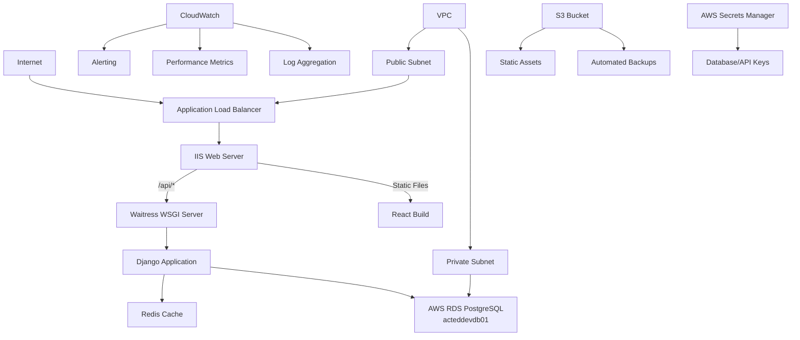

# Admin3 Production Server Setup - Comprehensive Guide

## AWS EC2 Windows Server 2025 - Enterprise-Grade Deployment

### **Overview**

This comprehensive guide provides enterprise-grade deployment procedures for Admin3 on AWS EC2 Windows Server 2025. It includes security hardening, monitoring, backup procedures, and performance optimization suitable for production environments and end-user demos.

### **🚀 Quick Start - Automated Installation**

For a complete automated setup, use our master installation script:

```powershell
# Navigate to the scripts directory
cd "C:\Code\Admin3\Project settings\server setup"

# Run the complete setup (interactive)
& ".\run-setup.ps1"

# Or run with specific options
& ".\run-setup.ps1" -SkipInitialSetup -RunTests -DryRun
```

**Available Scripts:**

- `01-initial-ec2-setup.ps1` - Initial server setup and dependencies
- `02-rds-database-setup.ps1` - Database configuration
- `03-redis-installation.ps1` - Redis cache installation
- `04-redis-service-setup.ps1` - Redis Windows service setup
- `05-redis-troubleshooting.ps1` - Redis diagnostics and recovery
- `06-iis-application-setup.ps1` - IIS and application deployment
- `07-monitoring-logging.ps1` - Monitoring and logging setup
- `08-troubleshooting.ps1` - System health diagnostics
- `09-backup-database.ps1` - Database backup automation
- `10-backup-application.ps1` - Application backup automation
- `11-restore-database.ps1` - Database recovery procedures
- `12-emergency-rollback.ps1` - Emergency system rollback
- `13-weekly-maintenance.ps1` - Automated maintenance tasks
- `14-pre-golive-checklist.ps1` - Production readiness validation
- `15-deployment-automation.ps1` - Automated deployment pipeline
- `secure-server-setup.ps1` - Secure setup with environment variables

### **Architecture Overview**


---

## **Table of Contents**

1. [Pre-Production Checklist](#1-pre-production-checklist)
2. [Infrastructure Setup](#2-infrastructure-setup)
3. [Security Hardening](#3-security-hardening)
4. [Application Deployment](#4-application-deployment)
5. [Monitoring & Logging](#5-monitoring--logging)
6. [Backup & Recovery](#6-backup--recovery)
7. [Performance Optimization](#7-performance-optimization)
8. [CI/CD Integration](#8-cicd-integration)
9. [Troubleshooting Guide](#9-troubleshooting-guide)
10. [Maintenance Procedures](#10-maintenance-procedures)
11. [Security Incident Response](#11-security-incident-response)

---

## **1. Pre-Production Checklist**

### **1.1 AWS Account Preparation**

- [ ] AWS account with appropriate permissions
- [ ] VPC configured with public/private subnets
- [ ] Security groups defined for EC2 and RDS
- [ ] IAM roles created
- [ ] S3 buckets for backups and static assets
- [ ] CloudWatch configured
- [ ] AWS Secrets Manager setup
- [ ] RDS PostgreSQL instance (acteddevdb01) created
- [ ] RDS subnet group configured
- [ ] RDS security group allows EC2 access on port 5432

### **1.2 Domain and SSL Requirements**

- [ ] Domain name registered and configured
- [ ] SSL certificate obtained (Let's Encrypt or AWS Certificate Manager)
- [ ] DNS records configured
- [ ] CDN setup (CloudFront) if required

### **1.3 Backup and Recovery Planning**

- [ ] Backup strategy defined (RTO/RPO requirements)
- [ ] Recovery procedures documented
- [ ] Test restore procedures validated

---

## **2. Infrastructure Setup**

### **2.1 Enhanced EC2 Instance Configuration**

#### **2.1.1 Instance Specifications**

```yaml
Instance Type: m7i.large (minimum for production)
vCPUs: 2
Memory: 8 GB
Storage: 
  - Root: 50 GB GP3
  - Data: 100 GB GP3 (separate volume for PostgreSQL)
  - Logs: 20 GB GP3
Network: Enhanced networking enabled
```

#### **2.1.2 Security Groups Configuration**

**EC2 Security Group (Admin3-EC2-SG):**

```yaml
Inbound Rules:
  - HTTP (80): 0.0.0.0/0
  - HTTPS (443): 0.0.0.0/0
  - RDP (3389): [Your IP Address only]
  - Redis (6379): 127.0.0.1/32 (localhost only)
  
Outbound Rules:
  - HTTPS (443): 0.0.0.0/0 (for updates, Let's Encrypt)
  - PostgreSQL (5432): [RDS Security Group]
  - SMTP (587): [Email provider only]
  - HTTP (80): 0.0.0.0/0 (for package downloads)
```

**RDS Security Group (Admin3-RDS-SG):**
```yaml
Inbound Rules:
  - PostgreSQL (5432): [EC2 Security Group]
  
Outbound Rules:
  - None (RDS doesn't need outbound rules)
```

#### **2.1.3 Enhanced Initial Setup**

**🚀 Automated Script Available:**
Run the automated setup script:
```powershell
& "C:\Code\Admin3\Project settings\server setup\01-initial-ec2-setup.ps1"
```

**Manual Commands (if needed):**
```powershell
# Set execution policy for PowerShell
Set-ExecutionPolicy -ExecutionPolicy RemoteSigned -Scope LocalMachine

# Install Windows Updates
Install-Module PSWindowsUpdate -Force
Get-WindowsUpdate -Install -AcceptAll -AutoReboot

# Install Chocolatey
Set-ExecutionPolicy Bypass -Scope Process -Force; `
[System.Net.ServicePointManager]::SecurityProtocol = [System.Net.ServicePointManager]::SecurityProtocol -bor 3072; `
iex ((New-Object System.Net.WebClient).DownloadString('https://community.chocolatey.org/install.ps1'))

# Install required software
choco install -y python nodejs git redis nginx awscli
choco install -y nssm # For service management
choco install -y 7zip # For backup compression
```

### **2.2 AWS RDS PostgreSQL Setup**

#### **2.2.1 RDS Instance Configuration**

**Create RDS PostgreSQL Instance:**
```yaml
Instance Identifier: acteddevdb01
Engine: PostgreSQL 17.x
Engine Version: 17.4 (or latest)
Instance Class: db.t4g.micro
Storage Type: gp2
Allocated Storage: 20 GB (minimum)
Storage Encryption: Enabled
Multi-AZ: No (dev) or Yes (prod)
Publicly Accessible: No
VPC Security Groups: Admin3-RDS-SG
DB Subnet Group: Create with private subnets
Backup Retention: 7 days (minimum)
Backup Window: 03:00-04:00 UTC
Maintenance Window: Sunday 04:00-05:00 UTC
Deletion Protection: Yes
```

#### **2.2.2 Install PostgreSQL Client Tools on EC2**
```powershell
# Install PostgreSQL client tools only (no server needed)
choco install postgresql --params '/Password:NotUsed /ClientOnly:true'

# Or install just the client tools
choco install postgresql-client

# Install OpenSSL for SSL connections
choco install openssl
```

#### **2.2.3 Database Setup via RDS Console and EC2 to RDS Connection Setup**

**🚀 Automated Script Available:**
Run the database setup script:
```powershell
& "C:\Code\Admin3\Project settings\server setup\02-rds-database-setup.ps1" -MasterPassword "YourRDSMasterPassword"
```

### **2.3 Redis Cache Setup**

#### **2.3.1 Redis Installation and Configuration**

**🚀 Automated Script Available:**
Run the Redis installation script:
```powershell
& "C:\Code\Admin3\Project settings\server setup\03-redis-installation.ps1"
```

This script will:
- Install Redis using Chocolatey
- Auto-detect Redis installation directory
- Create secure Redis configuration with environment variables
- Set up logging directories
- Configure memory management and persistence

#### **2.3.2 Redis Windows Service Setup (Fixed)**

**🚀 Automated Script Available:**
Run the Redis service setup script:
```powershell
& "C:\Code\Admin3\Project settings\server setup\04-redis-service-setup.ps1"
```

#### **2.3.3 Redis Connection Test**

Test Redis connectivity after installation:
```powershell
redis-cli ping
```

#### **2.3.4 Redis Troubleshooting & Common Issues**

**🚀 Automated Script Available:**
For comprehensive Redis troubleshooting and recovery:
```powershell
& "C:\Code\Admin3\Project settings\server setup\05-redis-troubleshooting.ps1"
```

**Quick Diagnostics:**
```powershell
# Check service status
Get-Service Redis

# Check process
Get-Process redis-server

# Test connectivity
redis-cli ping
```

---

## **2.4 EC2 to RDS Connection Configuration**

### **2.4.1 Network Configuration Prerequisites**

#### **VPC and Subnet Setup**
```yaml
VPC Configuration:
  - VPC CIDR: 10.0.0.0/16
  - Public Subnet: 10.0.1.0/24 (for EC2)
  - Private Subnet: 10.0.2.0/24 (for RDS)
  - Internet Gateway: Attached to VPC
  - NAT Gateway: In public subnet (for EC2 outbound traffic)
  - Route Tables: Configured for proper routing
```

#### **Security Group Configuration Details**
See 00-aws-ec2-security-group.ps1

### **2.4.2 Connection Testing and Troubleshooting**

#### **Network Connectivity Test**
```powershell
# Test network connectivity to RDS
function Test-RDSConnectivity {
    param(
        [string]$RDSEndpoint = $env:DB_HOST,
        [int]$Port = $env:DB_PORT
    )
    
    Write-Host "Testing RDS connectivity..." -ForegroundColor Cyan
    
    # Test TCP connection
    $tcpTest = Test-NetConnection -ComputerName $RDSEndpoint -Port $Port
    
    if ($tcpTest.TcpTestSucceeded) {
        Write-Host "✓ TCP connection to RDS successful" -ForegroundColor Green
        Write-Host "  Remote Address: $($tcpTest.RemoteAddress)" -ForegroundColor Gray
        Write-Host "  Remote Port: $($tcpTest.RemotePort)" -ForegroundColor Gray
    } else {
        Write-Host "✗ TCP connection to RDS failed" -ForegroundColor Red
        Write-Host "  Check security groups and network ACLs" -ForegroundColor Yellow
        return $false
    }
    
    # Test DNS resolution
    try {
        $dnsResult = Resolve-DnsName -Name $RDSEndpoint -Type A
        Write-Host "✓ DNS resolution successful" -ForegroundColor Green
        Write-Host "  IP Address: $($dnsResult.IPAddress)" -ForegroundColor Gray
    } catch {
        Write-Host "✗ DNS resolution failed: $_" -ForegroundColor Red
        return $false
    }
    
    return $true
}

# Run connectivity test
Test-RDSConnectivity
```

#### **Database Connection Test**

Test database connectivity:

```powershell
# Simple connection test
psql -h $env:DB_HOST -d $env:DB_NAME -U $env:DB_USER -c "SELECT version();"
```

### **2.4.3 Common Connection Issues and Solutions**

#### **Issue 1: Connection Timeout**

Troubleshoot connectivity issues:

```powershell
# Test network connectivity to RDS
Test-NetConnection -ComputerName $env:DB_HOST -Port $env:DB_PORT

# Check security groups
aws ec2 describe-security-groups --group-names Admin3-RDS-SG
aws ec2 describe-security-groups --group-names Admin3-EC2-SG
```

#### **Issue 2: Authentication Failed**

Check database credentials and permissions:

```powershell
# Verify environment variables are set
echo $env:DB_USER
echo $env:DB_NAME

# Test with master user if needed
psql -h $env:DB_HOST -U $env:DB_POSTGRE_USER -c "SELECT current_user;"
```

#### **Issue 3: SSL Connection Required**

Configure SSL connection:

```powershell
# Download RDS CA certificate
$certUrl = "https://truststore.pki.rds.amazonaws.com/global/global-bundle.pem"
Invoke-WebRequest -Uri $certUrl -OutFile $env:PGSSLROOTCERT
```

### **2.4.4 Production Backup Strategy for RDS**

**🚀 Automated Script Available:**
Create database backups:
```powershell
& "C:\Code\Admin3\Project settings\server setup\09-backup-database.ps1"
```

Manual RDS snapshot:
```powershell
aws rds create-db-snapshot --db-instance-identifier $env:DB_HOST --db-snapshot-identifier "admin3-manual-$(Get-Date -Format 'yyyyMMdd-HHmmss')"
```

---

## **3. Security Hardening**

### **3.1 Windows Server Security**

#### **3.1.1 Windows Security Policies**
```powershell
# Apply security policies
secedit /export /cfg c:\secpol.cfg

# Edit security policy (example modifications)
$secPolicy = @"
[System Access]
MinimumPasswordAge = 1
MaximumPasswordAge = 90
MinimumPasswordLength = 14
PasswordComplexity = 1
PasswordHistorySize = 24
LockoutBadCount = 5
LockoutDuration = 30
ResetLockoutCount = 30

[Registry Values]
MACHINE\System\CurrentControlSet\Control\Lsa\RestrictAnonymous=4,1
MACHINE\System\CurrentControlSet\Control\Lsa\RestrictAnonymousSAM=4,1
MACHINE\System\CurrentControlSet\Control\Lsa\LimitBlankPasswordUse=4,1
"@

$secPolicy | Out-File c:\secpol_modified.cfg
secedit /configure /db c:\windows\security\local.sdb /cfg c:\secpol_modified.cfg
```

#### **3.1.2 Windows Firewall Configuration**
```powershell
# Configure Windows Firewall
New-NetFirewallRule -DisplayName "HTTP" -Direction Inbound -Protocol TCP -LocalPort $env:HTTP_PORT -Action Allow
New-NetFirewallRule -DisplayName "HTTPS" -Direction Inbound -Protocol TCP -LocalPort $env:HTTPS_PORT -Action Allow
New-NetFirewallRule -DisplayName "Django" -Direction Inbound -Protocol TCP -LocalPort $env:DJANGO_PORT -Action Allow -RemoteAddress 127.0.0.1

# Block unnecessary ports
New-NetFirewallRule -DisplayName "Block PostgreSQL External" -Direction Inbound -Protocol TCP -LocalPort $env:DB_PORT -Action Block -RemoteAddress Internet
New-NetFirewallRule -DisplayName "Block Redis External" -Direction Inbound -Protocol TCP -LocalPort $env:REDIS_PORT -Action Block -RemoteAddress Internet

# Enable logging
Set-NetFirewallProfile -Profile Domain,Public,Private -LogAllowed True -LogBlocked True -LogMaxSizeKilobytes 10240
```

### **3.2 Application Security**

#### **3.2.1 Environment Variables and Secrets**

Environment variables are configured via the automated scripts. See the environment setup documentation in:

```powershell
C:\Code\Admin3\Project settings\server setup\.env.uat
C:\Code\Admin3\Project settings\server setup\load-environment.ps1
```

---

## **4. Application Deployment**

### **4.1 Enhanced Application Setup**

**🚀 Automated Script Available:**
Run the complete application deployment:
```powershell
& "C:\Code\Admin3\Project settings\server setup\06-iis-application-setup.ps1"
```

This script handles:

- Python virtual environment setup
- Dependency installation
- Django migrations and static files
- React production build
- IIS configuration
- Windows service setup

### **4.2 Waitress WSGI Server Configuration**

The Waitress WSGI server configuration is handled by the automated deployment script. Key features:

- Production-optimized settings
- Comprehensive logging
- Windows service integration
- Automatic startup configuration

### **4.3 IIS Configuration**

#### **4.3.1 Enhanced IIS Setup**

IIS installation and configuration is handled by the automated deployment script.

#### **4.3.3 URL Rewrite Rules**

```xml
<!-- C:\inetpub\wwwroot\Admin3\static\web.config -->
<?xml version="1.0" encoding="UTF-8"?>
<configuration>
    <system.webServer>
        <rewrite>
            <rules>
                <!-- API Proxy Rule -->
                <rule name="Django API Proxy" stopProcessing="true">
                    <match url="^api/(.*)" />
                    <action type="Rewrite" url="http://localhost:8000/api/{R:1}" appendQueryString="true" />
                </rule>
                
                <!-- Admin Panel Proxy -->
                <rule name="Django Admin Proxy" stopProcessing="true">
                    <match url="^admin/(.*)" />
                    <action type="Rewrite" url="http://localhost:8000/admin/{R:1}" appendQueryString="true" />
                </rule>
                
                <!-- React Router - Catch all -->
                <rule name="React Router" stopProcessing="true">
                    <match url=".*" />
                    <conditions logicalGrouping="MatchAll">
                        <add input="{REQUEST_FILENAME}" matchType="IsFile" negate="true" />
                        <add input="{REQUEST_FILENAME}" matchType="IsDirectory" negate="true" />
                        <add input="{REQUEST_URI}" pattern="^/api/" negate="true" />
                        <add input="{REQUEST_URI}" pattern="^/admin/" negate="true" />
                        <add input="{REQUEST_URI}" pattern="^/static/" negate="true" />
                    </conditions>
                    <action type="Rewrite" url="/index.html" />
                </rule>
            </rules>
        </rewrite>
        
        <!-- Compression -->
        <urlCompression doDynamicCompression="true" doStaticCompression="true" />
        
        <!-- Security Headers -->
        <httpProtocol>
            <customHeaders>
                <add name="X-Frame-Options" value="DENY" />
                <add name="X-Content-Type-Options" value="nosniff" />
                <add name="X-XSS-Protection" value="1; mode=block" />
                <add name="Strict-Transport-Security" value="max-age=31536000; includeSubDomains" />
                <add name="Content-Security-Policy" value="default-src 'self'; script-src 'self' 'unsafe-inline'; style-src 'self' 'unsafe-inline'; img-src 'self' data: https:; font-src 'self' data:; connect-src 'self' https:; frame-ancestors 'none';" />
            </customHeaders>
        </httpProtocol>
        
        <!-- Request Filtering -->
        <requestFiltering>
            <requestLimits maxAllowedContentLength="10485760" />
            <fileExtensions>
                <add fileExtension=".exe" allowed="false" />
                <add fileExtension=".bat" allowed="false" />
                <add fileExtension=".cmd" allowed="false" />
            </fileExtensions>
        </requestFiltering>
    </system.webServer>
</configuration>
```

---

## **5. Monitoring & Logging**

### **5.1 Application Monitoring**

#### **5.1.1 Django Logging Enhancement**

```python
# backend/django_Admin3/django_Admin3/monitoring.py
import logging
import time
from django.utils.deprecation import MiddlewareMixin
from django.conf import settings

class PerformanceMonitoringMiddleware(MiddlewareMixin):
    def process_request(self, request):
        request.start_time = time.time()
        
    def process_response(self, request, response):
        if hasattr(request, 'start_time'):
            duration = time.time() - request.start_time
            
            # Log slow requests
            if duration > 1.0:  # Requests taking more than 1 second
                logger = logging.getLogger('admin3.performance')
                logger.warning(
                    f"Slow request: {request.method} {request.path} "
                    f"took {duration:.2f} seconds"
                )
            
            # Add performance header
            response['X-Response-Time'] = f"{duration:.3f}s"
            
        return response

class SecurityMonitoringMiddleware(MiddlewareMixin):
    def process_request(self, request):
        # Log suspicious requests
        suspicious_patterns = [
            'admin', 'wp-admin', 'phpmyadmin', '.php',
            'eval(', 'script>', 'union select', 'drop table'
        ]
        
        path = request.path.lower()
        for pattern in suspicious_patterns:
            if pattern in path:
                logger = logging.getLogger('admin3.security')
                logger.warning(
                    f"Suspicious request: {request.method} {request.path} "
                    f"from {request.META.get('REMOTE_ADDR', 'unknown')}"
                )
                break
```

#### **5.1.2 Health Check Endpoints**

```python
# backend/django_Admin3/django_Admin3/health_check.py
from django.http import JsonResponse
from django.db import connection
from django.core.cache import cache
from django.utils import timezone
import redis
import os

def health_check(request):
    Comprehensive health check endpoint
    health_status = {
        'status': 'healthy',
        'timestamp': timezone.now().isoformat(),
        'version': os.environ.get('APP_VERSION', '1.0.0'),
        'checks': {}
    }
    
    # Database check
    try:
        with connection.cursor() as cursor:
            cursor.execute("SELECT 1")
            health_status['checks']['database'] = {
                'status': 'healthy',
                'response_time': '< 10ms'
            }
    except Exception as e:
        health_status['checks']['database'] = {
            'status': 'unhealthy',
            'error': str(e)
        }
        health_status['status'] = 'unhealthy'
    
    # Cache check
    try:
        cache.set('health_check', 'ok', 30)
        if cache.get('health_check') == 'ok':
            health_status['checks']['cache'] = {
                'status': 'healthy',
                'response_time': '< 5ms'
            }
        else:
            raise Exception("Cache write/read failed")
    except Exception as e:
        health_status['checks']['cache'] = {
            'status': 'unhealthy',
            'error': str(e)
        }
        health_status['status'] = 'unhealthy'
    
    # Disk space check
    try:
        disk_usage = os.statvfs('/')
        free_space = disk_usage.f_frsize * disk_usage.f_bavail
        total_space = disk_usage.f_frsize * disk_usage.f_blocks
        usage_percent = ((total_space - free_space) / total_space) * 100
        
        if usage_percent > 90:
            health_status['checks']['disk'] = {
                'status': 'warning',
                'usage_percent': usage_percent,
                'message': 'Disk space low'
            }
        else:
            health_status['checks']['disk'] = {
                'status': 'healthy',
                'usage_percent': usage_percent
            }
    except Exception as e:
        health_status['checks']['disk'] = {
            'status': 'unknown',
            'error': str(e)
        }
    
    status_code = 200 if health_status['status'] == 'healthy' else 503
    return JsonResponse(health_status, status=status_code)
```

### **5.2 Log Aggregation and Analysis**

#### **5.2.1 PowerShell Log Monitoring Script**

**🚀 Automated Script Available:**
Set up monitoring and logging:

```powershell
& "C:\Code\Admin3\Project settings\server setup\07-monitoring-logging.ps1"
```

---

## **6. Backup & Recovery**

### **6.1 Database Backup Strategy**

#### **6.1.1 Automated PostgreSQL Backup Script**

**🚀 Automated Script Available:**
Create database backups:

```powershell
& "C:\Code\Admin3\Project settings\server setup\09-backup-database.ps1"
```

#### **6.1.2 Application Files Backup**

**🚀 Automated Script Available:**
Create application backups:

```powershell
& "C:\Code\Admin3\Project settings\server setup\10-backup-application.ps1"
```

### **6.2 Recovery Procedures**

#### **6.2.1 Database Recovery Script**

**🚀 Automated Script Available:**
Restore database from backup:

```powershell
& "C:\Code\Admin3\Project settings\server setup\11-restore-database.ps1" -BackupFile "path\to\backup.sql"
```

---

## **7. Performance Optimization**

### **7.1 Database Performance Tuning**

#### **7.1.1 PostgreSQL Configuration Optimization**

```sql
-- Performance tuning queries
-- Run these in pgAdmin or psql

-- Create indexes for better query performance
CREATE INDEX CONCURRENTLY idx_users_email ON auth_user(email);
CREATE INDEX CONCURRENTLY idx_users_last_login ON auth_user(last_login);
CREATE INDEX CONCURRENTLY idx_cart_items_user ON cart_cartitem(user_id);
CREATE INDEX CONCURRENTLY idx_cart_items_product ON cart_cartitem(product_id);
CREATE INDEX CONCURRENTLY idx_products_active ON products_product(is_active) WHERE is_active = true;
CREATE INDEX CONCURRENTLY idx_exam_sessions_date ON exam_sessions_examsession(session_date);

-- Analyze tables for better query planning
ANALYZE;

-- Update table statistics
UPDATE pg_class SET reltuples = (SELECT COUNT(*) FROM auth_user) WHERE relname = 'auth_user';
UPDATE pg_class SET reltuples = (SELECT COUNT(*) FROM products_product) WHERE relname = 'products_product';
UPDATE pg_class SET reltuples = (SELECT COUNT(*) FROM cart_cartitem) WHERE relname = 'cart_cartitem';
```

#### **7.1.2 Connection Pooling Setup**

See ```backend/django_Admin3/django_Admin3/settings/production.py```

### **7.2 Caching Strategy**

#### **7.2.1 Redis Caching Implementation**
```python
# backend/django_Admin3/django_Admin3/cache.py
from django.core.cache import cache
from django.core.cache.utils import make_template_fragment_key
from functools import wraps
import hashlib
import json

def cache_result(timeout=300, key_prefix=):
    Decorator to cache function results
    def decorator(func):
        @wraps(func)
        def wrapper(*args, **kwargs):
            # Create cache key
            cache_key = f"{key_prefix}:{func.__name__}:{hashlib.md5(str(args).encode() + str(kwargs).encode()).hexdigest()}"
            
            # Try to get from cache
            result = cache.get(cache_key)
            if result is not None:
                return result
            
            # Execute function and cache result
            result = func(*args, **kwargs)
            cache.set(cache_key, result, timeout)
            return result
        return wrapper
    return decorator

def invalidate_cache_pattern(pattern):
    Invalidate cache keys matching pattern
    # Note: This requires Redis
    from django.core.cache import cache
    if hasattr(cache, 'delete_pattern'):
        cache.delete_pattern(pattern)
```

#### **7.2.2 View-Level Caching**
```python
# backend/django_Admin3/products/views.py
from django.views.decorators.cache import cache_page
from django.utils.decorators import method_decorator
from django.views.decorators.vary import vary_on_headers
from rest_framework.viewsets import ModelViewSet
from .cache import cache_result, invalidate_cache_pattern

@method_decorator(cache_page(60 * 15), name='list')  # Cache for 15 minutes
@method_decorator(vary_on_headers('Accept-Language'), name='list')
class ProductViewSet(ModelViewSet):
    queryset = Product.objects.select_related('category').prefetch_related('variations')
    serializer_class = ProductSerializer
    
    @cache_result(timeout=300, key_prefix='product_categories')
    def get_categories(self):
        return list(Product.objects.values_list('category', flat=True).distinct())
    
    def perform_create(self, serializer):
        super().perform_create(serializer)
        # Invalidate related caches
        invalidate_cache_pattern('product_categories:*')
    
    def perform_update(self, serializer):
        super().perform_update(serializer)
        # Invalidate related caches
        invalidate_cache_pattern('product_categories:*')
```

### **7.3 Static Files Optimization**

#### **7.3.1 IIS Compression and Caching**
```xml
<!-- C:\inetpub\wwwroot\Admin3\static\web.config -->
<system.webServer>
    <!-- Static file caching -->
    <staticContent>
        <clientCache cacheControlMode="UseMaxAge" cacheControlMaxAge="365.00:00:00" />
        <mimeMap fileExtension=".woff2" mimeType="font/woff2" />
        <mimeMap fileExtension=".woff" mimeType="font/woff" />
    </staticContent>
    
    <!-- Compression settings -->
    <httpCompression directory="C:\inetpub\temp\IIS Temporary Compressed Files">
        <scheme name="gzip" dll="%Windir%\system32\inetsrv\gzip.dll" />
        <dynamicTypes>
            <add mimeType="text/*" enabled="true" />
            <add mimeType="message/*" enabled="true" />
            <add mimeType="application/javascript" enabled="true" />
            <add mimeType="application/json" enabled="true" />
            <add mimeType="*/*" enabled="false" />
        </dynamicTypes>
        <staticTypes>
            <add mimeType="text/*" enabled="true" />
            <add mimeType="message/*" enabled="true" />
            <add mimeType="application/javascript" enabled="true" />
            <add mimeType="application/json" enabled="true" />
            <add mimeType="*/*" enabled="false" />
        </staticTypes>
    </httpCompression>
    
    <!-- Output caching -->
    <caching enabled="true" enableKernelCache="true">
        <profiles>
            <add extension=".js" policy="CacheUntilChange" kernelCachePolicy="CacheUntilChange" />
            <add extension=".css" policy="CacheUntilChange" kernelCachePolicy="CacheUntilChange" />
            <add extension=".png" policy="CacheUntilChange" kernelCachePolicy="CacheUntilChange" />
            <add extension=".jpg" policy="CacheUntilChange" kernelCachePolicy="CacheUntilChange" />
            <add extension=".jpeg" policy="CacheUntilChange" kernelCachePolicy="CacheUntilChange" />
            <add extension=".svg" policy="CacheUntilChange" kernelCachePolicy="CacheUntilChange" />
            <add extension=".woff" policy="CacheUntilChange" kernelCachePolicy="CacheUntilChange" />
            <add extension=".woff2" policy="CacheUntilChange" kernelCachePolicy="CacheUntilChange" />
        </profiles>
    </caching>
</system.webServer>
```

### **7.4 Performance Monitoring**

#### **7.4.1 Performance Metrics Collection**
```python
# backend/django_Admin3/django_Admin3/performance.py
import time
import psutil
import logging
from django.core.management.base import BaseCommand
from django.db import connection

logger = logging.getLogger('admin3.performance')

class PerformanceMetrics:
    @staticmethod
    def collect_system_metrics():
        Collect system performance metrics
        return {
            'cpu_percent': psutil.cpu_percent(interval=1),
            'memory_percent': psutil.virtual_memory().percent,
            'disk_usage': psutil.disk_usage('/').percent,
            'network_io': psutil.net_io_counters()._asdict(),
            'timestamp': time.time()
        }
    
    @staticmethod
    def collect_database_metrics():
        Collect database performance metrics
        with connection.cursor() as cursor:
            # Active connections
            cursor.execute("SELECT count(*) FROM pg_stat_activity WHERE state = 'active';")
            active_connections = cursor.fetchone()[0]
            
            # Database size
            cursor.execute("SELECT pg_database_size(current_database());")
            db_size = cursor.fetchone()[0]
            
            # Cache hit ratio
            cursor.execute(
                SELECT round(
                    (sum(heap_blks_hit) / (sum(heap_blks_hit) + sum(heap_blks_read))) * 100, 2
                ) as cache_hit_ratio
                FROM pg_statio_user_tables;
            )
            cache_hit_ratio = cursor.fetchone()[0] or 0
            
            return {
                'active_connections': active_connections,
                'database_size_bytes': db_size,
                'cache_hit_ratio': float(cache_hit_ratio),
                'timestamp': time.time()
            }
    
    @staticmethod
    def log_performance_metrics():
        Log performance metrics
        try:
            system_metrics = PerformanceMetrics.collect_system_metrics()
            db_metrics = PerformanceMetrics.collect_database_metrics()
            
            logger.info(f"System Metrics: {system_metrics}")
            logger.info(f"Database Metrics: {db_metrics}")
            
            # Alert if metrics exceed thresholds
            if system_metrics['cpu_percent'] > 80:
                logger.warning(f"High CPU usage: {system_metrics['cpu_percent']}%")
            
            if system_metrics['memory_percent'] > 85:
                logger.warning(f"High memory usage: {system_metrics['memory_percent']}%")
                
            if db_metrics['cache_hit_ratio'] < 95:
                logger.warning(f"Low database cache hit ratio: {db_metrics['cache_hit_ratio']}%")
                
        except Exception as e:
            logger.error(f"Failed to collect performance metrics: {e}")
```

---

## **8. CI/CD Integration**

### **8.1 GitHub Actions Workflow**

#### **8.1.1 Deployment Pipeline**
See ```.github\workflows\deploy.yml```

### **8.2 Deployment Automation**

#### **8.2.1 Automated Deployment Script**

**🚀 Automated Script Available:**
Run automated deployment:

```powershell
& "C:\Code\Admin3\Project settings\server setup\15-deployment-automation.ps1"
```

---

## **9. Troubleshooting Guide**

### **9.1 Common Issues and Solutions**

#### **9.1.1 Application Won't Start**

**🚀 Automated Script Available:**
Run comprehensive troubleshooting:

```powershell
& "C:\Code\Admin3\Project settings\server setup\08-troubleshooting.ps1"
```

Quick diagnostics:

```powershell
# Check services
Get-Service Admin3-Waitress, Redis, W3SVC

# Test database connection
psql -h $env:DB_HOST -d $env:DB_NAME -U $env:DB_USER -c "SELECT 1;"

# Test Redis
redis-cli ping

function Test-WebsiteResponse {
    try {
        $response = Invoke-WebRequest -Uri "http://localhost" -TimeoutSec 10
        Write-Host "Website response: $($response.StatusCode)" -ForegroundColor "Green"
    } catch {
        Write-Host "Website response: ERROR - $_" -ForegroundColor "Red"
    }
}

function Test-APIResponse {
    try {
        $response = Invoke-WebRequest -Uri "http://localhost/api/health/" -TimeoutSec 10
        Write-Host "API response: $($response.StatusCode)" -ForegroundColor "Green"
    } catch {
        Write-Host "API response: ERROR - $_" -ForegroundColor "Red"
    }
}

function Show-RecentErrors {
    $logPath = "C:\logs\admin3"
    $logFiles = Get-ChildItem -Path $logPath -Filter "*.log"
    
    foreach ($logFile in $logFiles) {
        $errors = Get-Content $logFile.FullName | Select-String -Pattern "ERROR|CRITICAL" | Select-Object -Last 5
        if ($errors) {
            Write-Host "`nRecent errors in $($logFile.Name):" -ForegroundColor "Yellow"
            $errors | ForEach-Object { Write-Host "  $_" -ForegroundColor "Red" }
        }
    }
}

# Run all tests
Write-Host "Admin3 System Health Check" -ForegroundColor "Cyan"
Write-Host "=========================" -ForegroundColor "Cyan"

Test-ServiceStatus
Test-DatabaseConnection
Test-RedisConnection
Test-WebsiteResponse
Test-APIResponse
Show-RecentErrors
```

#### **9.1.2 Performance Issues**

```powershell
# Performance diagnosis script
Project settings\server setup\diagnose_performance.ps1
```

### **9.2 Emergency Procedures**

#### **9.2.1 Emergency Rollback Script**

```powershell
Project settings\server setup\emergency_rollback.ps1
```

---

## **10. Maintenance Procedures**

### **10.1 Regular Maintenance Tasks**

#### **10.1.1 Weekly Maintenance Script**

**🚀 Automated Script Available:**
Run weekly maintenance:
```powershell
& "C:\Code\Admin3\Project settings\server setup\13-weekly-maintenance.ps1"
```

### **10.2 Monthly Maintenance**

#### **10.2.1 Monthly Security Updates**

```powershell
# C:\scripts\monthly_security.ps1

function Update-SecurityPatches {
    Write-Host "Installing security updates..."
    
    # Update Python packages
    cd "C:\inetpub\wwwroot\Admin3\backend\django_Admin3"
    .\.venv\Scripts\activate
    pip list --outdated --format=json | ConvertFrom-Json | ForEach-Object {
        Write-Host "Updating $($_.name) from $($_.version) to $($_.latest_version)"
        pip install --upgrade $_.name
    }
    
    # Update Node packages
    cd "C:\inetpub\wwwroot\Admin3\frontend\react-Admin3"
    npm update
    npm audit fix
    
    # Update system packages
    choco upgrade all -y
}

function Run-SecurityScan {
    Write-Host "Running security scan..."
    
    # Scan Python dependencies
    cd "C:\inetpub\wwwroot\Admin3\backend\django_Admin3"
    .\.venv\Scripts\activate
    pip install safety
    safety check
    
    # Scan Node dependencies
    cd "C:\inetpub\wwwroot\Admin3\frontend\react-Admin3"
    npm audit
    
    # Run bandit security scan
    bandit -r . -f json -o security_report.json
}

function Review-SecurityLogs {
    Write-Host "Reviewing security logs..."
    $securityLog = "C:\logs\admin3\security.log"
    
    if (Test-Path $securityLog) {
        $suspiciousEntries = Get-Content $securityLog | Select-String -Pattern "WARNING|ERROR" | Select-Object -Last 50
        if ($suspiciousEntries) {
            Write-Host "Recent security events:"
            $suspiciousEntries | ForEach-Object { Write-Host "  $_" }
        }
    }
}

Update-SecurityPatches
Run-SecurityScan
Review-SecurityLogs
```

---

## **11. Security Incident Response**

### **11.1 Incident Response Plan**

#### **11.1.1 Security Incident Detection**

```powershell
# C:\scripts\security_incident_response.ps1
param(
    [Parameter(Mandatory=$true)]
    [ValidateSet("Low", "Medium", "High", "Critical")]
    [string]$Severity,
    [Parameter(Mandatory=$true)]
    [string]$IncidentType,
    [string]$Description = ""
)

function Log-SecurityIncident {
    param([string]$Message, [string]$Level = "INFO")
    $timestamp = Get-Date -Format "yyyy-MM-dd HH:mm:ss"
    $logEntry = "[$timestamp] [SECURITY-INCIDENT] [$Level] $Message"
    Write-Host $logEntry -ForegroundColor "Red"
    Add-Content -Path "C:\logs\admin3\security_incidents.log" -Value $logEntry
}

function Collect-IncidentData {
    Log-SecurityIncident "Collecting incident data..."
    
    # System information
    $systemInfo = @{
        Timestamp = Get-Date
        ServerName = $env:COMPUTERNAME
        UserAccounts = Get-LocalUser | Select-Object Name, Enabled, LastLogon
        RunningProcesses = Get-Process | Select-Object Name, Id, CPU, WorkingSet
        NetworkConnections = Get-NetTCPConnection | Where-Object { $_.State -eq "Established" }
        EventLogs = Get-WinEvent -FilterHashtable @{LogName="Security"; Level=2,3} -MaxEvents 100
    }
    
    # Export to JSON
    $systemInfo | ConvertTo-Json -Depth 3 | Out-File "C:\logs\admin3\incident_data_$(Get-Date -Format 'yyyyMMdd_HHmmss').json"
    
    Log-SecurityIncident "Incident data collected and exported"
}

function Implement-ImmediateResponse {
    param([string]$Severity)
    
    switch ($Severity) {
        "Critical" {
            Log-SecurityIncident "CRITICAL incident detected - implementing immediate lockdown"
            
            # Disable IIS site
            Stop-WebSite -Name "Admin3"
            
            # Stop application services
            Stop-Service -Name "Admin3-Waitress" -Force
            
            # Block all non-essential network traffic
            New-NetFirewallRule -DisplayName "Emergency Block" -Direction Inbound -Action Block -Protocol TCP -LocalPort 80,443
            
            Log-SecurityIncident "Emergency lockdown implemented"
        }
        
        "High" {
            Log-SecurityIncident "HIGH severity incident detected - implementing enhanced monitoring"
            
            # Enable detailed logging
            Set-NetFirewallProfile -Profile Domain,Public,Private -LogAllowed True -LogBlocked True
            
            # Restart services with enhanced logging
            Stop-Service -Name "Admin3-Waitress"
            Start-Service -Name "Admin3-Waitress"
            
            Log-SecurityIncident "Enhanced monitoring enabled"
        }
        
        "Medium" {
            Log-SecurityIncident "MEDIUM severity incident detected - increasing monitoring"
            
            # Enable additional logging
            # Monitor specific user activities
            
            Log-SecurityIncident "Additional monitoring enabled"
        }
        
        "Low" {
            Log-SecurityIncident "LOW severity incident detected - documenting for review"
        }
    }
}

function Send-IncidentAlert {
    param([string]$Severity, [string]$IncidentType, [string]$Description)
    
    $subject = "Security Incident Alert - $Severity - $IncidentType"
    $body = @"
Security Incident Report
========================
Severity: $Severity
Type: $IncidentType
Description: $Description
Server: $env:COMPUTERNAME
Timestamp: $(Get-Date)

Immediate actions taken:
- Incident logged and documented
- System data collected
- Appropriate response measures implemented based on severity level

Please review the incident logs for further details.
"@
    
    try {
        # Send email alert (configure SMTP settings)
        Send-MailMessage -To "security@yourdomain.com" -From "server@yourdomain.com" -Subject $subject -Body $body -SmtpServer "smtp.yourdomain.com" -Port 587 -UseSsl
        Log-SecurityIncident "Security incident alert sent successfully"
    } catch {
        Log-SecurityIncident "Failed to send security incident alert: $_" -Level "ERROR"
    }
}

# Execute incident response
Log-SecurityIncident "Security incident response initiated - Severity: $Severity, Type: $IncidentType"

Collect-IncidentData
Implement-ImmediateResponse -Severity $Severity
Send-IncidentAlert -Severity $Severity -IncidentType $IncidentType -Description $Description

Log-SecurityIncident "Security incident response completed"
```

### **11.2 Recovery Procedures**

#### **11.2.1 Post-Incident Recovery**

```powershell
# C:\scripts\post_incident_recovery.ps1
param(
    [Parameter(Mandatory=$true)]
    [string]$IncidentId,
    [switch]$FullRecovery = $false
)

function Log-Recovery {
    param([string]$Message, [string]$Level = "INFO")
    $timestamp = Get-Date -Format "yyyy-MM-dd HH:mm:ss"
    $logEntry = "[$timestamp] [RECOVERY] [$Level] $Message"
    Write-Host $logEntry -ForegroundColor "Green"
    Add-Content -Path "C:\logs\admin3\recovery.log" -Value $logEntry
}

function Verify-SystemIntegrity {
    Log-Recovery "Verifying system integrity..."
    
    # Check critical files
    $criticalFiles = @(
        "C:\inetpub\wwwroot\Admin3\backend\django_Admin3\manage.py",
        "C:\inetpub\wwwroot\Admin3\backend\django_Admin3\django_Admin3\settings\production.py",
        "C:\inetpub\wwwroot\Admin3\frontend\react-Admin3\package.json"
    )
    
    foreach ($file in $criticalFiles) {
        if (Test-Path $file) {
            Log-Recovery "Critical file verified: $file"
        } else {
            Log-Recovery "Critical file missing: $file" -Level "ERROR"
            return $false
        }
    }
    
    # Verify database integrity
    try {
        $env:PGPASSWORD = $env:DB_PASSWORD
        $result = & "C:\Program Files\PostgreSQL\16\bin\pg_dump.exe" -h localhost -U admin3_user -d Admin3_Production --schema-only -f "C:\temp\schema_check.sql"
        if ($LASTEXITCODE -eq 0) {
            Log-Recovery "Database integrity verified"
            Remove-Item "C:\temp\schema_check.sql" -Force
        } else {
            Log-Recovery "Database integrity check failed" -Level "ERROR"
            return $false
        }
    } catch {
        Log-Recovery "Database integrity check error: $_" -Level "ERROR"
        return $false
    } finally {
        $env:PGPASSWORD = $null
    }
    
    return $true
}

function Restore-NormalOperations {
    Log-Recovery "Restoring normal operations..."
    
    # Remove emergency firewall rules
    Remove-NetFirewallRule -DisplayName "Emergency Block" -ErrorAction SilentlyContinue
    
    # Restart services
    Start-Service -Name "Admin3-Waitress"
    Start-WebSite -Name "Admin3"
    
    # Wait for services to start
    Start-Sleep -Seconds 30
    
    # Test application health
    try {
        $response = Invoke-WebRequest -Uri "http://localhost/api/health/" -TimeoutSec 30
        if ($response.StatusCode -eq 200) {
            Log-Recovery "Application health check passed - normal operations restored"
            return $true
        } else {
            Log-Recovery "Application health check failed during recovery" -Level "ERROR"
            return $false
        }
    } catch {
        Log-Recovery "Application health check error during recovery: $_" -Level "ERROR"
        return $false
    }
}

function Generate-RecoveryReport {
    param([string]$IncidentId)
    
    $report = @{
        IncidentId = $IncidentId
        RecoveryTimestamp = Get-Date
        SystemIntegrityStatus = "Verified"
        ServicesRestored = @("Admin3-Waitress", "IIS")
        ActionsPerformed = @(
            "System integrity verification",
            "Service restoration",
            "Application health check",
            "Normal operations resumed"
        )
        RecommendedFollowUp = @(
            "Review security logs for 24 hours",
            "Monitor application performance",
            "Verify user access patterns",
            "Update security policies if needed"
        )
    }
    
    $report | ConvertTo-Json -Depth 3 | Out-File "C:\logs\admin3\recovery_report_$IncidentId.json"
    Log-Recovery "Recovery report generated: recovery_report_$IncidentId.json"
}

# Execute recovery procedures
Log-Recovery "Post-incident recovery initiated for incident: $IncidentId"

if (Verify-SystemIntegrity) {
    if (Restore-NormalOperations) {
        Generate-RecoveryReport -IncidentId $IncidentId
        Log-Recovery "Post-incident recovery completed successfully"
    } else {
        Log-Recovery "Failed to restore normal operations" -Level "ERROR"
        exit 1
    }
} else {
    Log-Recovery "System integrity verification failed - manual intervention required" -Level "ERROR"
    exit 1
}
```

---

## **12. Final Checklist and Validation**

### **12.1 Pre-Go-Live Checklist**

#### **12.1.1 Comprehensive Pre-Launch Validation**

**🚀 Automated Script Available:**
Run pre-go-live validation:

```powershell
& "C:\Code\Admin3\Project settings\server setup\14-pre-golive-checklist.ps1"
```

---

**Document Version**: 1.0  
**Last Updated**: 2025-07-21  
**Target Environment**: AWS EC2 Windows Server 2025 + RDS PostgreSQL  
**Application**: Admin3 (Django + React)  
**Deployment Type**: Production-Ready Demo Environment
