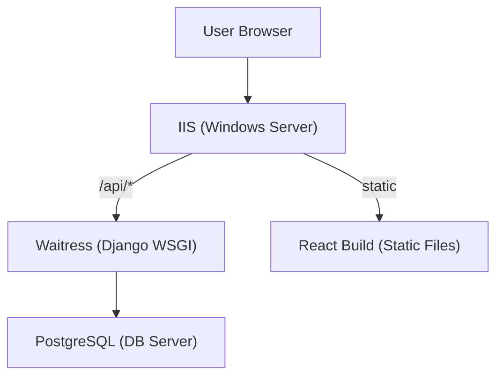

# Admin3 Production Server Setup on AWS EC2 (Windows Server 2025)

This guide walks you through deploying the Admin3 Django + React project on a fresh AWS EC2 m7i-flex.large instance running Windows Server 2025, with PostgreSQL, IIS, and all required security and production settings.

---

## 1. Initial Server Preparation

### 1.1. Connect to Your EC2 Instance
- Use RDP (Remote Desktop) to connect as Administrator.

### 1.2. Update Windows
- Open **Settings → Windows Update** and install all updates.
- Reboot if required.

### 1.3. Change Administrator Password
- Set a strong password for the Administrator account.

### 1.4. Configure Windows Firewall
- Open **Windows Defender Firewall**.
- Allow only necessary inbound ports:
  - **RDP (3389)**: For remote access (restrict to your IP if possible).
  - **HTTP (80)** and **HTTPS (443)**: For web traffic.
  - **PostgreSQL (5432)**: Only if remote DB access is needed (not recommended for production).

### 1.5. Configure EC2 Security Groups
- In AWS Console, restrict inbound rules to only necessary ports (80, 443, 3389).
- Remove 0.0.0.0/0 for RDP if possible; use your IP.

---

## 2. Install Prerequisites

### 2.1. Install Chocolatey (Windows Package Manager)
Open PowerShell as Administrator:
```powershell
Set-ExecutionPolicy Bypass -Scope Process -Force; `
[System.Net.ServicePointManager]::SecurityProtocol = [System.Net.ServicePointManager]::SecurityProtocol -bor 3072; `
iex ((New-Object System.Net.WebClient).DownloadString('https://community.chocolatey.org/install.ps1'))
```

### 2.2. Install Required Software
```powershell
choco install -y python nodejs git nginx
```
- **Python**: For Django backend
- **Node.js**: For React frontend
- **Git**: For code deployment
- **nginx**: (Optional, for reverse proxy or static file serving)

---

## 3. Install and Configure PostgreSQL

### 3.1. Install PostgreSQL
```powershell
choco install -y postgresql
```
- This installs PostgreSQL and the StackBuilder tool.

### 3.2. Initialize PostgreSQL
- Open **pgAdmin 4** (installed with PostgreSQL) or use the command line.
- Set a strong password for the `postgres` user.

### 3.3. Create Database and User
1. Open **pgAdmin 4** or use `psql`:
2. Create a new database (e.g., `ACTEDDEV01`).
3. Create a new user (e.g., `actedadmin`) with a strong password.
4. Grant all privileges on the new database to the new user.

Example SQL (run in pgAdmin or psql):
```sql
CREATE DATABASE "ACTEDDEV01";
CREATE USER actedadmin WITH PASSWORD 'your_strong_password';
GRANT ALL PRIVILEGES ON DATABASE "ACTEDDEV01" TO actedadmin;
```

---

## 4. Install and Configure IIS

### 4.1. Enable IIS and Required Features
Open PowerShell as Administrator:
```powershell
Install-WindowsFeature -name Web-Server,Web-WebSockets,Web-Asp-Net45,Web-ISAPI-Ext,Web-ISAPI-Filter,Web-Mgmt-Console
```

### 4.2. Install URL Rewrite Module
- Download and install from:  
  [https://www.iis.net/downloads/microsoft/url-rewrite](https://www.iis.net/downloads/microsoft/url-rewrite)

### 4.3. Install IIS ARR (Application Request Routing)
- Download and install from:  
  [https://www.iis.net/downloads/microsoft/application-request-routing](https://www.iis.net/downloads/microsoft/application-request-routing)

---

## 5. Prepare Your Project

### 5.1. Clone Your Repository
```powershell
cd C:\inetpub\wwwroot
git clone https://github.com/your-org/Admin3.git
```

### 5.2. Set Up Python Virtual Environment
```powershell
cd C:\inetpub\wwwroot\Admin3
python -m venv .venv
.\.venv\Scripts\activate
pip install --upgrade pip
pip install -r backend\django_Admin3\requirements.txt
```

### 5.3. Install Node.js Dependencies
```powershell
cd frontend\react-Admin3
npm install
npm run build
```
- This will create a `build/` directory with static files.

---

## 6. Configure Django for Production

### 6.1. Set Environment Variables
- Create a `.env` file in `backend/django_Admin3/` with your production settings (DB credentials, secret key, etc.).

### 6.2. Update Django Database Settings
Edit `backend/django_Admin3/settings.py`:
```python
DATABASES = {
    'default': {
        'ENGINE': 'django.db.backends.postgresql',
        'NAME': 'ACTEDDEV01',
        'USER': 'actedadmin',
        'PASSWORD': 'your_strong_password',
        'HOST': '127.0.0.1',
        'PORT': '5432',
    }
}
```

### 6.3. Collect Static Files
```powershell
cd C:\inetpub\wwwroot\Admin3\backend\django_Admin3
.\.venv\Scripts\activate
python manage.py collectstatic
```

### 6.4. Apply Migrations
```powershell
python manage.py migrate
```

### 6.5. Create Superuser
```powershell
python manage.py createsuperuser
```

---

## 7. Set Up Waitress (WSGI Server for Django)

### 7.1. Install Waitress
```powershell
pip install waitress
```

### 7.2. Create Waitress Runner Script
Create `run_waitress.py` in `backend/django_Admin3/`:
```python
from waitress import serve
from django_Admin3.wsgi import application

if __name__ == '__main__':
    serve(application, host='127.0.0.1', port=8000)
```

### 7.3. Run Django Backend
```powershell
python run_waitress.py
```
- (For production, use **NSSM** or Windows Task Scheduler to run this as a service.)

---

## 8. Configure IIS as a Reverse Proxy

### 8.1. Set Up a New IIS Site
- Open **IIS Manager**.
- Add a new site pointing to `C:\inetpub\wwwroot\Admin3\frontend\react-Admin3\build` for static files.

### 8.2. Configure Reverse Proxy to Django
- In IIS Manager, select your site.
- Open **URL Rewrite**.
- Add a rule:
  - **Name**: Proxy to Django
  - **Requested URL**: Matches the Pattern
  - **Pattern**: `^api/(.*)`
  - **Action type**: Rewrite
  - **Rewrite URL**: `http://localhost:8000/api/{R:1}`
  - **Check "Append query string"**

- For all other requests, serve static files from React build.

### 8.3. Enable WebSockets (if needed)
- In IIS, enable WebSocket Protocol for your site.

---

## 9. Set Up HTTPS (SSL/TLS)
- Use **Let’s Encrypt** (with [win-acme](https://www.win-acme.com/)) or import your certificate.
- Bind HTTPS to your IIS site.

---

## 10. Final Security and Performance Steps
- **Disable Debug** in Django settings.
- Set allowed hosts in Django.
- Restrict file/folder permissions (IIS_IUSRS, etc.).
- Set up regular Windows Updates and backups.
- Monitor logs (Django, IIS, Windows Event Viewer).

---

## 11. (Optional) Set Up Process Management
- Use [NSSM](https://nssm.cc/) (Non-Sucking Service Manager) to run Waitress as a Windows service:
  ```powershell
  choco install nssm
  nssm install Admin3Waitress "C:\inetpub\wwwroot\Admin3\.venv\Scripts\python.exe" "C:\inetpub\wwwroot\Admin3\backend\django_Admin3\run_waitress.py"
  ```

---

## 12. Test Your Deployment
- Open your server’s public IP in a browser.
- Test `/` (React app) and `/api/` (Django API).
- Log in to Django admin at `/api/admin/`.

---

## Summary Diagram



---

**References:**
- [Django Deployment Checklist](https://docs.djangoproject.com/en/5.1/howto/deployment/checklist/)
- [Waitress WSGI Server](https://docs.pylonsproject.org/projects/waitress/en/stable/)
- [IIS URL Rewrite Docs](https://docs.microsoft.com/en-us/iis/extensions/url-rewrite-module/using-the-url-rewrite-module)
- [win-acme Let's Encrypt for Windows](https://www.win-acme.com/) 