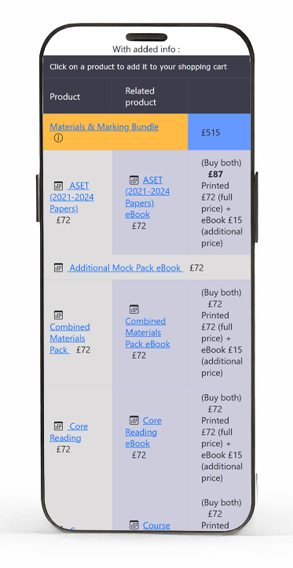

<style scoped>
h1 {
    margin: 0px;
    font-weight: 600;
    letter-spacing: -0.022em;
    font-optical-sizing: auto;
    font-style: normal;
    font-variation-settings: "wght" 600;
    font-family: Inter, Poppins, sans-serif;
    color: rgba(47,47,47,1);
    font-size: calc(1em * var(--wholestep) * var(--wholestep)) !important;
    line-height: var(--halfstep-dec) !important;
    border-bottom:1px solid rgba(47,47,47,0.45);
    width:fit-content;
  }
  h2 {
    margin-right: 0px;
    margin-bottom: 0px;
    margin-left: 0px;
    font-weight: 200;
    font-optical-sizing: auto;
    font-style: normal;
    font-variation-settings: "wght" 200;
    margin-top: calc(var(--2xs) / var(--wholestep) / var(--wholestep) / var(--halfstep));
    font-family: Inter, Poppins, sans-serif;
    color: #2F2F2F;
    font-size: calc(1em * var(--wholestep)) !important;
    line-height: calc(var(--halfstep) / var(--wholestep)) !important;
    letter-spacing: -0.022em !important;
  }
  
</style>

# BPP ActEd

## E-Store UI Redesign

---

## Part 1

1. **Initial Analysis**
1. **Industry Patterns Research**
1. **Feasibility Study**

## Part 2

1. **Demo**

---

## 1. Initial Analysis

---

### 1.1 Table layout vs mobile friendliness

<style scoped>
  td:last-child, th:last-child {
    background-color:#EDEDED;
  }
  td,th,tr {
    border: 0;
  }
</style>

- Increase row height for **Mobile**
- Adding more info = worse readability
- Flex grid breaks the relationship of Printed, ebook and Buy both

| Minimal info | Info Added | Flex Grid |
|:------:|:------:|:------:|
|| |  |

---
<style scoped>
  td,th,tr {
    border: 1px solid rgba(47,47,47,0.66);
  }
  td:last-child, th:last-child {
    background-color:#FFFFDD;
  }
</style>

### 1.2 Relationships and Information/Visual Hierarchy

#### 1.2.1 Information Hierarchy vs Visual Hierarchy in the products table

| Primary | Secondary | Relationship within row| Info Heirarchy | Visual Hierarchy | Remarks|
|:------:|:------:|:------:|:------:|:------:|:-------|
| Bundle | - | - | ☀️ Highest | ☀️ Highest | ⬆️ Spacing<br>⬆️ font weight<br>⬆️ colour|
| Printed | eBook | Same product |  Low |  Low |  |
| Mock Exam / Assignments | Marking | Different product |  Low |  Low |  |
| ASET / Mini-ASET<br>Vault / AMP | - | - |  Low | 🌤️ Higher | ⬆️Spacing |

#### ❗Rows for ASET / Mini-ASET / Vault / AMP

- Same information heirarchy as other products apart from Bundle
- Higher visual heirarchy than other products
- Mismatch visual vs information heirarchy: Visually more important, Information similar to other products 

---

<style scoped>
  td,th,tr {
    border: 1px solid rgba(47,47,47,0.66);
  }
  td:last-child, th:last-child {
    background-color:#FFFFDD;
  }
</style>

#### 1.2.2 Relationship within each row in the products table

| Primary | Secondary | Relationship within row| Buy Now |
|:------:|:------:|:------:|:------:|
| Printed | eBook | Same product | Material + Material <br/>**standard** + **additional** |
| Mock Exam / Assignments | Marking | Different product | Material + Marking <br/>**standard** + **standard** |

#### ❗Same "Buy Now" trigger different behaviour

---

### 1.3 Layout controlled by products.dbf table

The layout of the products table is controlled where clause condition:

- .NOT. main_product_category
- products.addonsale field.

```vbs
    SELECT *, RECNO() AS "rec", IIF("/PB" $ code .AND. .NOT. "/PB&R" $ code .AND. .NOT. "/PBAR" $ code,"A"+fullname,"Z"+fullname) AS "listorder" FROM "products" ;
                        WHERE ","+ALLTRIM(products.webtype)+"," $ ",DISTANCE,PAPER,MARKING,ELECTRONIC," ;
                        .AND. products.subject == lcSubject ;
                        .AND. .NOT. ("/CC/" $ products.code) ;
                        .AND. .NOT. ("/CCPR/" $ products.code) ;
                        .AND. .NOT. ("/CN/" $ products.code) ;
                        .AND. .NOT. ("/CNPR/" $ products.code) ;
                        .AND. .NOT. ("/CFC/" $ products.code) ;
                        .AND. .NOT. ("/MX/" $ products.code) ;
                        .AND. .NOT. ("/MY/" $ products.code) ;
                        .AND. .NOT. ("/MM1/" $ products.code) ;
                        .AND. .NOT. ("/MM2/" $ products.code) ;
                        .AND. .NOT. ("/CNRB/" $ products.code) ;
                        .AND. .NOT. ("/CCR/" $ products.code) ;
                        .AND. products.websale = "Y" ;
                        .AND. BETWEEN(DATE(),products.release,products.expiry) ;
                        ORDER BY listorder ;
                        INTO CURSOR tmpQuery READWRITE
```

---

#### Imagine 2 scenarios below

1. Adding third product variation (e.g. **Hub**)
    - "Buy Both" button for ebook and printed 
    - Printed + Hub
    - eBook + Hub
1. Or retiring all printed material in some subjects

Layout restricts flexibility of schema

❗**Form (layout) not following function**

---

## 2 Research : Industry Patterns

<div class="columns">
  
<div>

### 2.1 Focus

- Products page layout
- Mobile Navigation and Menu
- Common elements and functionalities

</div>
<div>

### 2.2 Sites studied

- [IFoA](https://my.actuaries.org.uk/eShop#!curr/GBP/cat/0a3e7cab-541a-ee11-8f6d-0022483edc02/page/1/sort/0)
- [ACTEX](https://www.actexlearning.com/exams/cs1)
- [ThinkActuary](https://thinkactuary.co.uk/#/landing)
- [Oxford Unibersity Press](https://global.oup.com/academic/category/science-and-mathematics/biological-sciences/?view=Grid&type=listing&lang=en&cc=gb)
- [Apple](https://www.apple.com/uk/shop/accessories/all)
- [Amazon](https://www.amazon.co.uk/blackfriday?ref_=nav_cs_td_bf_dt_cr)
- various e-commerce online store (e.g. Amazon, ebay, apple...etc.)

</div>
</div>

---

<div class="columns">  
<div>

#### 2.3 Summary

Summaries of common elements and functionalities for on the landing page or product page:

1. **Products**
    - Product card in grid
    - pricing and description
    - Filtering and Searching
1. **User**
    - access to functions thru out
      - Login/Logout
      - update profile
        - password
        - email
        - info

</div>
<div>

3. **Cart Panel**
    - View cart content in collapsible panel
    - no postback
1. **Navigatio Menu**
    - Mobile: Hamburger menu with drawer
    - Layered navigation structure (general category → specific category)

</div>
</div>

---

## 3 Feasibility Study

### Summary

- Marginal improvement if updating layout only
  - Cart panel and login functions possible
  - Table layout is the main show stopper
  - Duplicate work, not efficient
- Full scale update will provide noticeable improvement
  - Less work in the long run
  - More value
  - **Still a long road ahead if goal is a fully modernised online store**

---

## Part 2 : Our new ActEd Online Store

1. Technology Stack
1. Feature Matrix
    1. User Management
    1. Product
    1. Search & Filtering
    1. Rules Engine
    1. Shopping Cart & Checkout
    1. Email System

---

## 1. Technology Stack

<div class="columns">

<div>

**Database:**
- PostgreSQL 18

**Backend:**
- Python 3.14
- Django 5.1  
  - ORM
  - Django REST Framework
  - JWT Authentication
  - CORS, CSRF protection
- GraphQL (Administrate API)
- MJML (Email templates)
- JsonLogic (Rules engine)

</div>

<div>

**Frontend:**

- React 18
  - React Router
  - React Hooks
  - Context API
  - Redux Toolkit
  - Google Material-UI Component
  - Axios

</div>
</div>

---

## 3. Implementation Progress: Feature Matrix

### Overall Completion: **86%**

| Category | Completed | In Progress | To Implement | Blocked |
|----------|-----------|-------------|--------------|---------|
| User Management | 9/11 | 0 | 2 | 0 |
| Product Catalog | 7/11 | 2 | 2 | 0 |
| Search & Filtering | 9/9 | 0 | 0 | 0 |
| Rules Engine | 23/24 | 0 | 1 | 0 |
| Cart & Checkout | 9/11 | 0 | 1 | 1 |
| Email System | 15/16 | 0 | 1 | 0 |
| Payment | 0/1 | 0 | 0 | 1 |

**Total:** 73/83 features (86%)

---

### 3.1 User Management (11 features)

| Feature | Type | Status | Notes |
|---------|:----:|:------:|-------|
| Registration Wizard | 🆕 New | ✅ | Multi-step validation |
| Dynamic Int'l Phone Validation | 🆕 New | ✅ | E.164 format |
| Int'l Address Lookup | 🆕 New | ✅ | Postcoder API |
| Int'l Dynamic Address Fields | 🆕 New | ✅ | Country-specific validation |
| User Login | ✨ Revised | ✅ | Django + JWT |
| Password Reset | ✨ Revised | ✅ | Email-based flow |
| Change Email | ✨ Revised | ✅ | Verification required |
| Update Profile | ✨ Revised | ✅ | Via wizard |
| Sign Out | ✨ Revised | ✅ | Token invalidation |
| Extended User Types | ✨ Revised | ⚠️ TBI | Students, Marker, etc. |
| User Preferences | ✨ Revised | ⚠️ TBI | Subject/location prefs |

---

### 3.2 Products (11 features)

| Feature | Type | Status | Notes |
|---------|:----:|:------:|-------|
| Product Grid | ✨ Revised | ✅ | Responsive CSS Grid |
| Material Cards | ✨ Revised | ✅ | With variations |
| Marking Cards | ✨ Revised | ✅ | Deadline validation |
| Tutorial Cards | ✨ Revised | ✅ | Session selection |
| Product Variations | ✨ Revised | ✅ | Printed/eBook/types |
| Recommended Products | 🆕 New | ✅ | Relationships |
| Tutorial Choice Panel | 🆕 New | ✅ | Context, Dialog, Summary |
| Tutorial Dates | ✨ Revised | 🛠️ In progress | Schedule component |
| OC (India/UK) | ✨ Revised | 🛠️ In progress | Region variations |
| Check Availability | ✨ Revised | ⚠️ TBI | Real-time API |
| Tutorial Request | ✨ Revised | ⚠️ TBI | Tutorial request submission |

---

### 3.3 Search & Filtering (9 features)

| Feature | Type | Status | Technical Implementation |
|---------|:----:|:------:|--------------------------|
| Fuzzy Search | 🆕 New | ✅ | FuzzyWuzzy, Levenshtein distance |
| Filtering | 🆕 New | ✅ | Redux state, URL sync |
| Filter Configuration | 🆕 New | ✅ | Root of filter trees |
| Filter Groups | 🆕 New | ✅ | Hierarchical tree |
| Product Groups | 🆕 New | ✅ | Mapping tables |
| Subject Filtering | 🆕 New | ✅ | Multi-select Redux |
| Delivery Mode Filter | 🆕 New | ✅ | Printed/eBook/Online |
| Category Filtering | 🆕 New | ✅ | Bundle/Material/Tutorial |
| Product Type Filtering | 🆕 New | ✅ | Core Study Materials, Revision Materials |

---

### 3.4 Rules Engine (24 features) 1/4

| Feature | Type | Status | Notes |
|---------|:------:|:--------:|-------|
| Rules Engine | 🆕 New | ✅ | RuleEngine service with JSONB-based ActedRule model. Performance optimization with caching |
| Rules Entry Point | 🆕 New | ✅ | Entry Point for rules execution |
| Rules Configuration | 🆕 New | ✅ | Rule conditon, action and management via Django admin |
| Inline Model Message | 🆕 New | ✅ | Rules for displaying Message via inline alert or dialog modal that does not require tracking |
| Message Templates | 🆕 New | ✅ | MessageTemplate with JSON/HTML content formats |
| Holiday Messages | 🆕 New | ✅ | Easter/Exam message display |

---

### 3.4 Rules Engine (21 features)...cont 2/4

| Feature | Type | Status | Notes |
|---------|:------:|:--------:|-------|
| Session Change Messages | 🆕 New | ✅ | Exam session change notifications |
| ASET and Vault Message | 🆕 New | ✅ | Tutorial session change notifications |
| UK Import Tax Warning | 🆕 New | ✅ | Message for non-UK student |
| Expired Marking Deadlines Warning | 🆕 New | ✅ | Message for marking with expired deadline |
| Product List Delivery Information | 🆕 New | ✅ | Message for delivery information |
| User Acknowledgements Rules | 🆕 New | ✅ | Rules that requires user acknowledgement when ordering |

---

### 3.4 Rules Engine (21 features) ...cont 3/4

| Feature | Type | Status | Notes |
|---------|:------:|:--------:|-------|
| Terms and Conditions Rules | 🆕 New | ✅ | T&C rule enforcement via user_acknowledge actions |
| Digital Content Acknowledgment | 🆕 New | ✅ | digital content enforcement via user_acknowledge actions |
| Tutorial Credit Card Acknowledgment | 🆕 New | ✅ | nominal booking fee for tutorial order with credit card |
| User Preference Rules | 🆕 New | ✅ | Rules that stores user preference when ordering |
| Marketing Preference Rule | 🆕 New | ✅ | User preference for marketing |
| Special Educational Needs Preference Rule | 🆕 New | ✅ | User preference for special education needs |

---

### 3.4 Rules Engine (21 features) ...cont 4/4

| Feature | Type | Status | Notes |
|---------|:------:|:--------:|-------|
| Employer Feedback Preference Rule | 🆕 New | ✅ | User preference for sharing feedback to employer |
| Health and Safety Preference | 🆕 New | ✅ | Health and safety preference attending tutorial |
| Update Rules | 🆕 New | ✅ | Rule for applying changes to orders |
| Tutorial Booking Fee | 🆕 New | ✅ | Add or remove tutorial booking fee rules |
| Dynamic VAT Rules | 🆕 New | ✅ | 17 composite VAT rules for UK/IE/EU/SA/ROW with product-specific rates |
| Employer Validation Rules | 🆕 New | 🛠️ In progress | Employer-specific rules not yet configured |

---

### 3.5 Shopping Cart & Checkout (11 features)

| Feature | Type | Status | Technical Implementation |
|---------|:----:|:------:|--------------------------|
| Add/Update/Empty Cart | ✨ Revised | ✅ | Cart/CartItem models |
| Cart Panel | 🆕 New | ✅ | Slide-out component |
| Checkout Steps | 🆕 New | ✅ | Multi-step wizard |
| Invoice Address | ✨ Revised | ✅ | Address management |
| VAT Calculation | 🆕 New | ✅ | Rules engine-based |
| Terms & Conditions | 🆕 New | ✅ | Audit trail |
| Special Ed Support | 🆕 New | ✅ | Accessibility options |
| Order Notes | ✨ Revised | ✅ | Customer notes |
| Product Preferences | 🆕 New | ✅ | Item-specific |
| Credit Card Payment | ✨ Revised | ⛔ Blocked | Gateway integration |
| Invoice Payment | ✨ Revised | 🛠️ In progress | Invoice processing |

---

### 3.6 Email System (16 features) 1/2

| Feature | Type | Status | Notes |
|---------|------|--------|-------|
| Email Module | ✨ Revised | ✅ | Email system framework |
| Email Settings | ✨ Revised | ✅ | Email configuration |
| MJML Templates | ✨ Revised | ✅ | Responsive email templates |
| Conditional Email Rendering | ✨ Revised | ✅ | Dynamic email content |
| Email Attachments | ✨ Revised | ✅ | Attachment support |
| Content Rules | ✨ Revised | ✅ | Email content rules |
| Placeholders | ✨ Revised | ✅ | Dynamic content insert |
| User Registration Emails | ✨ Revised | ✅ | Verify registration Email |


---

### 3.6 Email System (16 features) 2/2

| Feature | Type | Status | Notes |
|---------|------|--------|-------|
| Change Emails Verification | ✨ Revised | ✅ | Verify Email change |
| Reset Password | ✨ Revised | ✅ | Reset Password with Time-restricted token |
| Reset Password Notification | ✨ Revised | ✅ | Reset Password Notification |
| Order Confirmation Emails | ✨ Revised | ✅ | Printed material confirmations |
| Digital Material Confirmations | ✨ Revised | ✅ | Digital order confirmations |
| Marking Material Confirmations | ✨ Revised | ✅ | Marking order confirmations |
| Tutorial Order Confirmations | ✨ Revised | ✅ | Tutorial confirmations |
| Tutorial Request Emails | ✨ Revised | 🛠️ In progress | Tutorial request notifications |

---

## Feedback?
